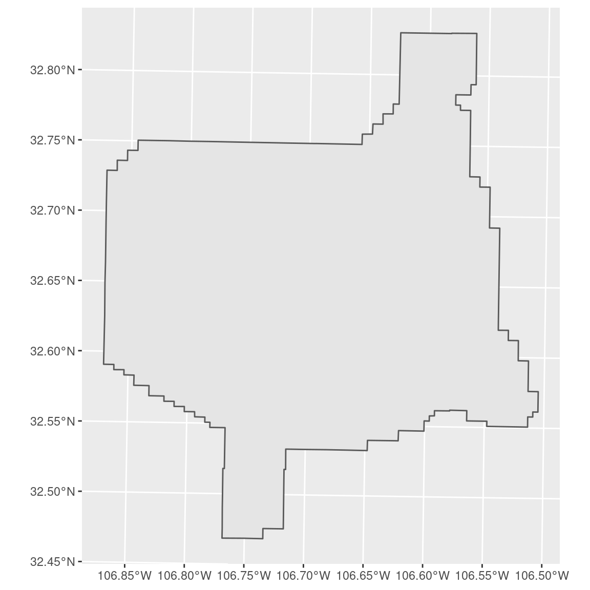
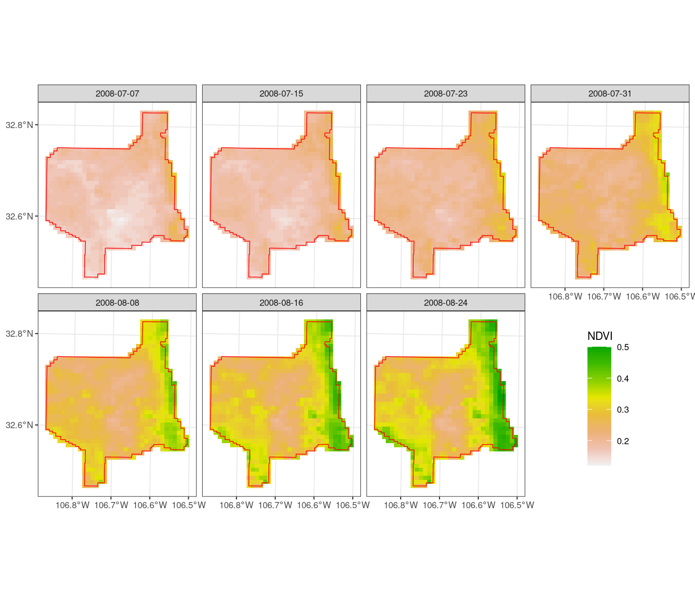
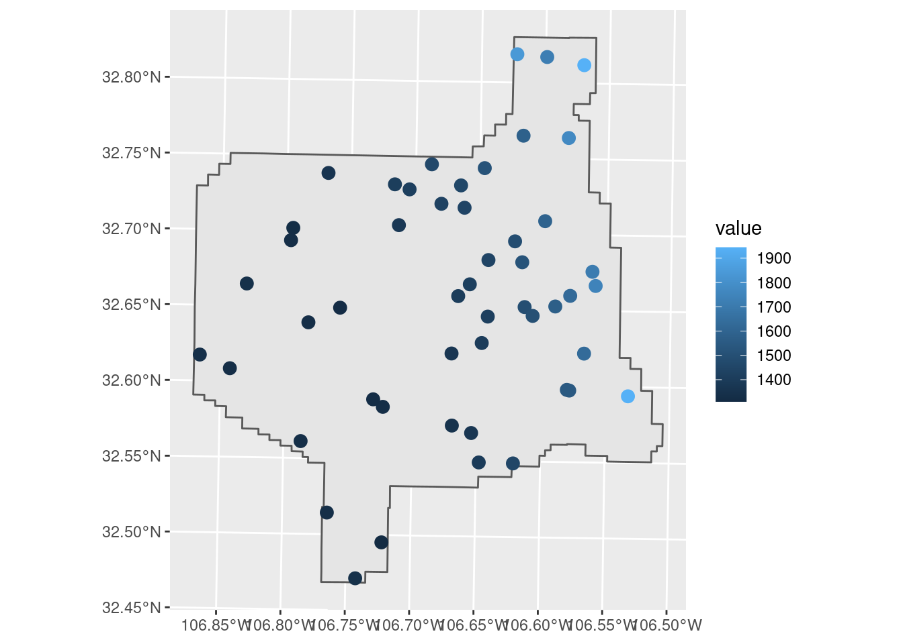

**Last Update:** 26 September 2022 <br />
**Download RMarkdown**: [GRWG22_GeoCDL.Rmd](https://geospatial.101workbook.org/tutorials/GRWG22_GeoCDL.Rmd)

## Overview

This tutorial covers the R package `rgeocdl` for the SCINet Geospatial Common 
Data Library (GeoCDL), a community project from the 
[Geospatial Research Working Group](https://scinet.usda.gov/working-groups/geospatial) 
to reduce the time and effort to access commonly used geospatial datasets. We have
collected several large gridded data products to store on Ceres and created a 
REST API for SCINet users to request the spatiotemporal subsets of those data 
that they need. The geospatial processing to create those subsets executes on 
Ceres and a service node has been setup to serve the API. 

This R package is a user-friendly interface to pass along user requests to the 
core GeoCDL API from the compute nodes. That is, the R package does not perform 
the geospatial processing itself. A major benefit of using this R package is that 
it was designed to integrate into a user's geospatial data processing workflow in 
R. For example, a user storing their study area boundary definition as a `sf` 
object can pass along that object to this package's functions and the package will
do the necessary formatting of the data to make it compatible with GeoCDL. Other 
interfaces, a python package for example, will also be released in the near future. 

The workflows we will cover are uploading a shapefile of an LTAR site, harmonizing 
with common gridded environmental data, downloading and visualizing the resulting 
maps. We also show how to extract point level information from a gridded layer.

This tutorial assumes you are running this Rmarkdown file in RStudio Server on 
Ceres. The easiest way to do that is with 
[Open OnDemand](http://ceres-ood.scinet.usda.gov/). As of this writing, the GeoCDL 
is only available on Ceres and not Atlas. 

If you have any questions, problems, or requests related to the R interface, please 
use the issue tracker on our GitHub repository: 
[https://github.com/USDA-SCINet/rgeocdl](https://github.com/USDA-SCINet/rgeocdl). 
 

*Language:* `R`

*Primary Libraries/Packages:*

| Name | Description | Link |
|:--|:--|:--|
| `rgeocdl` | R interface for SCINet GeoCDL API | https://github.com/USDA-SCINet/rgeocdl |
| `sf` | Simple Features for R | https://r-spatial.github.io/sf/ |

## Nomenclature

* *GeoCDL:* Geospatial Common Data Library, a collection of commonly used raster 
  datasets accessible from an API running on SCINet's Ceres cluster
* *Raster:* Data defined on a grid of geospatial coordinates
* *CRS:* Coordinate Reference System, also known as a spatial reference system. A
  system for defining geospatial coordinates. 

## Data Details

* Data: MODIS NDVI Data, Smoothed and Gap-filled, for the Conterminous US: 2000-2015
* Link: [https://doi.org/10.3334/ORNLDAAC/1299](https://doi.org/10.3334/ORNLDAAC/1299)
* Other Details: This data set provides Moderate Resolution Imaging Spectroradiometer 
  (MODIS) normalized difference vegetation index (NDVI) data, smoothed and gap-filled, 
  for the conterminous US for the period 2000-01-01 through 2015-12-31. The data 
  were generated using the NASA Stennis Time Series Product Tool (TSPT) to generate 
  NDVI data streams from the Terra satellite (MODIS MOD13Q1 product) and Aqua 
  satellite (MODIS MYD13Q1 product) instruments. TSPT produces NDVI data that 
  are less affected by clouds and bad pixels.

* Data: PRISM
* Link: [https://prism.oregonstate.edu/](https://prism.oregonstate.edu/)
* Other Details: The PRISM Climate Group gathers climate observations from a 
  wide range of monitoring networks, applies sophisticated quality control 
  measures, and develops spatial climate datasets to reveal short- and long-term 
  climate patterns. The resulting datasets incorporate a variety of modeling 
  techniques and are available at multiple spatial/temporal resolutions, covering 
  the period from 1895 to the present.


## Steps

* Specify desired data - Define the spatio-temporal scope of the user request:
  * Specify area and dates of interest 
  * Select datasets and their variables
* Download requested data - Send request to server and download results
* Visualize results - View the downloaded data and metadata
* Request variations - Multiple data request examples

## Step 0: Import Libraries/Packages

The `rgeocdl` package is now available to download from GitHub. When the package
reaches its first stable release, we will have it installed in the R site library
on Ceres for anyone to load. If you need to install or update `rgeocdl` from 
GitHub, you can use the line below. Note that the `devtools` package is in the
R site library on Ceres so you do not have to install it yourself even if you 
have not used that package before. 

```r
# Install SCINet's R interface for GeoCDL
devtools::install_github('USDA-SCINet/rgeocdl')
```
If you have not installed R packages for yourself
on Ceres before and see an error like the one below when you try to install from
within RStudio Server, try running the line in the shell instead. See [these 
instructions](https://scinet.usda.gov/guide/packageinstall/#installing-r-packages) 
for more details about installing packages on Ceres. 

> lib = "/usr/local/lib/R/site-library"' is not writable


The additional packages below are not necessary to load to use `rgeocdl` in every
case but help with this tutorial. These packages are each available in the R site 
library for RStudio Server on Ceres Open OnDemand, though not all are in the R site 
library if you were to load an R module in a shell. 

```r
library(rgeocdl)    

# Additional packages in tutorial
library(httr)       # Access geometry from AgCROS
library(sf)         # Handle vector data
library(terra)      # Handle raster data
library(tidyr)      # General data manipulation
library(stringr)    # String manipulation
library(ggplot2)    # Visualizations
```

## Step 1: Specify desired data 

### Step 1a: Specify area and dates of interest 

We will specify our area of interest as the USDA-ARS Jornada Experimental Range 
in southern New Mexico. This site is a part of the Long-Term Agricultural Research 
(LTAR) network, which has site boundaries available on 
[AgCROS](https://agcros-usdaars.opendata.arcgis.com/pages/ltar-dm-home). 
We will download the boundary for the 'JER' site and transform its coordinate 
reference system (CRS) to UTM 13N, a typical CRS for the site. 

We will showcase returning raster data overlapping this site. 

```r
# Read in site boundary and upload to GeoCDL
# AgCROS 
agcros_url <- 'https://services1.arcgis.com/SyUSN23vOoYdfLC8/arcgis/rest/services/'
ltar_features <- 'LTAR_Base/FeatureServer/1/query?'

# Specify LTAR site
my_site <- 'JER'
site_query <- paste0("where=acronym='",my_site,"'&f=pgeojson")

# Download JER boundary and read into a sf object
jer_bounds_sf <- GET(paste0(agcros_url, ltar_features, site_query))  %>%
  st_read(quiet=TRUE) %>%
  st_transform(32613) # EPSG code for UTM 13N with WGS84 datum

# View shape
ggplot() +
  geom_sf(data=jer_bounds_sf)

```



We can see from the plotted map that the site is an irregular shape. For cases 
like this where the geometry is defined by many points, it is easiest to provide
GeoCDL with a file containing the geometry definition. We can upload
this geometry to GeoCDL using the `upload_geometry` function which returns a unique
geometry upload identifier (GUID) that we will use later in our subset request.
This stand-alone upload step is optional, but recommended if you are likely to submit
multiple subset requests with the same geometry so that it is uploaded just once.

```r
# Upload to GeoCDL and get Geometry Upload IDentifier
guid_bounds <- upload_geometry(jer_bounds_sf)

```

To finish the spatial component of our subset request, we will define our target
spatial resolution and a resampling method. By indicating a target spatial 
resolution along with our geometry, we are telling GeoCDL that we want a 
spatially-harmonized 'datacube' that has each requested data layer with the
same CRS, spatial resolution, and spatial extent. The target CRS in this case is
that of our geometry, but you may specify an alternative one if you wish. The 
default resampling method is to take the nearest pixel.

```r
# Spatial resolution - in meters since that is the unit of the target CRS
spat_res <- 1000 # meters

# Resampling method - default is to take the "nearest" pixel. 
# The ri_method argument options are clarified in 'download_polygon_subset' 
# documentation.
resample_method <- 'bilinear'

```


The GeoCDL accepts multiple temporal range formats so that many different user 
needs can be met. In this example, we are interested in July-August 2008. One way
to specify that is with the years and months together as `'2008-07:2008-08'` or
separately as below. By specifying years and months, we are letting GeoCDL know
that we are interested in monthly data. If we only specify years, then it will
infer we want annual data and if we also specifies days, then it will infer we
want daily data. However, users can also request a combination of temporal grains
by specifying a 'grain method'. In this example, we are also interested in daily 
data available within July-August 2008, so we will indicate the 'finer' grain 
method.

```r
# Define time of interest and temporal resolution as monthly
yrs <- '2008'
mnths <- '7:8'   

# Allow sparse daily NDVI to be returned by specifying that
# finer temporal resolutions can be returned
g_method <- 'finer' 

```

### Step 1b: Select datasets and their variables

The GeoCDL can be queried to return the currently available datasets and their 
metadata. We will be using the MODIS NDVI Data, Smoothed and Gap-filled, for the 
Conterminous US: 2000-2015 data product. 
We will request monthly PRISM precipitation as well. 

The `list_datasets` function will return a dataframe listing the currently
available datasets from GeoCDL. To learn more about a particular dataset, use its
dataset ID with the `view_metadata` function to learn more about the dataset. 
For example, *MODIS_NDVI* has one variable, *NDVI*, and has data 
available from 2000-01-01 to 2012-12-31. This *MODIS_NDVI* product has layers 
for every 8 days over this time period, and so we designate this product as a 
daily product. 

To specify which data layers to include in the data download, you can construct
a dataframe or tibble listing the dataset ID with variable IDs. 

```r
# 1, Query the GeoCDL to list all datasets
list_datasets()

# 2. View a dataset's metadata
view_metadata("MODIS_NDVI")
view_metadata("PRISM")

# 3. Format datasets and variables
dsvars <- tibble(dataset = c("PRISM","MODIS_NDVI"),
                 variables = c("ppt","NDVI"))

```

## Step 2: Download the data

Up until now, we have been primarily saving our request specifications as 
variables. We will now pass each of those variables to the GeoCDL and download 
our subset using the `download_polygon_subset` function. GeoCDL returns a zipped
folder of results and `rgeocdl` unzips it for you. `download_polygon_subset` 
returns the filenames in that folder. We have here two monthly PRISM layers, 7 
daily MODIS NDVI layers (every 8 days), plus a metadata file that lists metadata 
related to the geospatial datasets as well as the GeoCDL request itself. The raster
layer files are GeoTIFFs with the dataset, variable, and date indicated in the 
filename. 

```r

subset_files <- download_polygon_subset(dsvars, 
                                        t_geom = guid_bounds,
                                        years = yrs,
                                        months = mnths,
                                        grain_method = g_method,
                                        resolution = spat_res,
                                        ri_method = resample_method)
subset_files

```

## Step 3: Visualize the results

Our use of `rgeocdl` is complete, but we can visualize the data that we downloaded.
We can see that in our site, NDVI increased over July-August 2008 during the 
summer monsoon, but by different degrees within the site. 

```r

# List NDVI GeoTIFFs and read in together with terra package
subset_tifs <- subset_files[grepl("tif$",subset_files) & grepl("NDVI",subset_files)]
subset_stack <-  rast(subset_tifs) 

# Rename layers with dates extracted from filenames
names(subset_stack) <- str_extract(subset_tifs, "[0-9-]{10}")

# Convert to long dataframe
ndvi_df <- subset_stack %>%
  as.data.frame(xy=TRUE) %>%
  pivot_longer(-c(x,y),
               names_to = 'date',
               values_to = 'NDVI')

# Plot NDVI in facets by date and overlay JER boundary
ndvi_df %>%
  ggplot() +
  geom_raster(aes(x,y,fill=NDVI)) +
  geom_sf(fill=NA,
          color = 'red',
          size = 0.25,
          data=jer_bounds_sf) +
  facet_wrap(~date,
             ncol=4) +
  scale_fill_gradientn(colors = rev(terrain.colors(8)),
                       na.value = 'white') +
  theme_bw(base_size = 8) +
  theme(legend.position = c(0.875,0.25)) +
  scale_y_continuous(name = NULL, breaks = seq(32.4,33,0.2)) +
  scale_x_continuous(name = NULL, breaks = seq(-106.9,-106.5,0.1)) 


```


## Request variations

### Point Extractions

For the sake of simplicity, we will create some random points from our previous
area of interest to represent some points of interest to showcase point subsets
from GeoCDL. Here, we are providing our `sf` object directly to 
`download_points_subset` instead of uploading it ahead of time. `rgeocdl` is still
doing the upload, but behind the scenes. We will extract the elevation of these
points and request the results in a shapefile (the default is a CSV). 

```r
# Generate N random points within our area of interest
N <- 50
jer_stations <- st_sample(jer_bounds_sf, N)

dsvars <- tibble(dataset = c("GTOPO30"),
                 variables = c("elev"))

subset_files <- download_points_subset(dsvars, 
                                       t_geom = jer_stations,
                                       out_format = 'shapefile')
subset_files

subset_shp <- subset_files[grepl("shp",subset_files)]

station_variables <- st_read(subset_shp)

station_variables %>%
  ggplot() +
  geom_sf(data = jer_bounds_sf) + 
  geom_sf(aes(color = value),
          size = 3)  
```


### Additional examples

Monthly data from multiple variables of the same dataset within a box and keep 
the original spatial resolution and CRS.
```r
my_vars <- data.frame(ds = c('PRISM','PRISM','PRISM'),
                     vars = c('ppt','tmin','tmax'))

# Two points representing upper left and lower right corners of a box,
# in CRS of the first requested dataset
my_box <- data.frame(x = c(-106,-103),
                     y = c(40,30))

download_polygon_subset(my_vars,
                       dates =  '2000-01:2000-12',
                       t_geom = my_box)
```

Monthly data from April-September 2000-2010
```r
download_polygon_subset(my_vars,
                       months = '4:9',
                       years = '2000:2010',
                       t_geom = my_box)
```


Daily data associated with the last day of the month for each month in 2020
```r
download_polygon_subset(my_vars,
                        days = "N", #Nth day of month
                        months = '1:12',
                        years = 2020,
                        t_geom = my_box)
```

Non-harmonized layers from two datasets
```r
my_vars2 <- data.frame(ds = c('PRISM','DaymetV4'),
                     vars = c('ppt','prcp'))

download_polygon_subset(my_vars2,
                        years = 2000,
                        t_geom = my_box)
```

Harmonized datacube from two datasets
```r
download_polygon_subset(my_vars2,
                        years = 2000,
                        t_geom = my_box,
                        t_crs = 'EPSG:4326',
                        resolution = 0.05)
```

