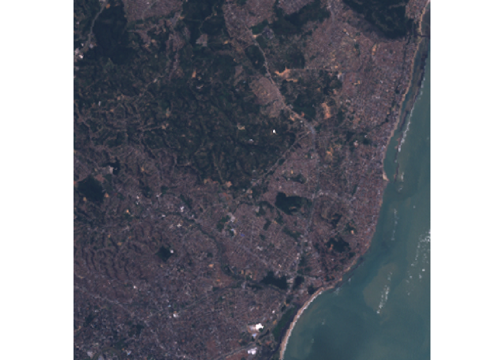
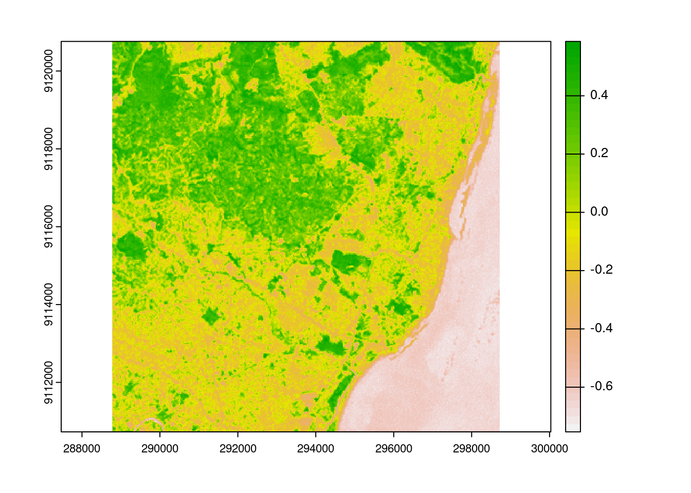

**Last Update:** 7 October 2022 <br />
**Download RMarkdown**: [GRWG22_RasterTiles.Rmd](https://geospatial.101workbook.org/tutorials/GRWG22_RasterTiles.Rmd)

## Overview

A common approach to distribute the workload in raster calculations is to split
a large raster into smaller 'tiles' or 'chunks'. This tutorial shows how to 
speed up a NDVI calculation by creating tiles and then distributing the tiles 
across cores. This process is not specific to calculating NDVI. You can use this
approach with any calculation that is performed per cell/pixel without depending
on the data in neighboring pixels (if neighboring data is needed, extra steps are 
involved).

This tutorial assumes you are running this Rmarkdown file in RStudio Server. The 
easiest way to do that is with Open OnDemand (OoD) on [Ceres](http://ceres-ood.scinet.usda.gov/)
or [Atlas](https://atlas-ood.hpc.msstate.edu/). 
Select the following parameter values when requesting a RStudio Server
app to be launched depending on which cluster you choose. All other values can 
be left to their defaults. Note: on Atlas, we are using the development partition
so that we have internet access to download files since the regular compute nodes
on the `atlas` partition do not have internet access.

Ceres:
* `Slurm Partition`: short
* `R Version`: 4.2.0
* `Number of cores`: 16
* `Memory required`: 24G

Atlas:
* `R Version`: 4.1.0
* `Partition Name`: development 
* `QOS`: normal
* `Number of tasks`: 16
* `Additional Slurm Parameters`: --mem=24G

To download the Rmarkdown file for this tutorial to either cluster within OoD, 
you can use the following lines:

```r
library(httr)
tutorial_name <- 'GRWG22_RasterTiles.Rmd'
GET(paste0('https://geospatial.101workbook.org/tutorials/',tutorial_name), 
    write_disk(tutorial_name))
```


In this tutorial, parallelization is performed within R using the resources 
allocated to the launched RStudio Server session. If you are interested in seeing
an example on how to submit your own SLURM job, please see 
[this tutorial](https://geospatial.101workbook.org/ExampleGeoWorkflows/GRWG22_ZonalStats_wSLURM_R).

*Language:* `R`

*Primary Libraries/Packages:*

| Name | Description | Link |
|:--|:--|:--|
| terra | Spatial Data Analysis | https://cran.r-project.org/web/packages/terra/index.html |
| foreach | Provides Foreach Looping Construct | https://cran.r-project.org/web/packages/foreach/index.html |
| doParallel | Foreach Parallel Adaptor for the 'parallel' Package | https://cran.r-project.org/web/packages/doParallel/index.html |

## Nomenclature

* *Parallel processing:* Distributing computational tasks among multiple cores. 
* *Core:* A processor on a central processing unit; a physical or logical component 
  that can execute computational tasks. 
* *Tile (or chunk):* A continuous segment of a raster dataset or multi-dimensional 
  array.
* *NDVI:* Normalized Difference Vegetation Index, a quantity derived from the red
  and near-infrared bands of imagery to detect vegetation. 

## Analysis Steps

* Open Imagery and Setup Tiles - Open a GeoTIFF of Landsat 7 imagery and divide
  it into multiple smaller images.
* Define NDVI function - Write a function to calculate Normalized Difference 
  Vegetation Index from an image file.
* Compare serial versus parallel computation times - Measure the time it takes to
  perform the NDVI calculation across tiles in serial and in parallel
  * Option 1: using the `foreach` and `doParallel` packages
  * Option 2: using the `parallel` package
* Visualize NDVI results - View the NDVI values in tiles as a whole image.

## Step 0: Import Libraries/Packages

For this tutorial, we will use the `stars` package for one of its example 
datasets, the `terra` package for handling raster data, and the `doParallel` and 
`foreach` packages together for distributing our calculations. The `stars` and 
`terra` packages are each available in the R site library for RStudio Server on 
Ceres and Atlas Open OnDemand, though not in the R site library if you were to load an R 
module in a shell. However, the `terra` version on Atlas is not a recent enough 
version for this tutorial, so we will install the latest version. As of this 
writing, `foreach` and `doParallel` are not in the 
site library and will need to be installed if you have not already done so. To 
learn more about installing packages on Ceres, see 
[this guide](https://scinet.usda.gov/guide/packageinstall/#installing-r-packages). 

```r
install.packages(c('foreach','doParallel','terra'))
```


```r
library(terra)
library(foreach)
library(doParallel)
```

## Step 1: Open Imagery and Setup Tiles

### Step 1a: Open imagery

The imagery file we will use is available from the `stars` package. It is an 
example image from Landsat 7 and you can learn more about it by calling 
`?L7_ETMs`. In that documentation, it indicates that the first three bands are 
from the visible part of the electromagnetic spectrum (blue, green, red) and the 
fourth band in the near-infrared band. We can use `terra`'s function `rast` to
read the imagery file. The `plotRGB` function will let us visualize the image in
typical RGB. We can see that it is of a coast with forested areas that should 
have relatively high NDVI values. 

```r
L7_ETMs <- rast(system.file("tif/L7_ETMs.tif", package = "stars"))

# RGB Image using the third-first bands
plotRGB(L7_ETMs[[3:1]])

```


This image is fairly small and we do not actually need to speed-up the NDVI 
calculation with parallel processing. So we will make it artificially a big data 
problem by disaggregating the pixels, i.e. making a greater number of smaller 
cells, for the sake of a portable example. The function `disagg` accepts a 
raster object and a disaggregation factor, i.e. the number of cells to create from
each original cell in each direction. Below, we are using a factor of 20 which 
will create 400x pixels than the original. 
```r
disagg_factor <- 20
nir_red_fine <- disagg(L7_ETMs[[3:4]], disagg_factor,
                       filename = "nr_test.tif",
                       overwrite = TRUE)
```

### Step 1b: Making tiles

The `terra` package comes with a handy function for making raster tiles called
`makeTiles` to which you pass the raster you want to split up, a template raster
indicating how to split it up into tiles, and how to name the resulting files
containing the tiles. First, we will specify how many tiles we want. This example
will use 4 tiles in each directions for a total of 16 tiles. Next, we will create
an empty raster template will the number of rows and columns matching our number
of tiles and our image's spatial extent and CRS. The we call `makeTiles` which
will write the tiles to file and return the filenames. 

```r
# Set number of tiles (number of rows, number of columns)
num_tiles <- c(4,4)

# Define empty raster template to define tiles
tile_template <- rast(nrows = num_tiles[1],
                      ncols = num_tiles[2],
                      crs = crs(nir_red_fine),
                      ext = ext(nir_red_fine))

# Generate the tile files using the red and NIR bands only
nr_tiles <- makeTiles(nir_red_fine, 
                      tile_template, 
                      filename="tile_.tif",
                      overwrite=TRUE)
```

## Step 2: Defining NDVI function

Next, we want to define a function that will calculate NDVI for the pixels in 
one tile. The function will accept a tile's filename, open that file with `terra`,
calculate NDVI for the pixels, then write the resulting single-band raster to
a new file. 

```r
# Define NDVI function that writes results to file
normalized_diff_r <- function(fname){
  nr <- rast(fname)
  NDVI_r <- (nr$L7_ETMs_4 - nr$L7_ETMs_3)/(nr$L7_ETMs_4 + nr$L7_ETMs_3)

  writeRaster(NDVI_r, filename=paste0('NDVI_',fname), overwrite = TRUE)
}
```

## Step 3: Comparing serial and parallel processing times

To have a baseline to which to compare how long the parallel approach takes, we
can first time the serial approach. The base R `system.time()` function provides 
basic timing capabilities and reports three different timings: *user*, *system*, 
and *elapsed*. The third timing, *elapsed*, is the physical or 'wall' time elapsed
and the one we are interested in comparing among our approaches. 

### Step 3a: `foreach`/`doParallel` 

#### Serial

In this first option, we are using the `foreach` package as a serial backend that
the `doParallel` extends with parallel processing. Using `foreach` is similar to
using a `for` loop with a slightly different syntax in the first line:

* `for` is replaced with `foreach`
* `in` is replaced with `=`
* `){` is replaced with `) %do% {`

```r
# for loop
for(i in 1:N){
  # Do your calculation
}

# foreach
foreach(i = 1:N) %do% {
  # Do your calculation
}
```

To have NDVI calculated for each of our tiles, we will have `foreach` iterate 
over each tile filename (which was returned by `makeTiles`) and call our
`normalized_diff_r` function for each iteration.
```r
# Time the serial execution
system.time({
  foreach(fname=nr_tiles) %do% {
    normalized_diff_r(fname)
  }
})
```

```
   user  system elapsed 
 10.277   0.296  12.665 
```


#### Parallel

To use `doParallel` to parallelize `foreach`, two things must be done:

1. You register `doParallel` with the number of cores you want to use
2. You change `%do%` to `%dopar%` in your `foreach` statement

Here, we are using as many cores as number of tiles so each core will have
one task to complete. 
```r
# Register doParallel
registerDoParallel(cores = prod(num_tiles))

# Time the parallel execution
system.time({
  foreach(fname=nr_tiles) %dopar% {
    normalized_diff_r(fname)
  }
})
```

```
   user  system elapsed 
  9.144   1.426   8.189  
```

### Step 3b: `parallel` 

There is another similar approach using the `parallel` package, which comes with
base R. Instead of extending `foreach`, we will see how `parallel` extends base
R's `lapply` with `mclapply`. 

#### Serial

Again, we will first time how long the serial `lapply` approach takes to perform
our NDVI calculation. `lapply` accepts a vector of inputs (our tile filenames) 
and a function that accepts those inputs (`normalized_diff_r`).
```r
# Time the serial execution
system.time({
  lapply(nr_tiles, normalized_diff_r)
})

```

```
   user  system elapsed 
 10.302   0.260  12.746  
```

#### Parallel

To use the parallel version of `lapply`, two changes are made to our
code above:

1. Call `mclapply` instead of `lapply`
2. Pass the desired number of cores

Like with `doParallel`, we are requesting as many cores as the number of tiles.
```r
# Time the parallel execution
system.time({
  mclapply(nr_tiles, normalized_diff_r, mc.cores = prod(num_tiles))
})

```

```
   user  system elapsed 
  6.226   1.213   7.670 
```


## Step 4: Visualize NDVI results

There is a `terra` function `vrt` (Virtual Raster Tiles) for visualizing tiles
without having to mosaic first. Note: if you are familiar with using 
[GDAL](https://gdal.org) (Geospatial Data Abstraction Library), their 
[VRT](https://gdal.org/drivers/raster/vrt.html) is a more general virtual format
not specific to just tiling.

We can see from the image that the forested areas have the higher NDVI values
as we expected.
```r
virtual_ndvi <- vrt(paste0('NDVI_',nr_tiles))
plot(virtual_ndvi)
```


### Continue to explore

Things you can change in this tutorial to see how it affects the difference in
processing time between serial and parallel (or the two parallel library 
options):

* The disaggregation factor 
* The number of tiles
* The number of cores

