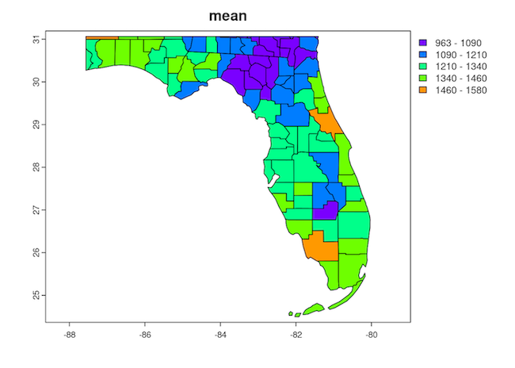

**Last Update:** 28 September 2022 <br />
**Download RMarkdown**: [GRWG22_ZonalStats_wSLURM.Rmd](https://geospatial.101workbook.org/tutorials/GRWG22_ZonalStats_wSLURM.Rmd)

## Overview

This tutorial covers how to:

1. calculate zonal statistics (i.e., extract summaries of raster values 
intersecting polygons) in R, and 
2. use SLURM job arrays to execute an R script with different inputs across 
multiple cores.

We will use 21 years of the PRISM gridded dataset's annual precipitation variable 
and the US Census counties polygon dataset to calculate the mean annual precipitation 
in each county per year. We will request SLURM to distribute the 21 years of input data 
across as many cores and run our zonal statistics R script on each one.

If you prefer to have an R script handle looping over your data inputs and 
submitting many job submission scripts, see [this tutorial](https://geospatial.101workbook.org/ExampleGeoWorkflows/GRWG22_JobPerDataFile_R).

*Language:* `R`

*Primary Libraries/Packages:*

| Name | Description | Link |
|:--|:--|:--|
| `rgeocdl` | R interface for SCINet GeoCDL API | https://github.com/USDA-SCINet/rgeocdl |
| `terra` | Methods for spatial data analysis with raster and vector data | https://rspatial.org/terra/pkg/index.html |

## Nomenclature

* *GeoCDL:* [Geospatial Common Data Library](https://geospatial.101workbook.org/ExampleGeoWorkflows/GRWG22_GeoCDL_R), 
  a collection of commonly used raster datasets accessible from an API running 
  on SCINet's Ceres cluster
* *SLURM Workload Manager:* The software on Ceres and Atlas that allocates 
  compute cores to users for their submitted jobs. 
* *Zonal statistics:* Calculating summary statistics, e.g. mean, of cell values
  from a raster in each region, where regions can be defined by an overlapping 
  polygon feature collection.
  
## Data Details

* Data: US Census Cartographic Boundary Files
* Link: https://www.census.gov/geographies/mapping-files/time-series/geo/cartographic-boundary.html
* Other Details: The cartographic boundary files are simplified representations 
  of selected geographic areas from the Census Bureau’s MAF/TIGER geographic 
  database. These boundary files are specifically designed for small scale 
  thematic mapping. 
  
* Data: PRISM
* Link: https://prism.oregonstate.edu/
* Other Details: The PRISM Climate Group gathers climate observations from a 
  wide range of monitoring networks, applies sophisticated quality control measures, 
  and develops spatial climate datasets to reveal short- and long-term climate 
  patterns. The resulting datasets incorporate a variety of modeling techniques 
  and are available at multiple spatial/temporal resolutions, covering the period 
  from 1895 to the present.

## Analysis Steps

* Write serial R script - this script will accept a year argument, open the 
  raster file associated with that year, open the polygon dataset, calculate 
  the mean value per polygon, and write a new shapefile with the mean values.
* Write and save a SLURM job submission script - Create a batch script with
  SLURM commands requesting resources to execute your calculations on multiple
  cores.
* Submit your job - Submit your batch script to SLURM
* Check results - Monitor the SLURM queue until your job is complete and then 
  ensure your job executed successfully.

## Step 0: Install packages and download data

For this tutorial, we are not running our spatial analyses via Open OnDemand,
so we do not have access to the same breadth of geospatial R packages in the
site library. If you have not used `terra` or `rgeocdl` outside of Open 
OnDemand on Ceres before, you can install it in a shell with the code chunks 
below. The first three `module load` commands load versions of non-R  
libraries on which `terra` or `rgeocdl` depends. Then we load the 3.6 
version of R, which is a version recent enough for `terra` to install that also
has some `rgeocdl` install dependencies also available in the site library on 
Ceres. You may use a newer version of R, but may need to do some additional package
installations yourself.

```bash
module load gdal
module load geos
module load udunits
module load r/3.6
R
```

Which will open R and you can run the following lines to install `terra`. The 
second line installs the SCINet `rgeocdl` package used for downloading the 
example data for this tutorial.

```r
# Install packages
install.packages('terra') # if needed
devtools::install_github('USDA-SCINet/rgeocdl') # if needed

```

The code chunk below will download the example data. For our US county polygons, 
we are downloading a zipped folder containing a shapefile. The folder is then 
unzipped. For our precipitation data, we are using the SCINet GeoCDL's R package
`rgeocdl` to download annual precipitation for 2000-2020 in a bounding box 
approximately covering the state of Florida. Feel free to change the latitude
and longitude to your preferred area, but any mentions of processing times below 
will reflect the bounds provided. 

```r
# Load packages for downloading data
library(rgeocdl)

# Download vector data - US Counties shapefile from US Census 
vector_f <- 'us_counties2021'
vector_zip <- paste0(vector_f,'.zip')
httr::GET('https://www2.census.gov/geo/tiger/GENZ2021/shp/cb_2021_us_county_20m.zip',
          httr::write_disk(vector_zip,
                           overwrite=TRUE))
unzip(vector_zip,
      exdir = vector_f)


# Download raster data - PRISM's annual precipitation in box around Florida
download_polygon_subset(dsvars = data.frame(ds = 'PRISM',var = 'ppt'),
                        years = '2000:2020',
                        t_geom = data.frame(x = c(-87.5,-79), y = c(31,24.5)),
                        req_name = 'ppt_for_zonal_stats')
```

You may now exit R by typing:

```r
q()
```


## Step 1: Write and save a serial R script that accepts command line arguments

Save these lines below as `zonal_stats.R` on Ceres. It is an R script that:

1. Takes one argument from the command line to specify the data input year
2. Uses the `terra` package to open the data file associated with that year
3. Opens the vector data
4. Extracts the mean values per polygon

```r
# Read in command line arguments. Expecting a year value.
args = commandArgs(trailingOnly=TRUE)

if (length(args)==0) {
  stop("Enter the year of data you want extracted", 
       call.=FALSE)
} 

# Load terra library for spatial analyses
library(terra)

# Read in the raster corresponding to the year argument
my_raster <- rast(paste0('ppt_for_zonal_stats-1/PRISM_ppt_', 
                         args[1], 
                         '.tif'))

# Read in the polygon shapefile and transform it to match raster
my_polygons <- crop(project(vect('us_counties2021/cb_2021_us_county_20m.shp'),
                            my_raster),
                    my_raster)

# Extract mean raster value per polygon
my_polygons$mean <- extract(my_raster,
                            my_polygons,
                            na.rm = TRUE,
                            fun = mean)$ppt

# Save extracted mean values in a shapefile
writeVector(my_polygons, filename = paste0('stats_', args[1], '.shp'))
```

## Step 2: Write and save a SLURM job submission script

Now that we have our R script that accepts a year as input, we will write a 
SLURM job batch script to request that R script be called over an array of years. 
This kind of job submission is known as a 'job array'. Each 'task' in the job 
array, each year in our case, will be treated like its own job in the SLURM queue,
but with the benefit of only having to submit one submission batch script. 

Save the lines below as `zonal_stats.sh`. The lines starting with `#SBATCH` are
instructions for SLURM about how long your job will take to run, how many cores
you need, etc. The lines that follow afterwards are like any other batch script.
Here, we are loading required modules and then executing our R script. 

```bash
#!/bin/bash

#SBATCH --time=00:30:00       # walltime limit (HH:MM:SS) 
#SBATCH --nodes=1             # number of nodes
#SBATCH --ntasks-per-node=2   # 1 processor core(s) per node X 2 threads per core
#SBATCH --partition=short     # standard node(s)
#SBATCH --array=2000-2020     # your script input (the years)
#SBATCH --output=slurm_%A_%a.out  # format of output filename

# LOAD MODULES, INSERT CODE, AND RUN YOUR PROGRAMS HERE
module load r/3.6

# Execute the R script and pass the year (task ID) as argument
Rscript --vanilla zonal_stats.R ${SLURM_ARRAY_TASK_ID}
```

The meaning of our parameter choices:

* `time=00:30:00`: Our tasks will take up to 30 minutes to run. 
* `nodes=1`: We only need one node. If you are just getting started with parallel
processing, you will likely only need one node. 
* `ntasks-per-node=2`: We want two logical cores on our one node, i.e. each task
will use one physical core. Our individual tasks are serial and only need one core. 
* `partition=short`: We will use the 'short' partition on Ceres, the collection 
of nodes dedicated to shorter walltime jobs not requiring extensive memory. See
[this guide](https://scinet.usda.gov/guide/ceres/#partitions-or-queues) for more 
information about the available partitions on Ceres. 
* `array=2000-2020`: This is the parameter that tells SLURM we want a job array:
although we are submitting one job script, treat it as an array of many tasks. 
Those tasks should have IDs in the range of 2000-2020 to represent the years of
data we want analyzed.
* `--output=slurm_%A_%a.out`: Save any output from R (e.g. printed messages,
warnings, and errors) to a file with a filename in the format of 
*output_JOBID_TASKID.out*. The *JOBID* is assigned when the job is submitted (see
the next step) and the *TASKID* will be in the range of our tasks in the array, 
2000-2020. This way, if a particular year runs into an error, it can be easily
found. 

Note: there are additional SLURM parameters you may use, including how to specify
your own job ID or setting memory requirements. Check out the 
[Ceres job script generator](https://scinet.usda.gov/support/ceres-job-script) 
to see more examples on how to populate job submission scripts on Ceres.


## Step 3: Submit your job

Now that we have our packages, data, R script, and job submission script prepared,
we can finally submit the job. To submit a batch job to SLURM, we use the command 
`sbatch` followed by the job submission script filename via our shell. After you 
run this line, you will see a message with your job ID. You can use this to 
identify this job in the queue.

```bash
sbatch zonal_stats.sh
```

```
Submitted batch job 8145006
```

## Step 4: Check results

To see the status of your job, you can view the SLURM queue. The queue lists all
of the jobs currently submitted, who submitted them, the job status, and what
nodes are allocated to the job. Since this can be a very long list, it is easiest
to find your jobs if you filter the queue to only the jobs you submitted. The 
command to view the queue is `squeue` and you can filter it to a specific user
with the `-u` parameter followed by their SCINet account name.

```bash
squeue -u firstname.lastname
```

Below is a partial output for the queue showing this job array. You can see the
JOBID column has job IDs that start with the submitted job ID printed above with
`_X` after it indicating the tasks in our job array.  

```
             JOBID PARTITION     NAME     USER ST       TIME  NODES NODELIST(REASON)
      8145006_2000     short zonal_st heather.  R       0:01      1 ceres19-compute-57
      8145006_2001     short zonal_st heather.  R       0:01      1 ceres20-compute-3
      8145006_2002     short zonal_st heather.  R       0:01      1 ceres20-compute-3
      8145006_2003     short zonal_st heather.  R       0:01      1 ceres20-compute-3
      8145006_2004     short zonal_st heather.  R       0:01      1 ceres20-compute-3
```

If you see jobs listed in the queue: you have jobs currently in the queue and the status 
column will indicate if that job is pending, running, or completing. If you do NOT 
see jobs listed in the queue: you do not have jobs currently in the
queue. If you submitted jobs but they are not listed, then they completed - either
successfully or unsuccessfully. 

To determine if the job executed successfully, 
you may check if your anticipated output was created. In our case, we would expect
to see new shapefiles of the format *stats_YYYY.shp*. If you do not see your 
anticipated results, you can read the contents of the *output_JOBID_TASKID.out*
files to check for error messages. 

Here is a visual of our 2020 result in *stats_2020.shp* showing the mean 2020 
total precipitation per county in Florida. Note: if you want to run these lines
and create the plot, it is easiest to do so in RStudio Server via Open OnDemand.

```r
library(terra)
result <- vect('stats_2020.shp')
plot(result, 'mean')
```





