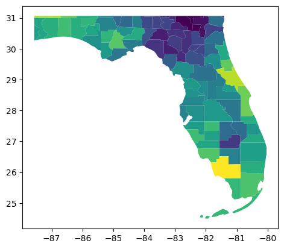

**Last Update:** 29 September 2022 <br />
**Download Jupyter Notebook**: [GRWG22_ZonalStats_wSLURM.ipynb](https://geospatial.101workbook.org/tutorials/GRWG22_ZonalStats_wSLURM.ipynb)

## Overview
This tutorial covers how to:

1. calculate zonal statistics (i.e., extract summaries of raster values 
intersecting polygons) in python, and 
2. use SLURM job arrays to execute an Python script with different inputs across 
multiple cores.

We will use 21 years of the PRISM gridded dataset's annual precipitation variable 
and the US Census counties polygon dataset to calculate the mean annual precipitation 
in each county per year. We will request SLURM to distribute the 21 years of input data 
across as many cores and run our zonal statistics Python script on each one.

If you prefer to have a python script handle looping over your data inputs and 
submitting many job submission scripts, see [this tutorial](https://geospatial.101workbook.org/ExampleGeoWorkflows/GRWG22_JobPerDataFile_python).

*Language*: `Python`

*Primary Libraries/Packages*:

|Name|Description|Link|
|-|-|-|
| `geopandas` | Extends datatypes used by pandas to allow spatial operations on geometric types | https://geopandas.org/en/stable/ |
| `rasterstats` | Summarizes geospatial raster datasets based on vector geometries | https://pythonhosted.org/rasterstats/ |


## Nomenclature

* *GeoCDL:* Geospatial Common Data Library, 
a collection of commonly used raster datasets accessible from an API running 
on SCINet's Ceres cluster
* *SLURM Workload Manager:* The software on Ceres and Atlas that allocates 
compute cores to users for their submitted jobs. 
* *Zonal statistics:* Calculating summary statistics, e.g. mean, of cell values
from a raster in each region, where regions can be defined by an overlapping 
polygon feature collection.

## Data Details

* Data: US Census Cartographic Boundary Files
* Link: https://www.census.gov/geographies/mapping-files/time-series/geo/cartographic-boundary.html
* Other Details: The cartographic boundary files are simplified representations 
  of selected geographic areas from the Census Bureau’s MAF/TIGER geographic 
  database. These boundary files are specifically designed for small scale 
  thematic mapping. 
  
* Data: PRISM
* Link: https://prism.oregonstate.edu/
* Other Details: The PRISM Climate Group gathers climate observations from a 
  wide range of monitoring networks, applies sophisticated quality control measures, 
  and develops spatial climate datasets to reveal short- and long-term climate 
  patterns. The resulting datasets incorporate a variety of modeling techniques 
  and are available at multiple spatial/temporal resolutions, covering the period 
  from 1895 to the present.

## Analysis Steps

* Write serial python script - this script will accept a year argument, open the 
  raster file associated with that year, open the polygon dataset, calculate 
  the mean value per polygon, and write a new shapefile with the mean values.
* Write and save a SLURM job submission script - Create a batch script with
  SLURM commands requesting resources to execute your calculations on multiple
  cores.
* Submit your job - Submit your batch script to SLURM
* Check results - Monitor the SLURM queue until your job is complete and then 
  ensure your job executed successfully.

### Step 0: Install packages and download data

Below are commands to run to create a new Conda environment named 'geoenv' that contains the packages used in this tutorial series. To learn more about using Conda environments on Ceres, see [this guide](https://scinet.usda.gov/guide/conda/). NOTE: If you have used other Geospatial Workbook tutorials from the SCINet Geospatial Research Working Group Workshop 2022, you may have aleady created this environment and may skip to activating the environment, opening python, and downloading data.

First, we call `salloc` to be allocated resources on a compute node so we do not burden the login node with the conda installations. Then we load the `miniconda` conda module available on Ceres to access the `Conda` commands to create environments, activate them, and install Python and packages. Last, we open the version of python in the environment for the next step.


```bash
salloc
module load miniconda
conda create --name geoenv
source activate geoenv
conda install geopandas rioxarray rasterstats plotnine ipython dask dask-jobqueue -c conda-forge
python
```

The code chunk below will download the example data. For our US county polygons, 
we are downloading a zipped folder containing a shapefile. For our precipitation data, we are using the SCINet GeoCDL
to download annual precipitation for 2000-2020 in a bounding box 
approximately covering the state of Florida. Feel free to change the latitude
and longitude to your preferred area, but any mentions of processing times below 
will reflect the bounds provided.


```python
import urllib.request
import zipfile

# Vector data
vector_base = 'us_counties2021'
vector_zip = vector_base + '.zip'
urllib.request.urlretrieve('https://www2.census.gov/geo/tiger/GENZ2021/shp/cb_2021_us_county_20m.zip', vector_zip)
with zipfile.ZipFile(vector_zip,"r") as zip_ref:
    zip_ref.extractall(vector_base)

# Raster data
geocdl_url = 'http://10.1.1.80:8000/subset_polygon?datasets=PRISM%3Appt&years=2000:2020&clip=(-87.5,31),(-79,24.5)'
raster_base = 'ppt_for_zonal_stats'
raster_zip = raster_base + '.zip'
urllib.request.urlretrieve(geocdl_url, raster_zip)
with zipfile.ZipFile(raster_zip,"r") as zip_ref:
    zip_ref.extractall(raster_base)

```

You may now exit python by typing:


```python
quit()
```

### Step 1: Write and save a serial python script that accepts command line arguments

Save these lines below as `zonal_stats.py` on Ceres. It is a python script that:

1. Takes one argument from the command line to specify the data input year
2. Points to the raster data file associated with that year
3. Opens the vector data
4. Extracts the mean values per polygon


```python
import argparse
import geopandas as gpd
import rioxarray
from shapely.geometry import box
from rasterstats import zonal_stats

# Read in command line arguments. Expecting a year value.
parser = argparse.ArgumentParser()
parser.add_argument("year",type=int)
args = parser.parse_args()

# Read in the raster corresponding to the year argument
r_fname = 'ppt_for_zonal_stats/PRISM_ppt_' + str(args.year) + '.tif'
my_raster = rioxarray.open_rasterio(r_fname)
raster_bounds = my_raster.rio.bounds()

# Read in the polygon shapefile and transform it to match raster
my_polygons = gpd.read_file('us_counties2021/cb_2021_us_county_20m.shp')
rbounds_df = gpd.GeoDataFrame({"id":1,"geometry":[box(*raster_bounds)]},
                              crs = my_raster.rio.crs)
my_polygons = my_polygons.to_crs(my_raster.rio.crs).clip(rbounds_df)

# Extract mean raster value per polygon
zs_gj = zonal_stats(
    my_polygons, 
    r_fname, 
    stats = "mean",
    geojson_out = True)
zs_gpd = gpd.GeoDataFrame.from_features(zs_gj)

# Save extracted mean values in a shapefile
zs_gpd.to_file('stats_' + str(args.year) + '.shp')
```

### Step 2: Write and save a SLURM job submission script

Now that we have our python script that accepts a year as input, we will write a 
SLURM job batch script to request that python script be called over an array of years. 
This kind of job submission is known as a 'job array'. Each 'task' in the job 
array, each year in our case, will be treated like its own job in the SLURM queue,
but with the benefit of only having to submit one submission batch script. 

Save the lines below as `zonal_stats.sh`. The lines starting with `#SBATCH` are
instructions for SLURM about how long your job will take to run, how many cores
you need, etc. The lines that follow afterwards are like any other batch script.
Here, we are loading required modules and then executing our python script. 

```bash
#!/bin/bash

#SBATCH --time=00:30:00       # walltime limit (HH:MM:SS) 
#SBATCH --nodes=1             # number of nodes
#SBATCH --ntasks-per-node=2   # 1 processor core(s) per node X 2 threads per core
#SBATCH --partition=short     # standard node(s)
#SBATCH --array=2000-2020     # your script input (the years)
#SBATCH --output=slurm_%A_%a.out  # format of output filename

# LOAD MODULES, INSERT CODE, AND RUN YOUR PROGRAMS HERE
module load miniconda
source activate geoenv

python zonal_stats.py ${SLURM_ARRAY_TASK_ID}
```

The meaning of our parameter choices:

* `time=00:30:00`: Our tasks will take up to 30 minutes to run. 
* `nodes=1`: We only need one node. If you are just getting started with parallel
processing, you will likely only need one node. 
* `ntasks-per-node=2`: We want two logical cores on our one node, i.e. each task
will use one physical core. Our individual tasks are serial and only need one core. 
* `partition=short`: We will use the 'short' partition on Ceres, the collection 
of nodes dedicated to shorter walltime jobs not requiring extensive memory. See
[this guide](https://scinet.usda.gov/guide/ceres/#partitions-or-queues) for more 
information about the available partitions on Ceres. 
* `array=2000-2020`: This is the parameter that tells SLURM we want a job array:
although we are submitting one job script, treat it as an array of many tasks. 
Those tasks should have IDs in the range of 2000-2020 to represent the years of
data we want analyzed.
* `--output=slurm_%A_%a.out`: Save any output from python (e.g. printed messages,
warnings, and errors) to a file with a filename in the format of 
*output_JOBID_TASKID.out*. The *JOBID* is assigned when the job is submitted (see
the next step) and the *TASKID* will be in the range of our tasks in the array, 
2000-2020. This way, if a particular year runs into an error, it can be easily
found. 

Note: there are additional SLURM parameters you may use, including how to specify
your own job ID or setting memory requirements. Check out the 
[Ceres job script generator](https://scinet.usda.gov/support/ceres-job-script) 
to see more examples on how to populate job submission scripts on Ceres.


### Step 3: Submit your job

Now that we have our packages, data, python script, and job submission script prepared,
we can finally submit the job. To submit a batch job to SLURM, we use the command 
`sbatch` followed by the job submission script filename via our shell. After you 
run this line, you will see a message with your job ID. You can use this to 
identify this job in the queue.


```bash
sbatch zonal_stats.sh
```

### Step 4: Watch the queue

To see the status of your job, you can view the SLURM queue. The queue lists all
of the jobs currently submitted, who submitted them, the job status, and what
nodes are allocated to the job. Since this can be a very long list, it is easiest
to find your jobs if you filter the queue to only the jobs you submitted. The 
command to view the queue is `squeue` and you can filter it to a specific user
with the `-u` parameter followed by their SCINet account name.


```bash
squeue -u firstname.lastname
```

If you see jobs listed in the queue: you have jobs currently in the queue and the status 
column will indicate if that job is pending, running, or completing. 

If you do NOT see jobs listed in the queue: you do not have jobs currently in the
queue. If you submitted jobs but they are not listed, then they completed - either
successfully or unsuccessfully. 

### Step 5: Check results

To determine if the job executed successfully, 
you may check if your anticipated output was created. In our case, we would expect
to see new shapefiles of the format *stats_YYYY.shp*. If you do not see your 
anticipated results, you can read the contents of the *output_JOBID_TASKID.out*
files to check for error messages. 

Here is a visual of our 2020 result in *stats_2020.shp* showing the mean 2020 
total precipitation per county in Florida. 


```python
import geopandas as gpd
result = gpd.read_file('stats_2020.shp')
result.plot('mean')
```

    

    

