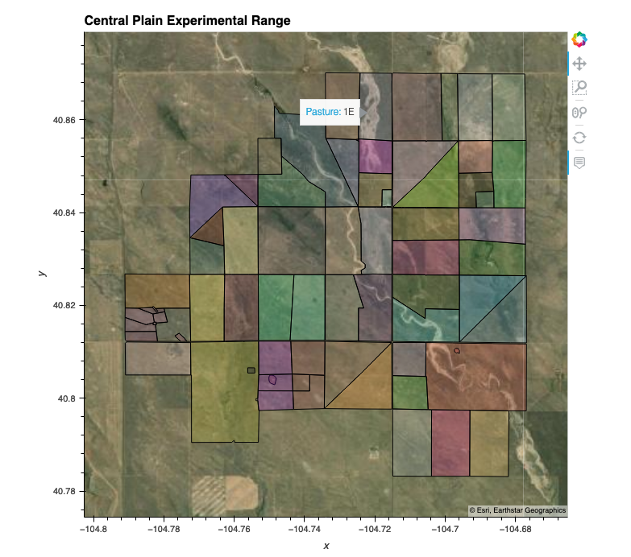
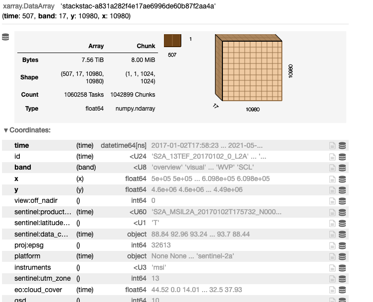
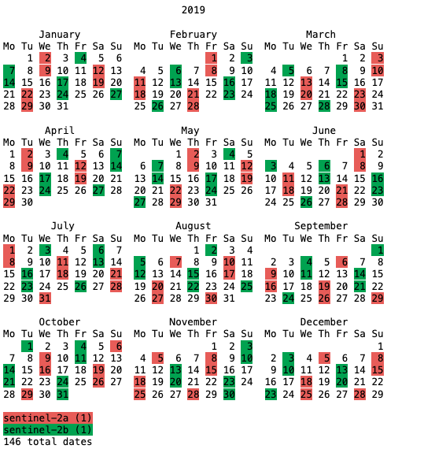
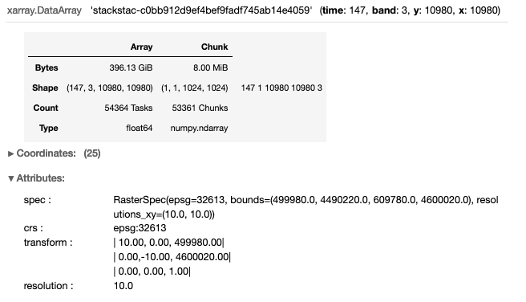
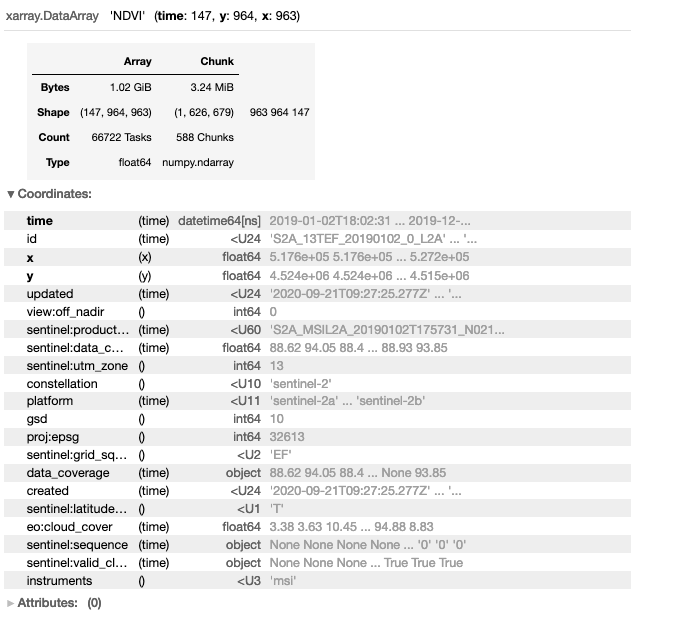
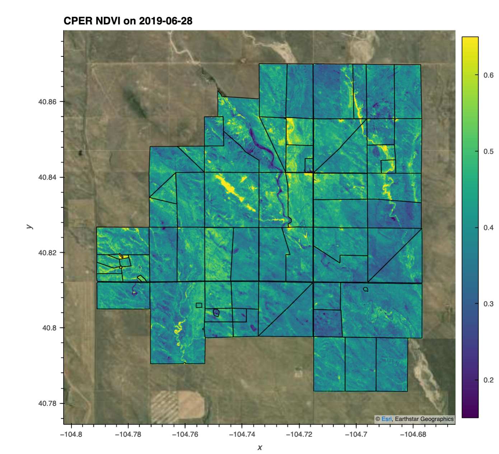
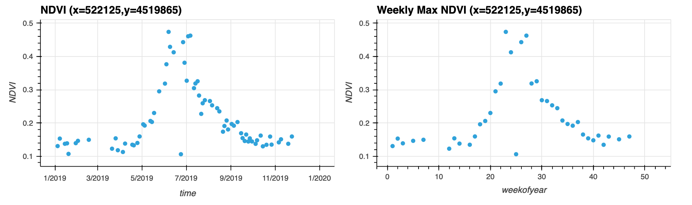
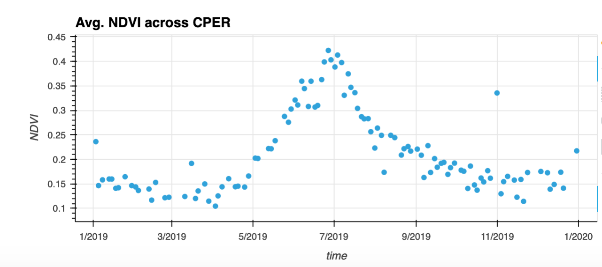

# Importing Images from Sentinel 2 satellite  

## Overview

Accessing, downloading, stacking, and working with earth observations (EO) data can be time-consuming, tedious, and generally in-efficient. Here we show how to leverage a SpatioTemporal Asset Catalog (STAC) to streamline the process of working with EO data.

## Primary Libraries/Packages:

|Name|Description|
|-|-|-|
|[xarray](http://xarray.pydata.org/en/stable/)|Labelled multi-dimensional arrays|
|[hvplot](https://hvplot.holoviz.org/)|High-level plotting API built on [HoloViews](https://holoviews.org/)
|[geopandas](https://geopandas.org/)|Extends [Pandas](https://pandas.pydata.org/) to allow spatial operations on geometric types|
|[stackstac](https://stackstac.readthedocs.io/en/latest/)|Turns a STAC collection into a lazy xarray.DataArray, backed by dask.
|[satsearch](https://github.com/sat-utils/sat-search)|Discovering/downloading satellite imagery using a STAC compliant API.|

## Nomenclature

  * *SpatioTemporal Asset Catalog (STAC)*: A ~json catalog to standardize the way geospatial asset metadata is structured and queried.
  * *Lazy Loading*: Delaying the loading of data until the object is called/computed. This can improve performance and reduce system resource use.
  * *Transform/Affine*: A matrix that maps the pixels in a raster to physical coordiantes (x, y). This consists of six elements, upper-left x coordinate, upper-left y coordinate, w-e pixel resolution, n-s pixel resolution, row rotation (typically zero), and the column rotation (typically zero).
  * *Amazon Web Services (AWS)*: Cloud computing platform by Amazon.
  * Amazon Simple Storage Service (S3): The AWS object storage service.
  * *Sentinel 2*: Two polar-orbiting satellites monitoring variability in land surface conditions. The revisit freqency is 5-days at the equator and 2-3 days at mid-latitudes.
  * *Central Plains Experimental Range (CPER)*: A research station in the Long Term Agro-ecosystem Research (LTAR) network operated by the USDA ARS.
  * *Military Grid Reference System (MGRS)*: Grid system used to tile Sentinel 2 data products.
  * *Normalized Difference Vegetation Index (NDVI)*: A spectral index using the Red and Near Infrared spectra to estimate green (photosynthetically active) vegetation.
  * *Cloud Optimized Geotiff (COG)*: A GeoTiff file that has a specialized internal organization that enables cloud computing workflows.

## Data Details

  * Repository: [AWS](https://registry.opendata.aws/)
  * Data: [Sentinel 2 L2A](https://sentinel.esa.int/web/sentinel/user-guides/sentinel-2-msi/product-types/level-2a)
  * Link: https://registry.opendata.aws/sentinel-2-l2a-cogs/
  * [STAC Catalog Viewer](https://stacindex.org/catalogs/earth-search#/Cnz1sryATwWudkxyZekxWx6356v9RmvvCcLLw79uHWJUDvt2)

## Analysis Steps
  1. **[Define the ROI](#roi)**
    - Read a shapefile of the USDA ARS LTAR Central Plains Experimental Range. This will be the region of interest (ROI) for this tutorial
  2. **[STAC Search Query Function](#stac_func)**
    - Define a function to Query a STAC catalog. Inputs are:
      - url of the catalog
      - dataset/collection
      - dates range of interest
      - bounding box
  3. **[Query Sentinel 2 Catalog](#stac1)**
    - Selects from the catalog for MRGS tiles that interest our ROI (see step 1)
    - Use the query results (python dictionary) to create an xarray object
  4. **[Query Sentinel 2 Catalog for 2019](#stac2)**
    - Selects from the catalog for MRGS tiles that interest our ROI (see step 1)
    - Limit the data to scenes (MRGS tiles) to the year 2019 (e.g. 2019-01-01 - 2019-12-31).
    - Use the query results (python dictionary) to create an xarray object. Subset to the Red, NIR, and QA bands.
  5. **[Subset and Mask to the CPER ROI](#subset)**
    - Using the xarray object from Step 4, clip the xarray object to the ROI (CPER bounding box).
    - Apply a mask using the CPER shapefile (pixels outside the shapefile will be changed to null).
  6. **[Apply QA Band & Calculate NDVI](#ndvi)**
    - Apply the QA band to the NIR and Red bands to remove "bad pixels" (i.e. clouds, water, snow, ice, etc...)
    - Calculate the Normalized Differenced Vegetation Index (NDVI)
  7. **[Explore and Plot](#plot)**
    - Bring data to memory (e.g. download from AWS) using `.compute()`.
    - Select a single time-step (2019-06-28) and plot the image.
    - Select a single pixel to get a time-series and plot the time series.
    - Calculate the average NDVI per time step and plot the time series.

### Step 0: Import Libraries / Packages


```python
import warnings
warnings.filterwarnings('ignore')
import holoviews as hv
hv.extension('bokeh')
import hvplot.xarray,hvplot.pandas,stackstac
import xarray as xr
import numpy as np
import geopandas as gpd
from rasterio import features,transform
from pprint import pprint
from satsearch import Search
```

### Step 1: Define the ROI

Read a shapefile of the USDA ARS LTAR Central Plains Experimental Range. This will be the region of interest (ROI) for this tutorial.

If you are new to geosptial data or not familiar with the idea of "projections", please see:  
Projections Tutorial: https://datacarpentry.org/organization-geospatial/03-crs/  
EPSG Site: https://epsg.io/

```python
# Read the shapefile into the geopandas dataframe
cper_shp = gpd.read_file('https://raw.githubusercontent.com/rmg55/test_dashboard/master/data/cper.geojson')

# Get the bounds of the shapefile (ROI) in both espg:4326 (geographic - lat. and long.) and epsg:32613 (projected - cartesian coords. in meters)
#This bounding box will be used to find Sentinel Tiles that intersect with our ROI
cper_bnds_4326 = cper_shp.to_crs(4326).total_bounds

#This bounding box will be used to clip the Sentinel L2A tiles to the extent our our ROI
cper_bnds_32613 = cper_shp.to_crs(32613).total_bounds

#Plot the shapefile/ROI
cper_shp.rename(columns = {'Past_Name_':'Pasture'}).hvplot(crs=32613,
                                                           alpha=.2,
                                                           line_alpha=1,
                                                           hover=True,
                                                           tiles='ESRI',
                                                           c='Pasture',
                                                           legend=False,
                                                           title='Central Plain Experimental Range',
                                                           frame_width=600)
```

Plot of the shape file :



### Step 2: STAC Search Query Function

Define a function to Query a STAC catalog. Inputs are:
 - url of the catalog
 - dataset/collection
 - date range of interest
 - bounding box


```python
def get_STAC_items(url, collection, dates, bbox):
    results = Search.search(url=url,
                            collections=collection,
                            datetime=dates,
                            bbox=bbox)
    return(results)
```

### Step 3: Query Sentinel 2 Catalog
- Selects from the catalog for MRGS tiles that interest our ROI (see step 1)
- Use the query results (python dictionary) to create an xarray object

Note that this is using a lazy-loading approach, where only the metadata is read from the files/stac catalog, rather than downloading the entire **7.52 TB** dataset.


```python
# Define the parameters to search the STAC catalog
url = 'https://earth-search.aws.element84.com/v0'
collection = ['sentinel-s2-l2a-cogs']
bbox=list(cper_bnds_4326)
dates = '1901-01-01/2090-12-31' #Ge the entire data range of the data.

# Query the catalog
stac_items = get_STAC_items(url,collection,dates,bbox).items()

# Transform into an Xarray object
stackstac.stack(stac_items.geojson()['features'])
```



### Step 4: Query Sentinel 2 Catalog for 2019

- Selects from the catalog for MRGS tiles that interest our ROI (see step 1)
- Limit the data to scenes (MRGS tiles) to the year 2019 (e.g. 2019-01-01 - 2019-12-31).
- Use the query results (python dictionary) to create an xarray object. Subset to the Red, NIR, and QA bands.

The dataset is reduced to **396 GB** (from 7.52 TB) by subseting the data to 2019 and selecting the 3-bands of interest for our analysis.


```python
# Define the parameters to search the STAC catalog
url = 'https://earth-search.aws.element84.com/v0'
collection = ['sentinel-s2-l2a-cogs']
bbox=list(cper_bnds_4326)
dates = '2019-01-01/2019-12-31' #Just 2019

# Query the catalog
stac_items = get_STAC_items(url,collection,dates,bbox).items()

# Lets look at a calendar
print(stac_items.calendar())
```



```python
# Lets examine a single asset (band) within a single STAC Item (date)
stac_dict = stac_items.geojson()
pprint(stac_dict['features'][0]['assets']['B04'])
```

```python
# Transform into an Xarray object and read only the 3 bands we want (Red, NIR, and QA)
da = stackstac.stack(stac_dict['features'],assets=['B04','B08','SCL'])
da
```


### Step 5: Subset and Mask to the CPER ROI


- Using the xarray object from Step 4, clip the xarray object to the ROI (CPER bounding box).
- Apply a mask using the CPER shapefile (pixels outside the shapefile will be changed to null).

The dataset is reduced to 3.05 GB (from 396 GB) by clipping the data the bounding box of the ROI. Note that we use two functions to "mask" the data that falls within the ROI bounding box, but outside the domain (perimeter) of the CPER. The first function xr_2_affine, takes an xarray object, and calculates the affine transform (see nominclature section). The second function, shp2mask, rasterizes a shapefile (0's=outside and 1's=inside the shapefile) to match the same dimensions of the xarray object.

```python
# Get the bounds in epsg:32613 and apply to the xarray object
minx,miny,maxx,maxy = cper_bnds_32613
da_cper = da.sel(x=slice(minx,maxx),y=slice(maxy,miny)).rename('CPER')
da_cper
```


```python
# Function to calculate the affine transform from an xarray object
def xr_2_affine(ds):
    x_size = len(ds.x)
    y_size = len(ds.y)
    x_scale = np.abs(np.diff(ds.x).mean())
    y_scale = np.abs(np.diff(ds.y).mean())
    upperleft_x = ds.x.min() - x_scale
    upperleft_y = ds.y.max() + y_scale
    return(transform.Affine(x_scale,0.0,upperleft_x,0,-y_scale,upperleft_y))

# Define a function to mask the xarray object with a shapefile
def shp2mask(shp,xr_object,fill=0, **kwargs):
    raster = features.rasterize(shp, fill=fill,
                                transform=xr_2_affine(xr_object),
                                out_shape=xr_object.isel(time=0,band=0).cper.shape,
                                dtype='int16',
                                **kwargs)
    return xr.DataArray(raster,
                        coords=(xr_object.coords['y'].values,
                                xr_object.coords['x']),
                        dims=('y', 'x'))
```


```python
### Create a Mask ###
# Convert DataArray to DataSet
da_cper = da_cper.to_dataset(name='cper')
# Create a single polygon to use as a mask
cper_shp_mask = cper_shp.dissolve().buffer(100).buffer(-100).geometry.values
# Add CPER mask (a DataArray) to the DataSet
da_cper['cper_mask'] = shp2mask(cper_shp_mask,da_cper)

# Apply the CPER mask and remap the data back to DataArray (from a DataSet)
da_cper = da_cper.cper.where(da_cper.cper_mask==1)
```
### Step 6: Apply QA Band and Calculate NDVI

- Apply the QA band to the NIR and Red bands to remove "bad pixels" (i.e. clouds, water, snow, ice, etc...)
- Calculate the Normalized Differenced Vegetation Index (NDVI)

The dataset is reduced to **1.02 GB** by reducing the bands from red, nir, and QA/QC to just NDVI.


```python
# Apply the QA band
mask = da_cper.sel(band='SCL').isin([4,5])
da_cper = da_cper.where(mask).sel(band=['B04','B08'])

# Calculate NDVI
Red = da_cper.sel(band='B04')
NIR = da_cper.sel(band='B08')
da_cper_ndvi = (NIR - Red) / (NIR + Red)
da_cper_ndvi = da_cper_ndvi.rename('NDVI')
da_cper_ndvi
```



### Step 7: Explore and Plot

- Bring data to memory (e.g. download from AWS) using `compute()`.
- Select a single time-step `2019-06-28` and plot the image.
- Select a single pixel to get a time-series and plot the time series.
- Calculate the average NDVI (across CPER) per time step and plot the time series.

```Python
# Bring data to memory (e.g. download from AWS)
# Depending on your internet speed, this can take 10's of seconds - ~ 5 minutes
da_cper_ndvi = da_cper_ndvi.compute()
```
```Python
# Query a single date / image
t = '2019-06-28'
da_cper_ndvi_plot = da_cper_ndvi.sel(time=t)

# Plot the image as well as the CPER shape file (showing pastures)
da_cper_ndvi_plot.squeeze().hvplot(x='x',
                                   y='y',
                                   tiles='ESRI',
                                   crs=32613,
                                   cmap='viridis',
                                   clim=(.15, .65),
                                   title='CPER NDVI on '+t,
                                   frame_width=600) * \
cper_shp.hvplot(crs=32613,
                alpha=0,
                line_alpha=1,
                hover=False)
```



```python
# Quey a single pixel, for all the time steps
da_cper_ndvi_ts = da_cper_ndvi.where(da_cper_ndvi>.1).isel(x=450,y=450).rename('NDVI')

# Plot the raw time series as well as a weekly max time series
pt_str = '(x='+str(int(da_cper_ndvi_ts.x.values))+',y='+str(int(da_cper_ndvi_ts.y.values))+')'
da_cper_ndvi_ts.hvplot(x='time',
                       kind='scatter',
                       title='NDVI '+pt_str,
                       width=500,
                       grid=True) + \
da_cper_ndvi_ts.groupby('time.weekofyear').max().hvplot(kind='scatter',
                                                        title='Weekly Max NDVI '+pt_str,
                                                        width=500,
                                                        grid=True)
```



```Python
# Get the mean for the entire Domain at each time step
da_cper_ndvi_tsall = da_cper_ndvi.where(da_cper_ndvi>.1).mean(dim=['x','y'])

# Plot the NDVI time series
da_cper_ndvi_tsall.hvplot(x='time',
                          kind='scatter',
                          title='Avg. NDVI across CPER',
                          grid=True,colorbar=True)

```


### Concluding Remarks:

A traditional workflow would involve downloading individual tiles that intersect the ROI, which for 2019, would be 396 GB, and then subsetting the data once it is in local storage. Assuming a download speed of 100 Mbps, this approach would take ~8.8 hours to simply download all the tiles. Here we have shown how to leverage a SpatioTemporal Asset Catalog to analyze EO data. The data is stored in Cloud Optimized Geotiffs (COGs), which allows efficient data access to particular chunks of the file (via http range requests). Using python packages that "lazily loading" the data, we are able to efficiently build out a workflow to subset, mask, and apply calculations (NDVI) before beginning the process of downloading the data. Finally, we "compute" the results into memory (Step 7), and are able to work with a much more managable dataset (1.0 GB).
