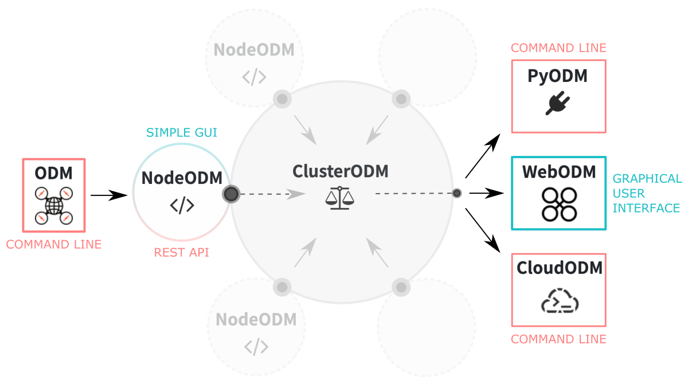
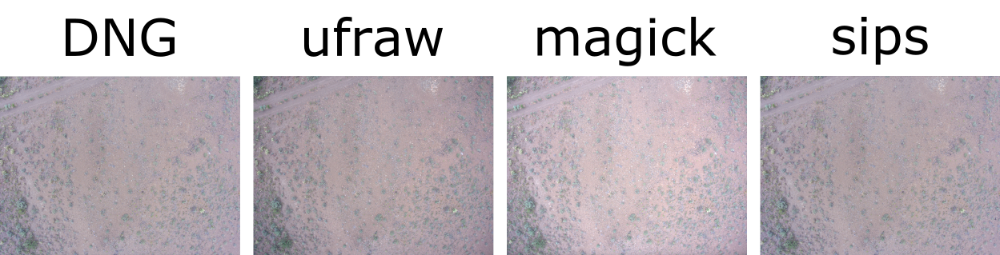



# Introduction

[OpenDroneMap](https://www.opendronemap.org) is open-source software for processing aerial imagery. In simple terms, it enables digital 3D mapping of objects using overlapping photos showing the scene from different perspectives. Although there are many practical applications, here we will focus on the use of OpenDronMap for processing **drone-taken photos of agricultural land areas** for mapping crops and monitoring woodlands.

<div style="background: #cff4fc; padding: 15px;">
<span style="font-weight:800;">PRO TIP:</span>
<br><span style="font-style:italic;">
<b>OpenDroneMap</b> is still an actively developing project. To stay up to date with recent releases and new features check out the blog: <a href="https://www.opendronemap.org/blog/" style="color: #3f5a8a;">https://www.opendronemap.org/blog/</a>.
</span>
</div><br>


OpenDroneMap project has gained scale that is accompanied by a growing community: <a href="https://community.opendronemap.org">https://community.opendronemap.org</a>.
<span style="color: #ff3870; font-weight: 600;">Do not hesitate to <u>actively join</u> both when you have questions or developed solutions that enrich the <u>user community</u>.</span>


# OpenDronMap Modules

**OpenDroneMap** is not a single software but rather a modular package that combines individual components which can be assembled in various configurations to meet the needs of a wide range of users and their computing setups.

<br>
**Figure 1.** OpenDroneMap project includes several modules: **ODM** is the core of software that can be run directly from the command line; **NodeODM** is a communication channel between components; **ClusterODM** allows management of multiple ODM nodes; **WebODM** is a web-based graphical user interface; **CloudODM** faciliotates in-cloud computations; **pyODM** enables incorporation of ODM into the customized  applications.


## ODM

The **[ODM](https://www.opendronemap.org/odm/)** is analytical core of the OpenDroneMap software. It is an open source toolkit that actually process aerial images. The ODM module can be **run directly from the command line** on a local machine or remotely on HPC infrastructure. It generates a complete set of files organized in hierarchical directories (**point clouds, 3D textured models, georeferenced ortophotos and elevation models**). Unfortunately, in this approach there is **NO support to create web tiles** [�](https://community.opendronemap.org/t/import-odm-output-into-webodm-and-2d-google-map-tiles/2653). Thus, the analysis results cannot be directly opened in the complementary WebODM graphical interface. But the files can be still visualized in external software that supports the given format. The other modules of the package are higher-level layers that facilitate the use of the software, but they always call out functions from the built-in ODM core.

To learn how to run **ODM from the command line**, and specifically on HPC infrastructure such as SCINet clusters, go to the hands-on tutorial: [Command-line ODM modules](https://geospatial.101workbook.org/IntroPhotogrammetry/OpenDroneMap/02-ODM-modules).

## WebODM

The **[WebODM](https://www.opendronemap.org/webodm/)** is a **web-based graphical user interface** (GUI) for the OpenDroneMap software. In the back-end, it employs by default a single NodeODM to facilitate communication with a built-in ODM core. It generates an identical set of outputs to ODM on the command line, but it also **automatically creates web tiles**, so it is possible to **visualize the results** directly in the graphical interface. Other features include project management and the ability to **reopen and/or restart tasks**. There is also a built-in tool for **creating grand control points**.<br>
In general, after start the GUI is available on localhost (port 8000) in a web browser directly on the machine on which WebODM is running. That's why it's a perfect solution **when working on a local machine**. WebODM can also be available **remotely on HPC infrastructure through the OpenOn Demand service**. Depending on the admins' configuration, it will probably have more processing nodes (multiple NodeODM instances) added, which will increase computing performance. *Adding more processing nodes enables to run of many jobs in parallel.*

To learn how to run **graphical interface of the WebODM** on your local machine or remotely using Open OnDemand service on HPC infrastructure (such as SCINet clusters), go to the hands-on tutorial: [WebODM: web-based graphical interface](https://geospatial.101workbook.org/IntroPhotogrammetry/OpenDroneMap/01-WebODM).

<!--## NodeODM

## ClusterODM

## CloudODM

## pyODM -->


# Prepare input imagery

As of now (2022), OpenDroneMap only supports imagery inputs in **JPEG** (JPG) and **TIFF** (8 and 16-bit) formats. In some cases, WebODM successfully performs analysis for **PNG** files as well, but the reconstruction performance is worse than using JPEG.

Using raw image formats such as **DNG is NOT currently possible**. Therefore, if you have data of such type it is necessary to **convert the photos** to one of the supported formats, preferably JPEG. Follow the instructions in the next section: [DNG to JPG conversion](), to learn how to effectively convert raw DNG files to JPG to preserve the highest possible resolution.

Sometimes the conversion of the graphic format results in the loss of metadata, especially geolocation details. Without this data, creating **georeferenced results** (i.e., orthophotos, geoTIFF, digital elevation models) with OpenDroneMap will not be possible. In the next section: [Keep EXIF GEO metadata](), you will learn **how to copy EXIF metadata** including geolocation, from the original raw files to JPG files.

## DNG to JPG batch conversion

Changing the file format can easily be done in many graphics programs with a visual interface, such as <a href="https://www.gimp.org" target="_blank">GIMP</a>. Unfortunately, this usually means having to edit individual files one by one, and with a vast number of files, this is an overkilling task. So it's good to know that you can automate the procedure for **converting any number of files on the command line**.

I have tested various options for converting the raw DNG images into the format allowed as input for WebODM (JPG, PNG, TIF). Based on the preliminary tests performed on the set of 20 photos, three tools are suitable:
* `ufraw`, command-line, easily installable on any system
* ImageMagick (`magick`), command-line, easily installable on any system
* macOS Preview (`sips`), available on macOS, usage from the command-line or graphical interface

The summary of results is provided in the table below, and some visual glimpses are in the pictures below.

| conversion tool:   | magic | magic | magic | ufraw | ufraw | ufraw | sips (macOS) | sips (macOS) |
|--------------------|-------|-------|-------|-------|-------|-------|--------------|--------------|
| format             | JPG   |**JPEG**| PNG  | JPG   | PNG   | TIF   | JPG          | PNG          |
| size               | 19MB  | 19MB  | 64MB  | 2.5MB | 21MB  | 36MB  | 3.6MB        | 45MB         |
| resolution         |4000×3000|4000×3000|4000×3000|4000×3000|4000×3000|4000×3000|3992×2992|3992×2992|
| colors             |brighter|brighter|brighter|darker|darker|darker| original     |original      |
| used Exiftool      | YES   | YES   | YES   |  YES  | YES   | YES   | NO           | NO           |
| **WebODM success** | YES   | YES   | FAILED|  YES  | YES   | YES   | YES          | FAILED       |
| visual quality     | good  | good  | -     | good  | low   | broken| good         | -            |
| no. points rebuilt | 5,31 M|**5,37 M**| -     | 1,24 M| 3,26 M| 1,00 M| 4,39 M    | -            |
| average GSD        |1.62 cm|1.63 cm| -     |1.9 cm |0.72 cm| -     | 1.52 cm      | -            |
| area               |1,224 m²|1,222 m²| -   |1,283 m²|1,299 m²|36.01 m²| 1,343 m²  | -            |

^ original DNG size ~24MB/photo with resolution 3992 × 2992

In short, the most universal and ensuring best performance is `magick` with conversion into the JPG or JPEG format. The size and resolution of the files after conversion are almost the same (24MB DNG vs. 19MB JPG). The only inconvenience is that the color is slightly brighter than the preview of the original DNG. Please review in the picture below the color changes after conversion of the image format.

<br>

Despite the altered color intensity, `magick` came with the highest performance when reconstructing a 3D model from photos *(highest number of rebuilt points, high average GSD, large area)*, so it is a recommended method. However, below you will also find usage instructions for the other tools.


<div style="background: #cff4fc; padding: 15px;">
<span style="font-weight:800;">PRO TIP:</span>
<br>
If you are working on a computing machine with multiple cores, it will be advantegous to use the GNU parallel module, which will parallelize the conversions of many files and save your time.<br>
If running the command throws an error: <i><b>"error: 'parallel' command not found"</b></i>, it means that you do not have the <i>parallel</i> module installed/loaded into your environment.<br>
</div><br>

* **install parallel on macOS:**
```
brew install parallel
```

* **install parallel on Linux:**
```
sudo apt-get install parallel
```

* **load parallel module on HPC:**
```
module load parallel
```

### using **magic**

Learn more about the **ImageMagick** tool at <a href="https://imagemagick.org" target="_blank">https://imagemagick.org</a> <br>
Follow **installation** instructions at <a href="https://imagemagick.org/script/download.php" target="_blank">https://imagemagick.org/script/download.php</a>

**install magic on macOS:**

```
brew update
brew install imagemagick
```

**install magic on Linux:**

```
sudo apt update
sudo apt install imagemagick
```

**install magic on Windows:**

Download ready-to-run executable from: <a href="https://imagemagick.org/script/download.php#windows" target="_blank">https://imagemagick.org/script/download.php#windows</a>

<div style="background: #cff4fc; padding: 15px;">
<span style="font-weight:800;">PRO TIP:</span>
<br>
The <b>ImageMagick</b> is a toolkit composed of several utilities for manipulating images. Once installed you can run them directly on the command line by calling specific commands, such as <i><b>magi</b>c, animate, compare, composite, conjure, convert, display, identify, import, mogrify, montage, stream</i>. You can learn more about their use from the documentation: <a href="https://imagemagick.org/script/command-line-tools.php" target="_blank" style="color: #3f5a8a;">ImageMagick Command-line Tools</a>.
</div><br>


**DNG to JPG batch conversion using <i>magic</i>:**

```
# run magic in a loop

for i in *.DNG
do
    magick -quality 100 -define dng:use-camera-wb=true $i "${i%DNG}jpg"
done
```

```
# run magic in parallel

ls *.DNG | sed 's/DNG//g' | parallel magick -quality 100 -define dng:use-camera-wb=true {}DNG {}JPG
```
*^ `-quality 100` - the option sets the JPEG quality to 100%. You can customize it as much as you like.* <br>
*^ `-define dng:use-camera-wb=true` - the option adjust colors to match the original.*


### using **ufraw**

Learn more about the **UFRaw** *(Unidentified Flying Raw)* tool at <a href="http://ufraw.sourceforge.net" target="_blank">http://ufraw.sourceforge.net</a> <br>
Follow system-specific **installation** instructions at <a href="http://ufraw.sourceforge.net/Install.html" target="_blank">http://ufraw.sourceforge.net/Install.html</a>

**DNG to JPG batch conversion using <i>ufraw</i>:**

```
# run ufraw in a loop

for i in *.DNG
do
    ufraw-batch --wb=camera --exposure=auto --out-depth=8 --out-type=jpg --output "${i%DNG}jpg" $i
done
```

```
# run ufraw in parallel

ls *.DNG | sed 's/DNG//g' | parallel ufraw-batch --wb=camera --exposure=auto --out-depth=8 --out-type=jpg --output {}jpg {}DNG
```

### using **sips** (macOS)

The `sips` command comes pre-installed on macOS. Simply open a terminal window and copy-paste one of the code snippet given below. The advantage of this solution is also that **sips automatically copies the EXIF metadata** to the file in the new format.

**DNG to JPG batch conversion using <i>sips</i>:**

```
# run sips in a loop

for i in *.DNG
do
    sips -s format jpeg -s formatOptions 100 "${i}" --out "${i%DNG}jpg"
done
```

```
# run sips in parallel
ls *.DNG | sed 's/DNG//g' | parallel sips -s format jpeg -s formatOptions 100 {}DNG --out {}jpg
```
*^ `-s formatOptions 100` - the option sets the JPEG quality to 100%. You can customize it as much as you like.*

## Keep EXIF GEO metadata

It often happens that EXIF *(Exchangeable Image File Format)* metadata, especially geolocation data, is lost when converting image files. Whether GEO data, such as *Latitude* or *Longitude*, is recorded in the file's metadata you can easily check in the image preview. All you have to do is right-click and select *'Get info'* or *'Image properties'* from the menu that appears.

<br>

<div style="background: #cff4fc; padding: 15px;">
<span style="font-weight:800;">PRO TIP:</span>
<br>
You can also use the <b><a href="https://www.gimp.org" target="_blank">GIMP</a></b> tool with a graphical interface to check whether your converted images have geolocation data. Open an image with GIMP and select the options in order: <br>
<b>Image → Metadata → View Metadata</b>, then click on the <b>EXIF</b> tab, and search for <i>GPSAltitude, GPSLatitude,</i> and <i>GPSLongitude</i> tags.
</div><br>

If the original photo (e.g., DNG) contains GEO metadata, but the file after conversion (e.g. JPG) does not have these tags or they are empty, you have to copy this data manually. You can easily automate this procedure and apply it to batch files using the `Exiftool` command-line tool.

Learn more about the **ExifTool** tool at <a href="https://exiftool.org" target="_blank">https://exiftool.org</a><br>
Download source code and follow system-specific **installation** instructions at <a href="https://exiftool.org/install.html" target="_blank">https://exiftool.org/install.html</a>

**copy EXIF tags from original images using <i>exiftool</i>:**

```
# run exiftool in a loop

for i in *.DNG
do
    exiftool -overwrite_original_in_place -tagsFromFile $i "${i%DNG}jpg"
done
```

```
# run exiftool in parallel

ls *.DNG | sed 's/DNG//g' | parallel exiftool -overwrite_original_in_place -tagsFromFile {}DNG {}jpg
```

**add EXIF tags from a text file using <i>exiftool</i>:**

You can also use `exiftool` to add geolocation information to the image metadata by copying it from the column-like text files. First, prepare a text file with the data by properly ordering and formatting the columns:

```
SourceFile  GPSLatitude  GPSLongitude  GPSAltitude  GPSLatitudeRef  GPSLongitudeRef  GPSAltitudeRef
image1.JPG  43.3565900   116.4459442   198.609      N               W                0
image2.JPG  43.3524584   116.4458293   198.609      N               W                0
```

^ the first column should contain the names of your images; you can easily create the list of filenames using the `ls` command and redirecting the output into the ` > gps.csv`.

Once the file is ready, execute the `exiftool` with the following configuration:

```
exiftool -GPSLatitude -GPSLongitude -GPSAltitude -GPSLatitudeRef -GPSLongitudeRef -GPSAltitudeRef -csv="gps.csv" -o geo_output/ input_images/
```

^ `input_images` is a directory with input imagery <br>
^ `geo_output` is a directory with geotagged output imagery <br>
^ `gps.csv` should be stored in a current directory (i.e., a parent dir for both `input_images` and `geo_output`)


Now that you have a complete imagery in the ODM-supported format (JPG/JPEG/TIFF) and all of them are properly geotagged, you can take one of the following **hands-on tutorials to perform your geospatial analysis using OpenDroneMap** software:
* [WebODM: web-based graphical user interface](01-WebODM)
* [Command-line ODM modules](02-ODM-modules)

___
# Further Reading
* [WebODM: web-based graphical user interface](01-WebODM)
* [Command-line ODM modules](02-ODM-modules)


___

[Homepage](../index.md){: .btn  .btn--primary}
[Section Index](../00-IntroPhotogrammetry-LandingPage){: .btn  .btn--primary}
[Next](01-WebODM){: .btn  .btn--primary}
