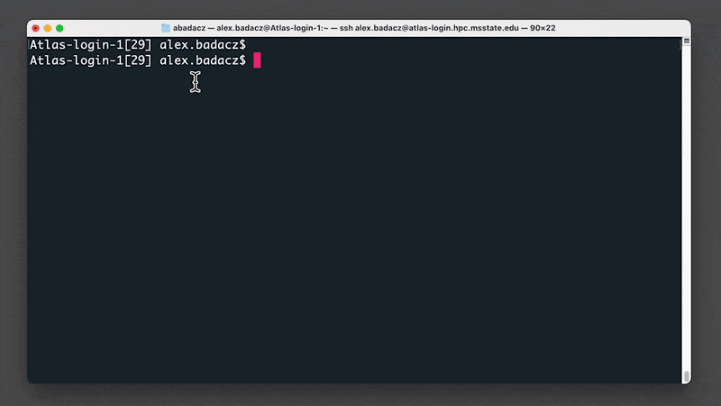
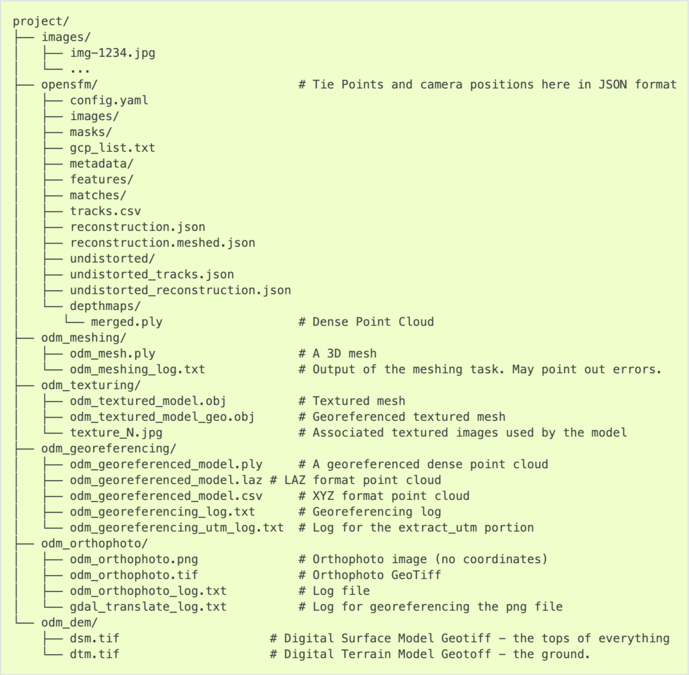




# Getting started with ODM

ODM stands for OpenDroneMap, an **open-source** photogrammetry software. OpenDroneMap project includes several modules which facilitate geospatial analysis in customized configurations of available computing power and for projects of different scales. The [OpenDroneMap/ODM](https://www.opendronemap.org/odm/) [[GitHub](https://github.com/OpenDroneMap/ODM)] module is the analytical core of the software. Typically it is employed by the higher-level layers of other OpenDroneMap products that provide a graphical user interface or manage analysis configuration and task scheduling *(learn more in the [Introduction to OpenDroneMap](https://geospatial.101workbook.org/IntroPhotogrammetry/OpenDroneMap/00-IntroODM) section of the [Geospatial Workbook](https://geospatial.101workbook.org)*.

The point is that you can **directly use the ODM module on the command line** in the terminal for drone imagery mapping. This tutorial will take you **step-by-step** through creating an efficient file structure and setting up a script to send the job to the SLURM queue on an HPC cluster, which will allow you **to collect all the results** of the photogrammetric analysis with OpenDroneMap.

<span style="color: #ff3870;font-weight: 500;">
The complete workflow includes photo alignment and generation of the dense point cloud (DPC), elevation models (DSMs & DTMs), textured 3D meshes, and orthomosaics (georeferenced & orthorectified).
</span>
<b>Note that in this approach there is NO support to create web tiles</b>. So, the results can not be directly opened in the complementary WebODM graphical interface. But, the files can be still visualized in external software that supports the given format.

# Run ODM in the command line <br><i>using Atlas cluster of the SCINet HPC</i>

## **Create file structure**

The ODM module for the command-line usage requires the specific file structure to work without issues. Specifically, it requires that input imagery be in the `code/images` subdirectories structure of the working directory for a given project.

To facilitate proper path management, I suggest creating the core of ordered file structure for all future projects. Let's say it will be the **ODM** directory, serving as a working directory for all future ODM analyses. It should contain two main subdirectories: IMAGES and RESULTS. In the **IMAGES** directory, you will create a new folder with a unique name for each new project, where you will place photos in JPG format *(e.g., ~/ODM/IMAGES/PROJECT-1)*. In the **RESULTS** directory, when submitting an ODM task into the SLURM queue, a subdirectory with ODM outputs will be automatically created for each project. And there, also automatically, an `code/images` subdirectories will be created with soft links to photos from the relative project.

<div style="background: #cff4fc; padding: 15px;">
<b>ODM/</b> &emsp;&emsp;&emsp;&emsp;&emsp;&emsp;&emsp;&emsp;&ensp;<i>(storage directory for all future ODM projects)</i><br>
|― run_odm.sh &emsp;&emsp;&emsp;&emsp; <i>(SLURM job submission script)</i> <br>
|― <b>IMAGES/</b> <br>
 &emsp;&nbsp; |― <b>PROJECT-1/</b> &emsp;&emsp;&ensp;<i>(directory with images in JPG format and geo.txt file with GCPs)</i> <br>
 &emsp;&nbsp; |― <b>PROJECT-2/</b> <br>
|― <b>RESULTS/</b> &emsp;&emsp;&emsp;&emsp;&emsp;<i>(parent directory for ODM analysis outputs)</i> <br>
<span style="color: #8ca3a8;">
&emsp;&nbsp; |― PROJECT-1-tag/ &ensp; <i>(automatically created directory with ODM analysis outputs)</i> <br>
&emsp; &nbsp;&emsp;&nbsp; |― code/ &emsp;&emsp;&emsp; &ensp; <i>(automatically created dir for analysis outputs; <u>required!</u>)</i> <br>
&emsp; &emsp;&emsp; &emsp; |― images/ &emsp; <i>(automatically created dir with soft links to JPG images)</i> <br>
</span>
</div><br>

This way, if you want to perform several analyses with different parameters on the same set of images, you will not need to have a hard copy for each repetition. Instead, you will use soft links to the original photos stored in the IMAGES directory. **That will significantly save storage space and prevent you from accidentally deleting input imagery when resuming the analysis in the working directory.**

<br><span style="color: #ff3870;font-weight: 600; font-size:24px;">
To set up the file structure for ODM analysis follow the steps in the command line:
</span><br>

**0.** Open the terminal window on your local machine and login to the SCINet Atlas cluster *(or any HPC infrastructure)* using the `ssh` command and respective hostname:

```
ssh <user.name>@atlas-login.hpc.msstate.edu
```

Then, enter on the keyboard your 1) [multi-factor authenticator](https://scinet.usda.gov/guide/multifactor/) number (6 digits), followed by 2) password in a separate prompt.

<p align="center"></p>

*^ Note that when entering the identification code and password, the characters are not visible on the screen.*

<div style="background: #cff4fc; padding: 15px;">
<span style="font-weight:800;">PRO TIP:</span>
<br><span style="font-style:italic;">
If you happen to forget the hostname for the Atlas cluster, you can save the login command to a text file in your home directory on your local machine: <br><br>
<span style="color: black;font-weight: 600;">
$ echo "ssh user.name@atlas-login.hpc.msstate.edu" > ~/login_atlas <br><br>
</span>
Then every time you want to log in, just call the name of this file with a dot and space preceding it: <br><br>
<span style="color: black;font-weight: 600;">
$ . ~/login_atlas <br><br>
</span>
You can also review the HPC clusters available on SCINet at <a href="https://scinet.usda.gov/guide/quickstart#hpc-clusters-on-scinet" style="color: #3f5a8a;">https://scinet.usda.gov/guide/quickstart#hpc-clusters-on-scinet</a>.
</span>
</div><br>


**1.** Once logged in to Atlas HPC, go into your group folder in the `/project` location
```
cd /project/<your_account_folder>/

# e.g., cd /project/90daydata
```

<div style="background: #cff4fc; padding: 15px;">
<span style="font-weight:800;">PRO TIP:</span>
<br><span style="font-style:italic;">
If you do not remember or do not know the name of your group directory in <b>/project</b> location, try the command: <br><br>
<span style="color: black;font-weight: 600;">
$ ls /project
</span><br><br>
That will display all available group directories. You can search for suitable ones by name or you can quickly filter out only the ones you have access to: <br><br>
<span style="color: black;font-weight: 600;">
$ ls /project/* 2> /dev/null
</span><br><br></span>
</div><br>

<div style="background: mistyrose; padding: 15px;">
<span style="font-weight:800;">WARNING:</span>
<br><span style="font-style:italic;">
Note that you do NOT have access to all directories in the <b>/project</b> location. You also can NOT create the new directory there on your own. All users have access to <b>/project/90daydata</b>, but data is stored there only for 90 days and the folder is dedicated primarily to collaborative projects between groups. If you do NOT have access to your group's directory or need a directory for a new project <b><a href="https://scinet.usda.gov/support/request-storage#to-request-a-new-project-allocation" style="color: #3f5a8a;">request a new project allocation</a></b>.
</span>
</div><br>

<div style="background: #cff4fc; padding: 15px;">
<span style="font-weight:800;">PRO TIP:</span><br>
You can display the contents of any directory with access while being in any other location in the file system. To do this, you need to know the relative or absolute path to the target location. <br><br>
The <b>absolute path</b> requires defining all intermediate directories starting from the root (shortcutted by a single <b>/</b>): <br>
$ <b>ls /project/90daydata</b> <br><br>
The <b>relative path</b> requires defining all intermediate directories relative to the current location. To indicate the parent directories use the <b>../</b> syntax for each higher level. To point to child directories you must name them directly. Remember, however, that pressing the tab key expands the available options, so you don't have to remember entire paths. <br>
$ <b>ls ../../inner_folder</b> <br><br>
The same principle applies to relocation in the file system using the <b>cd</b> command.
</div><br>


**2.** Create a working directory (`mkdir`) for all future ODM projects and get into it (`cd`):

```
mkdir ODM
cd ODM
```
<br>

**3.** Create a directory for input images (IMAGES) and ODM analysis outputs (RESULTS):
```
mkdir IMAGES RESULTS
```

<p align="center"></p>


## **Detect GCPs on the photos**

<br><span style="color: #ff3870; font-weight: 600;">
Section in development...
</span><br>


## **Copy input imagery on Atlas**

### *A. export from local machine*

In case the input images are on your local machine, you can transfer them to HPC Atlas via the command line using the `scp` command with syntax: <br> `scp <location on local machine> <user.name>@atlas-dtn.hpc.msstate.edu:<project location on Atlas cluster>`.

The complete command should look like that:
```
scp /local/machine/JPGs/* alex.badacz@atlas-dtn.hpc.msstate.edu:/project/isu_gif/Alex/ODM/IMAGES/project-X
```

...and it has to be executed in the terminal window from the selected location in the file system on your local machine.

<p align="center"></p>

<div style="background: mistyrose; padding: 15px; margin-bottom: 20px;">
<span style="font-weight:800;">WARNING:</span><br>
Note that you HAVE to use <b>transfer nodes</b> every time you want to move data to a cluster. Transfer nodes <u>differ</u> from login nodes <u>by the hostname</u> while your user.name remains the same. <br>
For data transfer purposes, always use the transfer hostname:
user.name@<b>atlas-dtn.hpc.msstate.edu</b>
</div>


You can also transfer data from your local machine to the Atlas cluster using the web-based Globus approach. Learn more by following the tutorial in the DataScience workbook: [Copying Data using Globus](https://datascience.101workbook.org/07-DataParsing/01-FILE-ACCESS/02-2-tutorial-copy-globus).

### *B. import from other HPC*

You can use the approach from section A to <b>export data from any computing machine</b> (including another HPC, e.g., Ceres) to an Atlas cluster. You need to be physically logged into that other machine and follow the procedure described in step A.

If you want to make a transfer from another machine <u>while logged into Atlas</u> then you will <b>import the data</b>. You can also do this using the `scp` command, but you NEED to know the <u>hostname</u> for that other external machine. The idea of syntax is simple: `scp source_location destination_location`.

```
scp username@external-hostname:/path/JPGs/* /project/project_account/on/Atlas/ODM/IMAGES/project-X
```

Sometimes an external machine may require access from a specific port, in which case you must use the `-P` option, i.e., `scp -P port_number source_host:location destination_location_on_atlas`.

You can probably transfer data from other HPC infrastructure to the Atlas cluster using the web-based Globus approach. Learn more by following the tutorial in the DataScience workbook: [Copying Data using Globus](https://datascience.101workbook.org/07-DataParsing/01-FILE-ACCESS/02-2-tutorial-copy-globus).

### *C. move locally on Atlas*

To move data locally in the file system on a given machine (such as an Atlas cluster) use the `cp` command with the syntax: <br> `cp source_location destination_location`.

The complete command should look like that:
```
cp /project/90daydata/shared/project-X/JPGs/* /project/project_account/user/ODM/IMAGES/project-X
```

...and it has to be executed in the terminal window when logged into Atlas cluster.

<div style="background: #cff4fc; padding: 15px;">
<span style="font-weight:800;">PRO TIP:</span><br>
Absolute paths work regardless of the current location in the file system. If you want to simplify the path syntax, first go to the <u>source</u> or <u>destination</u> location and replace them with <b>./*</b> or <b>./</b> respectively. An asterisk (*) means that all files from the source location will be transferred. <br><br>
<b>transfer while in the source location: </b> cp ./* /project/.../ODM/IMAGES/project-X <br><br>
<b>transfer while in the destination location: </b> cp /project/90daydata/project-X/JPGs/* ./
</div><br>


## **Setup SLURM script**

Make sure you are in your ODM working directory at the **/project** path:

```
pwd
```

It should return a string with your current location, something like **/project**/project_account/user/**ODM**. If the basename of your current directory is different from "ODM" use the `cd` command to get into it. When you get to the right location in the file system follow the next instructions.

**Create an empty file for the SLURM script and open it with your favorite text editor:**

```
touch run_odm_latest.sh
nano run_odm_latest.sh           # nano, vim, mcedit are good text file editors

```

**Copy-paste the template code provided below:**

```
#!/bin/bash

# job standard output will go to the file slurm-%j.out (where %j is the job ID)
# DEFINE SLURM VARIABLES
#SBATCH --job-name="geo-odm"                   # custom SLURM job name visible in the queue
#SBATCH --partition=atlas                      # partition: atlas, gpu, bigmem, service
#SBATCH --nodes=1                              # number of nodes
#SBATCH --ntasks=48                            # 24 processor core(s) per node X 2 threads per core
#SBATCH --time=04:00:00                        # walltime limit (HH:MM:SS)
#SBATCH --account=<project_account>            # EDIT ACCOUNT, provide your SCINet project account

# LOAD MODULES, INSERT CODE, AND RUN YOUR PROGRAMS HERE
module load singularity                        # load container dependency
module load python/3.9.2                       # load phython 3.9 (default)

# DEFINE CODE VARIABLES
workdir=/project/<project_account>/.../ODM     # EDIT PATH, path to your ODM directory
project=PROJECT-1                              # EDIT PROJECT NAME, name of the directory with input JPG imagery
tag=$SLURM_JOB_ID                              # EDIT CUSTOM TAG, by default it is a SLURM job ID
#tag=`date +%Y%b%d-%T | tr ':' '.'`            # alternative TAG, use date in format 2022Aug16-16.57.59 to make the name unique
images_dir=$workdir/IMAGES/$project            # automatically generated path to input images when stored in ~/ODM/IMAGES; otherwise provide absolute path
output_dir=$workdir/RESULTS/$project-$tag      # automatically generated path to project outputs
mkdir -p $output_dir/code/images               # automatically generated images directory
ln -s $images_dir/* $output_dir/code/images/   # automatically linked input imagery
cp $BASH_SOURCE $output_dir/submit_odm.sh      # automatically copied the SLURM script into the outputs directory (e.g., for future reuse or reference of used options)
odm=/reference/containers/opendronemap/2.8.3/opendronemap-2.8.3.sif        # pre-configured odm image on Atlas

# DEFINE ODM COMMAND
singularity run --writable-tmpfs $odm  \
--feature-quality ultra \
--pc-csv --pc-las \
--mesh-octree-depth 12 \
--gcp $output_dir/code/images/geo.txt \
--dsm --dtm --smrf-threshold 0.4 --smrf-window 24 \
--orthophoto-png --orthophoto-kmz --build-overviews \
--use-hybrid-bundle-adjustment --max-concurrency 16 \
--project-path $output_dir --ignore-gsd \
--time
```

<p align="center"></p>

<br><span style="color: #ff3870; font-weight: 600; font-size:24px;">
Each time before submitting the script to the queue...
</span><br>

### *A. Adjust script variables and paths*

<div style="background: mistyrose; padding: 15px;">
<span style="font-weight:800;">WARNING:</span>
<br><span style="font-style:italic;">
Follow the adjustment steps <u>each time</u> before submitting the job into the SLURM queue. Note that you SHOULD use the same script file every time you arrange an ODM analysis. For your convenience, when you submit a job to the queue, the script with all the settings is automatically copied to the corresponding folder of ODM analysis outputs (located directly in the RESULTS directory).
</span>
</div>


<br><span style="font-weight: 500; font-size:22px;"><i>^ <b>Adjust</b> the script lines marked with <b># EDIT</b> comment</i></span><br>

**0.** Select Atlas partition in section **# DEFINE SLURM VARIABLES** (optional)

<div style="background: #f0f0f0; padding: 15px; margin-bottom: 20px;">
#SBATCH --partition=
<span style="font-weight:800;">atlas</span>
</div>

<div style="background: #cff4fc; padding: 15px;">
<span style="font-weight:800;">PRO TIP:</span><br>
For most jobs, Atlas users should specify the <b>atlas</b> partition. The specification for all available Atlas partitions is provided in <b><a href="https://www.hpc.msstate.edu/computing/atlas/" style="color: #3f5a8a;">Atlas Documentation</a></b>, in section <i>Available Atlas Partitions</i>.
</div><br>

**1.** Enter your SCINet project account in section **# DEFINE SLURM VARIABLES** (obligatory)

<div style="background: #f0f0f0; padding: 15px; margin-bottom: 20px;">
#SBATCH --account=
<span style="font-weight:800;">project_account</span>
</div>

For example, I use `isu_gif_vrsc` account: `#SBATCH --account=isu_gif_vrsc`

**2.** Edit path to your ODM directory in section **# DEFINE CODE VARIABLES** (obligatory)

<div style="background: #f0f0f0; padding: 15px; margin-bottom: 20px;">
workdir=
<span style="font-weight:800;">/project/project_account/.../ODM</span>
</div>

For example, I use the following path: `workdir=/project/isu_gif_vrsc/Alex/geospatial/ODM`

**3.** Edit name of the directory with input imagery in section **# DEFINE CODE VARIABLES** (obligatory)

<span style="color: #ff3870;font-weight: 600;">IMPORTANT:</span>
This step determines which set of images will be used in the ODM analysis!

<div style="background: #f0f0f0; padding: 15px; margin-bottom: 20px;">
project=
<span style="font-weight:800;">PROJECT-1</span>
</div>

<div style="background: mistyrose; padding: 15px;">
<span style="font-weight:800;">WARNING:</span>
<br><span style="font-style:italic;">
CASE 1: Note that the entered name should match the subdirectory existing directly in your ~/ODM/IMAGES/ where you store imagery for a particular analysis. Then you do NOT need to alter the <b>images_dir</b> variable (with the full path to the input photos) because it will be created automatically. <br>
<b>Keep images_dir default:</b> <br>
images_dir=$workdir/IMAGES/$project <br><br>

CASE 2: Otherwise, give a customized (any) name for the project outputs but remember <u>to provide</u> the absolute path (of any location in the HPC file system) to the input photos in the <b>images_dir</b> variable. <br>
<b>Provide the absolute path to imagery:</b> <br>
images_dir=/aboslute/path/to/input/imagery/in/any/location
</span>
</div><br>

**4.** Edit tag variable to customize project outputs directory **# DEFINE CODE VARIABLES** (optional)

By default, the `tag` variable is tagging the name of the directory with the ODM analysis outputs by adding the `$SLURM_JOB_ID` when the job is submitted. Alternatively, it could be date and time (in the format: 2022Aug16-16:57:59). This prevents accidental overwriting of results for a project started from the same input images and makes the project name of each analysis unique.

<div style="background: #f0f0f0; padding: 15px; margin-bottom: 20px;">
tag=<span style="font-weight:800;">$SLURM_JOB_ID</span><br>
# tag=<span style="font-weight:800;">`date +%Y%b%d-%T | tr ':' '.'`</span>
</div>

<div style="background: #cff4fc; padding: 15px;">
<span style="font-weight:800;">PRO TIP:</span><br>
You can overwrite the value of the <b>tag</b> variable in any way that will distinguish the analysis variant and make the name of the new folder unique. <br>
Avoid overwriting the tag with manually typed words, and remember to always add an automatically generated randomization part in the variable to prevent overwriting the results in a previous project (for example, when you forget to update the tag). <br><br>
If you want to assign a value to the tag variable as the result of a command, use <b>backtick</b> bash expansion around it, <code>tag=`command`</code>.
</div><br>

<p align="center"></p>

### *B. Choose ODM options for analysis*

<div style="background: mistyrose; padding: 15px; margin-bottom: 20px;">
<span style="font-weight:800;">WARNING:</span>
<br><span style="font-style:italic;">
The script template provided in this section has a <b>default configuration</b> of options available in the command-line ODM module. You may find that these settings are not optimal for your project. Follow the instructions in this section to learn more about the <b>available ODM options and their possible values</b>.
</span>
</div>

<span style="font-weight: 500; font-size:22px;"><i>^ <b>Adjust</b> flags in the <b># DEFINE ODM COMMAND</b> section in the script file</i></span><br>

```
# DEFINE ODM COMMAND
singularity run --writable-tmpfs $odm \
--feature-quality ultra \                                              # feature
--pc-csv --pc-las \                                                    # point cloud
--mesh-octree-depth 12 \                                               # meshing
--gcp $output_dir/code/images/geo.txt \                                # georeferencing
--dsm --dtm --smrf-threshold 0.4 --smrf-window 24 \                    # 3D model
--orthophoto-png --orthophoto-kmz --build-overviews \                  # orthophoto
--use-hybrid-bundle-adjustment --max-concurrency 16 \                  # performance
--project-path $output_dir --ignore-gsd \                              # inputs / outputs
--time                                                                 # runtime info
```

The syntax of the first line launches via the singularity container the odm image, `$odm`. All further `--X` flags/arguments define the set of options used in photogrammetry analysis. For clarity and readability, a long command line has been broken into multiple lines using the special character, backslash <b><code> \ </code></b>. Thus, be careful when adding or removing options. Also, <b>do NOT write any characters</b> after backslash character *(# comments are placed in this code block only for educational purposes)*. The order of the options entered does not matter but they have been grouped by their impact on various outputs.

You can find a complete <b>list of all available options</b> with a description in the official OpenDroneMap documentation: [v2.8.8](https://docs.opendronemap.org/arguments/).
<span style="color: #ff3870;font-weight: 600;">Click on the selected headline in the list below to expand the corresponding section with options.</span>


<details><summary><b>MANAGE WORKFLOW options</b></summary>
<div><br>
<b>A.</b> To <b>end processing at selected stage</b> use <code style="background-color:#fafafa;">--end-with</code> option followed by the keyword for respective stage: <br>
<ul>
<li><code>dataset</code></li>
<li><code>split</code></li>
<li><code>merge</code></li>
<li><code>opensfm</code></li>
<li><code>openmvs</code></li>
<li><code>odm_filterpoints</code></li>
<li><code>odm_meshing</code></li>
<li><code>mvs_texturing</code></li>
<li><code>odm_georeferencing</code></li>
<li><code>odm_dem</code></li>
<li><code>odm_orthophoto</code></li>
<li><code>odm_report</code></li>
<li><code>odm_postprocess</code>[<i>default</i>]</li>
</ul>

<b>B.</b> There are several options to restart workflow: <br>
<ul>
<li> To <b>restart the selected stage</b> only and stop use <code>--rerun</code> option followed by the keyword for respective stage (see list in section A).</li>
<li> To resume processing <b>from selected stage to the end</b>, use <code>--rerun-from</code> option followed by the keyword for respective stage (see list in section A).</li>
<li> To permanently <b>delete all</b> previous results <b>and rerun</b> the processing pipeline use <code>--rerun-all</code> flag.</li>
</ul>

<b>C.</b> For <b>fast generation of orthophoto</b> skip dense reconstruction and 3D model generation using <code style="background-color:#fafafa;">--fast-orthophoto</code> flag. It creates the orthophoto directly from the sparse reconstruction which saves the time needed to build a full 3D model. <br><br>

<b>D.</b> Skip individually other stages of the workflow: <br>
<ul>
<li> Skip generation of a full 3D model with <code>--skip-3dmodel</code> flag in case you only need 2D results such as orthophotos and DEMs. <i>Saves time!</i></li>
<li> Skip generation of the orthophoto with <code>--skip-orthophoto</code> flag n case you only need 3D results or DEMs. <i>Saves time!</i></li>
<li> Skip generation of PDF report with <code>--skip-report</code> flag in case you do not need it. <i>Saves time!</i></li>
</ul>
</div>
</details>


<details><summary><b>PHOTO ALIGNMENT options</b></summary>

<br><table>
  <tr style="background-color:#f0f0f0; border-bottom: 1px solid black;">
    <th width="170">flag</th><th>values</th><th>default</th><th>description</th><th>notes</th></tr>
  <tr>
    <td>--feature-type</td><td>akaze, hahog, orb, sift</td><td>sift</td><td>algorithm for extracting keypoints and computing descriptors</td><td> </td></tr>
  <tr>
    <td>--min-num-features</td><td>integer</td><td>10000</td><td>minimum number of features to extract per image</td><td><i>More features ~ more matches between images. Improves reconstruction of areas with little overlap or insufficient features. <br><b>More features slow down processing.</b></i></td></tr>
  <tr>
    <td><b>--feature-quality</b></td><td>ultra, high, medium, low, lowest</td><td>high</td><td>levels of feature extraction quality</td><td><i>Higher quality generates better features, but requires more memory and takes longer.</i></td></tr>
  <tr>
    <td>--resize-to</td><td>integer</td><td>2048</td><td>resizes images by the largest side for feature extraction purposes only</td><td><i>Set to <b>-1</b> to disable or use <b>--feature-quality</b> instead. This does not affect the final orthophoto resolution quality and will not resize the original images.</i></td></tr>
  <tr>
    <td>--matcher-neighbors</td><td>positive integer</td><td>0</td><td>performs image matching with the nearest N images based on GPS exif data</td><td><i>Set to <b>0</b> to match by triangulation.</i></td></tr>
  <tr>
    <td>--matcher-type</td><td>bow, bruteforce, flann</td><td>flann</td><td>image matcher algorithm</td><td><i>FLANN is slower, but more stable. <br>BOW is faster, but can sometimes miss valid matches. <br>BRUTEFORCE is very slow but robust.</i></td></tr>
</table>
</details>


<details><summary><b>SfM & DPC options</b></summary>

<br>
Structure from Motion (SfM) algorithm estimates camera positions in time (motions) and generates a 3D Dense Point Cloud (DPC) of the object from multi-view stereo (MVS) photogrammetry on the set of images.

<br><table>
<tr  style="background-color:#f0f0f0; border-bottom: 1px solid black;">
  <th width="140">flag</th><th>values</th><th>default</th><th>description</th><th>notes</th></tr>
<tr>
  <td>--sfm-algorithm</td><td>incremental, triangulation, planar</td><td>incremental</td><td>structure from motion algorithm (SFM)</td><td><i>For aerial datasets, if camera GPS positions and angles are available, triangulation can generate better results. For planar scenes captured at fixed altitude with nadir-only images, planar can be much faster.</i></td></tr>
<tr>
  <td>--depthmap-resolution</td><td>positive float</td><td>640</td><td>controls the density of the point cloud by setting the resolution of the depthmap images</td><td><i>Higher values take longer to compute but produce denser point clouds. <br><b>Overrides --pc-quality</b></i></td></tr>
<tr>
  <td>--pc-quality</td><td>ultra, high, medium, low, lowest</td><td>medium</td><td>the level of point cloud quality</td><td><i>Higher quality generates better, denser point clouds, but requires more memory and takes longer (~4x/level).</i></td></tr>
<tr>
  <td>--pc-geometric</td><td> </td><td>off</td><td>improves the accuracy of the point cloud by computing geometrically consistent depthmaps</td><td><i>Increases processing time, but can improve results in urban scenes.</i></td></tr>
<tr>
  <td>--pc-rectify</td><td> </td><td>off</td><td>performs ground rectification on the point cloud</td><td><i>The wrongly classified ground points will be re-classified and gaps will be filled. <br><b>Useful for generating DTMs.</b></i></td></tr>
<tr>
  <td>--pc-filter</td><td>positive float</td><td>2.5</td><td>filters the point cloud by removing points that deviate more than N standard deviations from the local mean</td><td><i><b>0</b> - disables filtering</i></td></tr>
<tr>
  <td>--pc-sample</td><td>positive float</td><td>0.0</td><td>filters the point cloud by keeping only a single point around a radius N [meters]</td><td><i>Useful to limit the output resolution of the point cloud and remove duplicate points. <br>b>0</b> - disables sampling</i></td></tr>
<tr>
  <td>--pc-copc</td><td> </td><td>off</td><td>exports the georeferenced point cloud</td><td><i>Cloud Optimized Point Cloud (COPC) format</i></td></tr>
<tr>
  <td><b>--pc-csv</b></td><td> </td><td>off</td><td>exports the georeferenced point cloud</td><td><i>Entwine Point Tile (EPT) format</i></td></tr>
<tr>
  <td>--pc-ept</td><td> </td><td>off</td><td>CSV format</td><td><i>exports the georeferenced point cloud</i></td></tr>
<tr>
  <td>-<b>-pc-las</b></td><td> </td><td>off</td><td>exports the georeferenced point cloud</td><td><i>LAS format</i></td></tr>
</table>
</details>


<details><summary><b>MESHING & TEXTURING options</b></summary>

<br><table>
<tr  style="background-color:#f0f0f0; border-bottom: 1px solid black;">
  <th width="175">flag</th><th>values</th><th>default</th><th>description</th><th>notes</th></tr>
<tr>
  <td><b>--mesh-octree-depth</b></td><td>integer: <br>1 <= x <= 14</td><td>11</td><td>octree depth used in the mesh reconstruction</td><td><i> </i></td></tr>
<tr>
  <td>--mesh-size</td><td>positive integer</td><td>200000</td><td>the maximum vertex count of the output mesh</td><td><i> </i></td></tr>
<tr>
  <td>--texturing-data-term</td><td>gmi, area</td><td>gmi</td><td>texturing feature</td><td><i>When texturing the 3D mesh, for each triangle, choose to prioritize images with sharp features (gmi) or those that cover the largest area (area).</i></td></tr>
<tr>
  <td>--texturing-keep-unseen-faces</td><td> </td><td>off</td><td> </td><td><i>keeps faces in the mesh that are not seen in any camera</i></td></tr>
<tr>
  <td>--texturing-outlier-removal-type</td><td>none, gauss_clamping, gauss_damping</td><td>gauss_clamping</td><td>type of photometric outlier removal method</td><td><i> </i></td></tr>
<tr>
  <td>--texturing-skip-global-seam-leveling</td><td> </td><td>off</td><td>skips normalization of colors across all images</td><td><i>Useful when processing radiometric data.</i></td></tr>
<tr>
  <td>--texturing-skip-local-seam-leveling</td><td> </td><td>off</td><td>skips the blending of colors near seams</td><td><i> </i></td></tr>
<tr>
  <td>--texturing-tone-mapping</td><td>none, gamma </td><td>none</td><td>turns on gamma tone mapping or none for no tone mapping</td><td><i> </i></td></tr>
</table>
</details>


<details><summary><b>GEOREFERENCING options</b></summary>

<br><table>
<tr style="background-color:#f0f0f0; border-bottom: 1px solid black;">
  <th width="140">flag</th><th>values</th><th>default</th><th>description</th><th>notes</th></tr>
<tr>
  <td>--force-gps</td><td> </td><td>off</td><td>uses images’ GPS exif data for reconstruction, even if there are GCPs present</td><td><i>Useful if you have high precision GPS measurements.* <br><b>If there are no GCPs, it does nothing.</b></i></td></tr>
<tr>
  <td><b>--gcp</b></td><td><i>PATH</i> string</td><td>none</td><td>path to the file containing the ground control points used for georeferencing</td><td><i> </i></td></tr>
<tr>
  <td>--use-exif</td><td> </td><td>off</td><td>EXIF-based georeferencing</td><td><i>Use this tag if you have a GCP File but want to use the EXIF information for georeferencing instead.</i></td></tr>
<tr>
  <td>--geo</td><td><i>PATH</i> string</td><td>none</td><td>path to the image geolocation file containing the camera center coordinates used for georeferencing</td><td><i>Note that omega/phi/kappa are currently not supported (you can set them to 0).</i></td></tr>
<tr>
  <td>--gps-accuracy</td><td>positive float</td><td>10</td><td>value in meters for the GPS Dilution of Precision (DOP) information for all images</td><td><i>If you use high precision GPS (RTK), this value will be set automatically. You can manually set it in case the reconstruction fails. Lowering the value can help control bowling-effects over large areas.</i></td></tr>
</table>
</details>


<details><summary><b>DSM - Digital Surface Model options</b></summary>

<br><table>
<tr  style="background-color:#f0f0f0; border-bottom: 1px solid black;">
  <th width="180">flag</th><th>values</th><th>default</th><th>description</th><th>notes</th></tr>
<tr>
  <td><b>--dsm</b></td><td> </td><td>off</td><td>builds DSM (ground + objects) using a progressive morphological filter</td><td><i>Use -<b>--dem*</b> parameters for finer tuning.</i></td></tr>
<tr>
  <td>--dem-resolution</td><td>float</td><td>5.0</td><td>DSM/DTM resolution in cm / pixel</td><td><i>The value is capped to 2x the ground sampling distance (GSD) estimate. <br> ^ use <b>–-ignore-gsd</b> to remove the cap</i></td></tr>
<tr>
  <td>--dem-decimation</td><td>positive integer</td><td>1</td><td>decimates the points before generating the DEM <br><b>1</b> is no decimation (full quality) <br><b>100</b> decimates ~99% of the points</td><td><i>Useful for speeding up generation of DEM results in very large datasets.</i></td></tr>
<tr>
  <td>--dem-euclidean-map</td><td></td><td>off</td><td>computes an euclidean raster map for each DEM</td><td><i>Useful to isolate the areas that have been filled.</i></td></tr>
<tr>
  <td>--dem-gapfill-steps</td><td>positive integer</td><td>3</td><td>number of steps used to fill areas with gaps <br><b>0</b> disables gap filling</td><td><i>see details in the <a href="https://docs.opendronemap.org/arguments/dem-gapfill-steps/#dem-gapfill-steps" style="color: #3f5a8a;">docs</a></i></td></tr>
</table>
</details>


<details><summary><b>DTM - Digital Terrain Model options</b></summary>

<br><table>
<tr  style="background-color:#f0f0f0; border-bottom: 1px solid black;">
  <th width="150">flag</th><th>values</th><th>default</th><th>description</th><th>notes</th></tr>
<tr>
  <td><b>--dtm</b></td><td> </td><td>off</td><td>builds DTM (ground only) using a simple morphological filter</td><td><i>Use <b>--dem* </b> and <b>--smrf* </b> parameters for finer tuning.</i></td></tr>
<tr>
  <td><b>--smrf-threshold</b></td><td>positive float</td><td>0.5</td><td>Simple Morphological Filter elevation threshold parameter [meters]</td><td><i> </i></td></tr>
<tr>
  <td><b>--smrf-window</b></td><td>positive float</td><td>18.0</td><td>Simple Morphological Filter window radius parameter [meters]</td><td><i> </i></td></tr>
<tr>
  <td>--smrf-slope</td><td>positive float</td><td>0.15</td><td>Simple Morphological Filter slope parameter (rise over run)</td><td><i> </i></td></tr>
<tr>
  <td>--smrf-scalar</td><td>positive float</td><td>1.25</td><td>Simple Morphological Filter elevation scalar parameter</td><td><i> </i></td></tr>
</table>
</details>


<details><summary><b>ORTHOPHOTO options</b></summary>

<br><table>
<tr  style="background-color:#f0f0f0; border-bottom: 1px solid black;">
  <th width="175">flag</th><th>values</th><th>default</th><th>description</th><th>notes</th></tr>
<tr>
  <td>--orthophoto-resolution</td><td>float > 0.0</td><td>5.0</td><td>orthophoto resolution in cm / pixel</td><td><i> </i></td></tr>
<tr>
  <td>--orthophoto-compression</td><td>JPEG, LZW, LZMA, DEFLATE, PACKBITS, NONE</td><td>DEFLATE</td><td>compression to use for orthophotos</td><td><i> </i></td></tr>
<tr>
  <td>--orthophoto-cutline</td><td> </td><td>off</td><td>generates a polygon around the cropping area that cuts the orthophoto around the edges of features</td><td><i>The polygon can be useful for stitching seamless mosaics with multiple overlapping orthophotos.</i></td></tr>
<tr>
  <td><b>--orthophoto-png</b></td><td> </td><td>off</td><td>generates rendering of the orthophoto</td><td><i>PNG format</i></td></tr>
<tr>
  <td><b>--orthophoto-kmz</b></td><td> </td><td>off</td><td>generates rendering of the orthophoto</td><td><i>Google Earth (KMZ) format</i></td></tr>
<tr>
  <td>--orthophoto-no-tiled</td><td> </td><td>off</td><td>generates striped GeoTIFF</td><td><i> </i></td></tr>
<tr>
  <td><b>--build-overviews</b></td><td> </td><td>off</td><td>builds orthophoto overviews</td><td><i>Useful for faster display in programs such as QGIS.</i></td></tr>
<tr>
  <td>--use-3dmesh</td><td> </td><td>off</td><td>uses a full 3D mesh to compute the orthophoto instead of a 2.5D mesh</td><td><i>This option is a bit faster and provides similar results in planar areas.</i></td></tr>
</table>
</details>


<details><summary><b>GENERAL QUALITY OPTIMIZTION options</b></summary>

<br><table>
<tr  style="background-color:#f0f0f0; border-bottom: 1px solid black;">
  <th width="150">flag</th><th>values</th><th>default</th><th>description</th><th>notes</th></tr>
<tr>
  <td>--auto-boundary</td><td> </td><td>off</td><td>automatically set a boundary using camera shot locations to limit the area of the reconstruction</td><td><i>Useful to remove far away background artifacts (sky, background landscapes, etc.).</i></td></tr>
<tr>
  <td>--boundary</td><td>JSON file</td><td>none</td><td>GeoJSON polygon limiting the area of the reconstruction</td><td><i>Can be specified either as path to a GeoJSON file or as a JSON string representing the contents of a GeoJSON file.</i></td></tr>
<tr>
  <td>--camera-lens</td><td>auto, perspective, brown, fisheye, spherical, dual, equirectangular</td><td>auto</td><td>camera projection type</td><td><i>Manually setting a value can help improve geometric undistortion.</i></td></tr>
<tr>
  <td>--cameras</td><td>JSON file</td><td>none</td><td>camera parameters computed from another dataset</td><td><i>Use params from text file instead of calculating them. <br>Can be specified either as path to a cameras.json file or as a JSON string representing the contents of a <code>cameras.json</code> file.</i></td></tr>
<tr>
  <td>--use-fixed-camera-params</td><td> </td><td>off</td><td>turns off camera parameter optimization during bundle adjustment</td><td><i>This can be sometimes useful for improving results that exhibit doming/bowling or when images are taken with a rolling shutter camera.</i></td></tr>
<tr>
  <td>--cog</td><td> </td><td>off</td><td>creates cloud-optimized GeoTIFFs instead of normal GeoTIFFs</td><td><i> </i></td></tr>
</table>
</details>


<details><summary><b>PERFORMANCE OPTIMIZATION options</b></summary>

<br><table>
<tr  style="background-color:#f0f0f0; border-bottom: 1px solid black;">
  <th width="180">flag</th><th>values</th><th>default</th><th>description</th><th>notes</th></tr>
<tr>
  <td><b>--use-hybrid-bundle-adjustment</b></td><td> </td><td>off</td><td>runs local bundle adjustment for every image added to the reconstruction and a global adjustment every 100 images</td><td><i>Speeds up reconstruction for very large datasets.</i></td></tr>
<tr>
  <td><b>--max-concurrency</b></td><td>positive integer</td><td>4</td><td>maximum number of processes to use in various processes</td><td><i>Peak memory requirement is ~1GB per thread and 2 megapixel image resolution.</i></td></tr>
<tr>
  <td>--no-gpu</td><td> </td><td>off</td><td>does not use GPU acceleration, even if it’s available</td><td><i> </i></td></tr>
<tr>
  <td>--optimize-disk-space</td><td> </td><td>off</td><td>deletes heavy intermediate files to optimize disk space usage</td><td><i>This disables restarting the pipeline from an intermediate stage, but allows the analysis on machines that don’t have sufficient disk space available.</i></td></tr>
</table>
</details>


<details><summary><b>INPUT / OUTPUT MANAGEMENT options</b></summary>

<br><table>
<tr  style="background-color:#f0f0f0; border-bottom: 1px solid black;">
  <th width="140">flag</th><th>values</th><th>default</th><th>description</th><th>notes</th></tr>
<tr>
  <td><b>--project-path</b></td><td><i>PATH</i> string</td><td>none</td><td>path to the project folder</td><td><i>Your project folder should contain subfolders for each dataset. Each dataset should have an <code>images</code> folder.</i></td></tr>
<tr>
  <td>--name</td><td><i>NAME</i> string</td><td>code</td><td>name of dataset</td><td><i>That is the ODM-required subfolder within project folder.</i></td></tr>
<tr>
  <td><b>--ignore-gsd</b></td><td> </td><td>off</td><td>ignores Ground Sampling Distance (GSD)</td><td><i>GSD caps the maximum resolution of image outputs and resizes images, resulting in faster processing and lower memory usage. Since GSD is an estimate, sometimes ignoring it can result in slightly better image output quality.</i></td></tr>
<tr>
  <td>--crop</td><td>positive float</td><td>3</td><td>crop image outputs by creating a smooth buffer around the dataset boundaries, shrunk by N meters</td><td><i>Use <b>0</b> to disable cropping.</i></td></tr>
<tr>
  <td>-copy-to</td><td><i>PATH</i> string</td><td>none</td><td>copies output results to this folder after processing</td><td><i> </i></td></tr>
</table>
</details>

<span style="margin-top: 20px;">See description of other options directly in the OpenDroneMap documentation: </span><br>
* general usage: [help](https://docs.opendronemap.org/arguments/help/#help), [debug](https://docs.opendronemap.org/arguments/debug/#debug), <br>
* large datasets: [split](https://docs.opendronemap.org/arguments/split/#split), [split-image-groups](https://docs.opendronemap.org/arguments/split-image-groups/#split-image-groups), [split-overlap](https://docs.opendronemap.org/arguments/split-overlap/#split-overlap),
* multispectral datasets: [primary-band](https://docs.opendronemap.org/arguments/primary-band/#primary-band), [radiometric-calibration](https://docs.opendronemap.org/arguments/radiometric-calibration/#radiometric-calibration), [skip-band-alignment](https://docs.opendronemap.org/arguments/skip-band-alignment/#skip-band-alignment), <br>
* rolling-shutter camera: [rolling-shutter](https://docs.opendronemap.org/arguments/rolling-shutter/#rolling-shutter), [rolling-shutter-readout](https://docs.opendronemap.org/arguments/rolling-shutter-readout/#rolling-shutter-readout)


## **Submit ODM job into the SLURM queue**

The SLURM is a workload manager available on the Atlas cluster. It is a simple Linux utility for resource management and computing task scheduling. In simple terms, you HAVE to use it every time you want to outsource some computation on HPC infrastructure. To learn more about SLURM take a look at the tutorial [SLURM: Basics of Workload Manager](https://datascience.101workbook.org/06-IntroToHPC/05-JOB-QUEUE/01-SLURM/01-slurm-basics) available in the [DataScience Workbook](https://datascience.101workbook.org).

<div style="background: #cff4fc; padding: 15px; margin-bottom: 20px;">
<span style="font-weight:800;">PRO TIP:</span><br>
If you are working on an HPC infrastructure that uses the PBS workload manager, take a look at the tutorial <b><a href="https://datascience.101workbook.org/06-IntroToHPC/05-JOB-QUEUE/02-PBS/01-pbs-basics" style="color: #3f5a8a;">PBS: Portable Batch System</a></b> to learn more about the command that sends a task to the queue and the script configuration. <br>
[<i><a href="https://datascience.101workbook.org" style="color: #3f5a8a;">source: DataScience Workbook</a></i>]
</div>


Use the `sbatch` SLURM command to submit the computing job into the queue:

```
sbatch run_odm_latest.sh
```

<div style="background: mistyrose; padding: 15px;">
<span style="font-weight:800;">WARNING:</span>
<br><span style="font-style:italic;">
Tasks submitted into the queue are sent to <b>powerful compute nodes</b>, while all the commands you write in the terminal right after logging in are executed on the <b>capacity-limited login node</b>.<br><br>
<b>Never perform an aggravating computation on a logging node.</b><br>
A. If you want to optimize some computationally demanding procedure and need a live preview for debugging, start an <b><a href="https://datascience.101workbook.org/06-IntroToHPC/05-JOB-QUEUE/01-SLURM/01-slurm-introduction/interactive-session" style="color: #3f5a8a;">interactive session on the compute node</a></b>.<br>
B. If you want to migrate a large amount of data use transfer node: <b>@atlas-dtn.hpc.msstate.edu</b>.
</span>
</div><br>

## **Access ODM analysis results**

The figure shows the file structure of all outputs generated by the ODM command-line module. The original screenshot comes from the official [OpenDroneMap (v2.8.7) Documentation](https://docs.opendronemap.org/outputs/#list-of-all-outputs).




# Get ODM on local machine

## **Download the ODM module**

**A. Download docker image using singularity** <br>
*^ suggested for usage on computing machines where the singularity is available*

 ```
 module load singularity
 singularity pull --disable-cache  docker://opendronemap/odm:latest
 ```

<div style="background: mistyrose; padding: 15px; margin-bottom: 20px;">
<span style="font-weight:800;">WARNING:</span>
<br><span style="font-style:italic;">
<b>Do it only once (!)</b> when the first time you configure your work with the command-line ODM module. Once created, the singularity image of an ODM tool can be used any number of times.
</span>
</div>

Executing the code in the command line should create a new file named `odm_latest.sif`. This is an image of an ODM tool whose configuration ensures that it can be used efficiently on an HPC cluster. You can check the presence of the created file using the `ls` command, which will display the contents of the current directory.


**B. Download docker image using Docker** <br>
*^ suggested for usage on computing machines where the Docker can be installed* <br>
*^ requires prior Docker installation, follow instructions for your OS at* [docs.docker.com](https://docs.docker.com/engine/install/#desktop)

```
# Windows
docker run -ti --rm -v c:/Users/youruser/datasets:/datasets opendronemap/odm --project-path /datasets project

# Mac or Linux
docker run -ti --rm -v /home/youruser/datasets:/datasets opendronemap/odm --project-path /datasets project
```

<span style="margin-bottom: 20px;"> </span>

**C. ODM at GitHub:** [https://github.com/OpenDroneMap/OpenDroneMap/](https://github.com/OpenDroneMap/OpenDroneMap/)

```
git clone https://github.com/OpenDroneMap/ODM.git
```

<span style="margin-bottom: 20px;"> </span>

**D. Download zipped source code:** [https://github.com/OpenDroneMap/OpenDroneMap/archive/master.zip](https://github.com/OpenDroneMap/OpenDroneMap/archive/master.zip)

```
 get https://github.com/OpenDroneMap/OpenDroneMap/archive/master.zip
```


___
# Further Reading
<!-- * []() -->


___

[Homepage](../index.md){: .btn  .btn--primary}
[Section Index](../00-IntroPhotogrammetry-LandingPage){: .btn  .btn--primary}
[Previous](01-WebODM){: .btn  .btn--primary}
[Next](){: .btn  .btn--primary}
