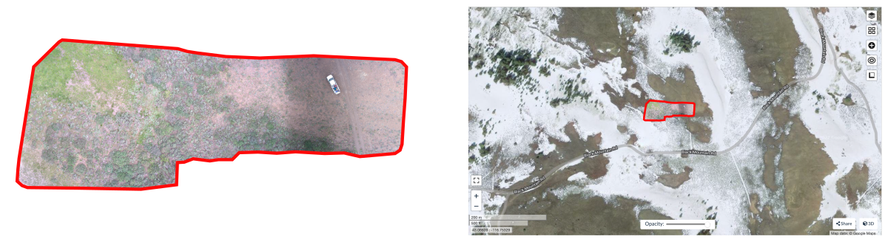
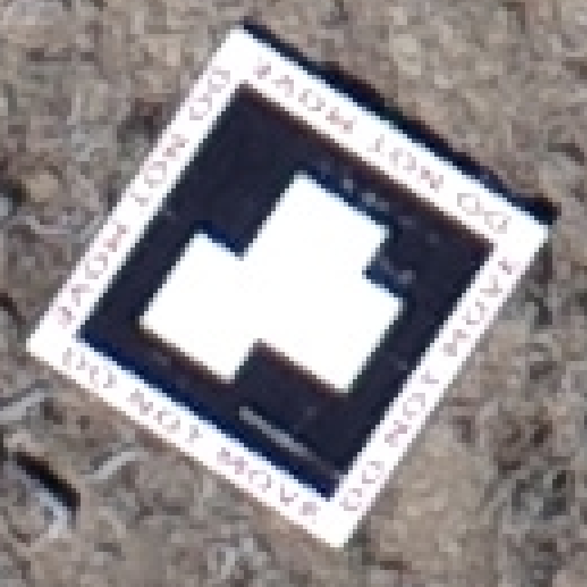
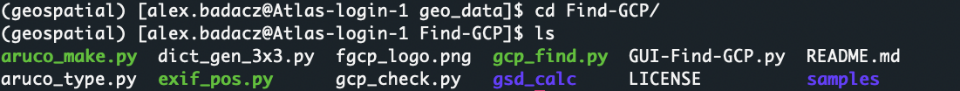
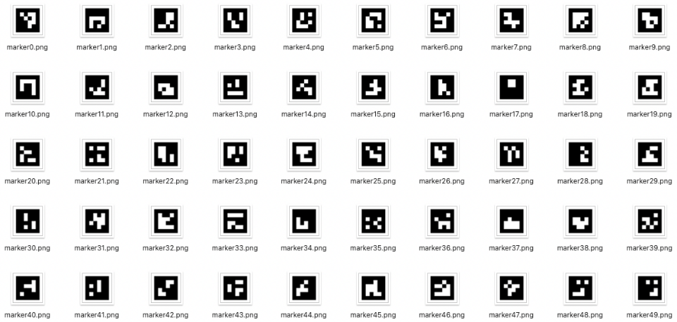
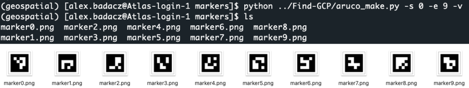
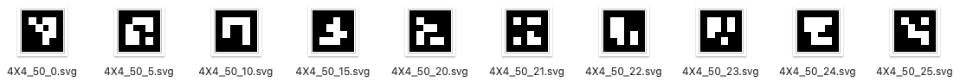
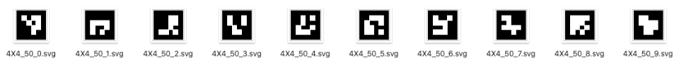
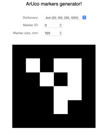
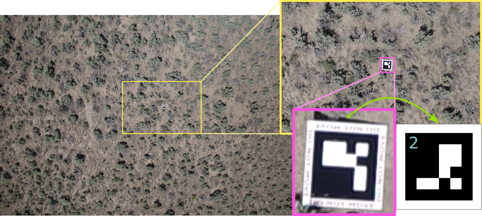



# Georeferencing

Georeferencing process results in locating a piece of the landscape visible in the photo in the corresponding geographic destination on the real-world map.



Most software designed for photogrammetric workflows has a built-in geolocation step. The same is true for <b>OpenDroneMap</b>.
In any case, to make geospatial localization of [aerial] photos, **GPS data** *(Global Positioning System)* is required. Most modern professional cameras record GPS coordinates automatically in the images, usually with an accuracy of 10-30 feet (3-9 meters) *[[source](https://www.blog.jimdoty.com/?p=14661)]*. While such a result is sufficient for most ordinary purposes, your research may be more precision demanding. For example, consider the case where the target area is even smaller than the geolocation threshold. The novel, more accurate geolocation systems, such as VPS *(Visual Positioning System)* or CPS *(Camera Positioning Standard)*, are now being developed *[[learn more](https://www.mosaic51.com/community/alternative-to-gps-how-to-get-better-accuracy/)]* and will probably supplant GPS technology in the future. By this time, though, the best patch for improving georeferencing process is still to use a **high-accuracy GPS point reference**, which will minimize the error.


## Georeferencing options in OpenDroneMap

The user has some level of control over the ODM settings for the photo georeferencing stage. By default, ODM tries to use the GPS information embedded in the images automatically while recording the mission. If this is the case, you don't need to add any additional option for geolocation to be performed.

**1. Force the use of geolocation from images' EXIF metadata**

```
--force-gps --use-exif \
```

Use `--force-gps` and `--use-exif` flags when you have a GCP data file in the project file structure but <u>want to force</u> the use of the GPS data stored in the image metadata.

That is especially useful when the original imagery is not geotagged, but you have GPS data in separate text files. In such a case, you can add this information to the image EXIF metadata using [ExifTool](https://exiftool.org) software. Follow the instructions in the tutorial ["Keep EXIF GEO metadata"](https://geospatial.101workbook.org/IntroPhotogrammetry/OpenDroneMap/00-IntroODM#keep-exif-geo-metadata) *(section: add EXIF tags from a text file using exiftool)* to accomplish this step.

**2. Force the use of GPS data (e.g., RTK) from a text file**

```
--geo geo.txt \
```

Regardless of whether your imagery is geotagged, once you have alternative GPS information <u>stored in a text file</u>, you can force direct use of it with the option `--geo geo.txt`. This is especially useful when you have more **accurate geolocation data such as RTK** *(Real-Time Kinematic positioning)* that corrects some of the common errors in current satellite navigation (GNSS) systems.

<div style="background: mistyrose; padding: 15px; margin-bottom: 20px;">
<span style="font-weight:800;">WARNING:</span>
<br><span style="font-style:italic;">
Keep in mind that the format of the text file containing the GPS data is strictly defined! <br><br>
If the <b>geo.txt</b> file is somewhere outside of your project's workdir or you have several GPS files, then provide the <b>absolute path</b> to the one you want.
</span>
</div>

<div style="background: #cff4fc; padding: 15px; margin-bottom: 20px;">
<span style="font-weight:800;">geo.txt</span> <i>(file content below)</i>
<span style="color:navy;"><i>[see details in the <a href="https://docs.opendronemap.org/geo/#image-geolocation-files" style="color: blue;">ODM Documentation: GPS data</a>]</i></span>
<br><br>
+proj=utm +zone=11 +ellps=WGS84 +datum=WGS84 +units=m +no_defs &emsp; # header <br>
DJI_0028.JPG &emsp; -91.9942096 &emsp; 46.8425252 &emsp; 198.609 &emsp;&emsp;&emsp;&emsp;&emsp;&emsp;&emsp;&emsp; # GPS data <br>
DJI_0032.JPG &emsp; -91.9938293 &emsp; 46.8424584 &emsp; 198.609 &emsp;&emsp;&emsp;&emsp;&emsp;&emsp;&emsp;&emsp; # GPS data <br>
</div>

* The first line should contain the name of the projection used for the geo-coordinates, in one of the following formats:

```
* PROJ string:   +proj=utm +zone=11 +ellps=WGS84 +datum=WGS84 +units=m +no_defs
*   EPSG code:   EPSG:4326
*   WGS84 UTM:   WGS84 UTM 16N
```

* Subsequent lines are the GPS information for a given image <u><i>(the first 3 columns are obligatory)</i></u>:

```
     col-1 col-2 col-3  col-4              col-5          col-6             col-7                    col-8                    col-9      col-10
     _____ _____ _____ ______ _________________  ______________  ________________  _______________________  _______________________  ___________
image_name geo_x geo_y [geo_z] [omega (degrees)] [phi (degrees)] [kappa (degrees)] [horz accuracy (meters)] [vert accuracy (meters)] [extras...]
```


**3. Force fixed value of GPS Dilution of Precision** *(use along with variant 1 or 2)*

```
--gps-accuracy 10.0 \
```

If you know the **estimated error of GPS** location determined by the camera in use, consider setting it as a value of the `--gps-accuracy value` option. The value is a positive float in meters and will be used as a GPS Dilution of Precision for all images. *The default is 10 meters.*

<div style="background: mistyrose; padding: 15px; margin-bottom: 20px;">
<span style="font-weight:800;">WARNING:</span>
<br><span style="font-style:italic;">
If you use high-precision GPS (RTK), this value will be set automatically. You can manually set it in case the reconstruction fails. Lowering the value can help control bowling effects over large areas.
</span>
</div>

**3. Force the use of GCP-based georeferencing**

**Ground Control Points** (GCPs) are clearly visible objects which can be easily identified in several images. Using the precise GPS position of these ground points is a good reference that improves significantly the accuracy of the project's geolocation. Ground control points can be any **steady structure** existing in the mission area, otherwise can be set using **targets placed on the ground**. *Learn more about recommended practices for GCPs in ODM workflow from the OpenDronMap Documentation: [Ground Control Points](https://docs.opendronemap.org/gcp/#ground-control-points).*

If you have a file with GCPs detected on the image collection, force georeferencing using it by option `--gcp gcp_list.txt`.

```
--gcp gcp_list.txt \
```


<div style="background: mistyrose; padding: 15px; margin-bottom: 20px;">
<span style="font-weight:800;">WARNING:</span>
<br><span style="font-style:italic;">
Keep in mind that the format of the text file containing the GCP data is strictly defined! <br><br>
If the <b>gcp_list.txt</b> file is somewhere outside of your project's workdir or you have several GCP files, then provide the <b>absolute path</b> to the one you want.
</span>
</div>

<br><span style="color: #ff3870;font-weight: 600; font-size:24px;">
Detect each ground control point in at least 5-10 photos!
</span><br>


<div style="background: #cff4fc; padding: 15px; margin-bottom: 20px;">
<span style="font-weight:800;">gcp_list.txt</span> <i>(file content below)</i>
<span style="color:navy;"><i>[see details in the <a href="https://docs.opendronemap.org/gcp/#ground-control-points" style="color: blue;">ODM Documentation: GCPs</a>]</i></span>
<br><br>
EPSG:4326 <br>
-116.74998 &emsp; 43.06477 &emsp; 2090.14 &emsp; 1559.41645 &emsp; 1372.84669 &emsp; DJI_0177.JPG &emsp; 100 <br>
-116.74998 &emsp; 43.06477 &emsp; 2090.14 &emsp; 1491.01638 &emsp; 2471.85207 &emsp; DJI_0355.JPG &emsp; 100 <br>
-116.74998 &emsp; 43.06477 &emsp; 2090.14 &emsp; 1524.14196 &emsp; 2214.43593 &emsp; DJI_0178.JPG &emsp; 100 <br>
-116.74998 &emsp; 43.06477 &emsp; 2090.14 &emsp; 1142.59915 &emsp; 1739.80028 &emsp; DJI_0152.JPG &emsp; 100 <br>
-116.74998 &emsp; 43.06477 &emsp; 2090.14 &emsp; 1207.88116 &emsp; 1863.28946 &emsp; DJI_0329.JPG &emsp; 100 <br>
-116.75048 &emsp; 43.06475 &emsp; 2088.22 &emsp; 1737.22646 &emsp; 1763.28507 &emsp; DJI_0172.JPG &emsp; 101 <br>
-116.75048 &emsp; 43.06475 &emsp; 2088.22 &emsp; 1660.24277 &emsp; 2912.50267 &emsp; DJI_0350.JPG &emsp; 101 <br>
-116.75048 &emsp; 43.06475 &emsp; 2088.22 &emsp; 1736.70576 &emsp; 1411.55810 &emsp; DJI_0171.JPG &emsp; 101 <br>
-116.75048 &emsp; 43.06475 &emsp; 2088.22 &emsp; 989.578526 &emsp; 1391.94185 &emsp; DJI_0157.JPG &emsp; 101 <br>
-116.75048 &emsp; 43.06475 &emsp; 2088.22 &emsp; 877.826253 &emsp; 2459.65369 &emsp; DJI_0335.JPG &emsp; 101 <br>
</div>

* The first line should contain the name of the projection used for the geo-coordinates, in one of the following formats:

```
* PROJ string:   +proj=utm +zone=11 +ellps=WGS84 +datum=WGS84 +units=m +no_defs
*   EPSG code:   EPSG:4326
*   WGS84 UTM:   WGS84 UTM 16N
```

* Subsequent lines are the GPS information for a given image <u><i>(the first 6 columns are obligatory)</i></u>:

```
col-1 col-2 col-3 col4 col5    col-6     col-7     col-8    col-9
_____ _____ _____ ____ ____ __________ __________ ________ ________
geo_x geo_y geo_z im_x im_y image_name [gcp_name] [extra1] [extra2]
```


# Software for manual detection of (any) GCPs

<span style="color: #ff3870;font-weight: 600;">Section in development...</span>

Use any software for tagging GCPs, e.g., the [GCP Editor Pro](https://uav4geo.com/software/gcpeditorpro) is a good match for the ODM. Download source code from the [GitHub](https://github.com/uav4geo/GCPEditorPro).


# Automatic detection of ArUco targets

ArUco markers are a type of fiducial marker that are often used in computer vision applications. A fiducial marker is an object placed in the field of view of the camera which appears in the image with a known location, size, and appearance. <b>Aruco markers are square black-and-white patterns which can be easily detected</b>, identified, and used to calculate the camera's pose with respect to the marker.


| ArUco_feature         | description |
|-----------------|-------------|
|Simple Structure | *Being just black and white squares, they are relatively easy and efficient to detect in an image.*|
|Identification   | *Each Aruco marker has a unique identifier assigned based on its pattern, which allows the system to distinguish between different markers.*|
|Flexibility      | *Aruco markers come in different dictionaries, or sets of markers. Each dictionary varies in the number of bits in the marker and the number of different markers. This allows for a balance between the total number of unique markers and the robustness against detection errors.*|
|Pose Estimation  | *By knowing the real size of the marker and its position in the image, one can determine the position and orientation (pose) of the camera with respect to the marker.*|
|Calibration      | *ArUco markers can be employed to calibrate cameras by capturing images of the markers from different orientations and positions.*|


<div style="background: #dff5b3; padding: 15px;">
<span style="font-weight:800;">NOTE:</span>
<br><span style="font-style:italic;">ArUco markers originated from academic research, and the term "aruco" is derived from the name of the library that introduced and popularized these markers. The <b>ArUco library</b> was initially a standalone project but later got integrated into the <b>OpenCV (Open Source Computer Vision Library)</b>. Therefore, when you're looking to utilize ArUco functionalities, you'd typically access it through OpenCV's ArUco module.</span>
</div>


## Working with ArUco in Land Surveying Tasks

The most official and widely recognized source for information and usage of ArUco markers is within the **OpenCV** (*Open Source Computer Vision Library*) library, which has integrated ArUco module functionalities. The OpenCV documentation provides detailed information on how to use ArUco markers, and you can access it via the [official OpenCV website](https://docs.opencv.org/master/d9/d6a/group__aruco.html).

**OpenCV is one of the most popular and comprehensive libraries for computer vision and machine learning tasks.** It was initially developed by Intel and released in 2000. Since then, it has become a standard tool for computer vision researchers and developers due to its rich set of functionalities and performance optimizations.
* **OpenCV is organized into modules**, each focused on a specific aspect of computer vision or image processing. This includes modules for:
  * image filtering with `imgproc` module
  * **pose estimation with** `aruco` **module**
  * feature detection with `features2d` module
  * object detection with `objdetect` module
  * machine learning with `ml` module
  * camera calibration with `calib3d` module
  * motion analysis with `video` module
  * and more.
* While OpenCV was originally written in `C++`, it now has bindings for `Python`, `Java`, and several other languages. This makes it accessible to a wide range of developers. **The Python bindings have become extremely popular** enabling developers to create custom computer vision applications, such as [Find-GCP](https://github.com/zsiki/Find-GCP) utility for finding ArUco markers in digital photos.

<span style="color: #ff3870;font-weight: 500;">Learn more about ArUco markers in OpenCV library: <a href="https://docs.opencv.org/3.2.0/d5/dae/tutorial_aruco_detection.html" target="_blank">https://docs.opencv.org/3.2.0/d5/dae/tutorial_aruco_detection.html</a></span>

### Steps in the land surveying

**1. Markers Generation:** Before the survey, ArUco markers are generated using specialized software or libraries, such as the `aruco_make.py` python utility *(using ArUco module in OpenCV library)*. <br>

<div style="background: #cff4fc; padding: 15px;">
<span style="font-weight:800;">PRO TIP:</span><br>
You can generate GCP (Ground Control Point) markers ranging from 1 to up to 1000 using various ArUco dictionaries by leveraging OpenCV's built-in ArUco module. <span style="color: #ff3870;font-weight: 500;"> To learn more, see section <a href="#automatic-generation-of-aruco-codes ">Automatic generation of ArUco codes </a>.</span>
</div><br>

**2. Printing and Placement:** Once generated, these markers are printed on sturdy material to withstand outdoor conditions. They're then placed strategically at known positions within the area to be surveyed.

<div style="background: #cff4fc; padding: 15px;">
<span style="font-weight:800;">PRO TIP:</span><br>
When recording the exact positions of the placed Ground Control Points (GCPs), <b>always note which GCP corresponds to which ArUco marker ID</b><i> (e.g., create GCP_reference.txt file)</i>; this association will be crucial when pinpointing them on the images during post-processing. <br>
Expected format of the <i>GCP_reference.txt</i> is 4-columns: <b>ArUco_ID x y z </b><br>
0 523287.368 4779588.335 1397.823 <br>
1 523305.976 4779572.588 1397.817 <br>
2 523347.074 4779571.424 1397.653 <br>
3 523364.648 4779587.932 1395.735 <br>
4 523394.376 4779529.525 1398.728 <br>
5 523363.938 4779530.027 1400.244 <br>
</div><br>

<div style="background: mistyrose; padding: 15px; margin-bottom: 20px;">
<span style="font-weight:800;">WARNING:</span>
<br><span style="font-style:italic;">When using ArUco markers for Ground Control Points (GCPs), it's strongly recommended to <b>avoid using custom IDs</b>. If custom IDs are unavoidable, make sure to maintain an accurate reference that matches your custom IDs with the corresponding ArUco marker ID or type <i>(i.e., marker's pattern)</i>.</span>
</div>

<table style="background: mistyrose; padding: 15px; margin-bottom: 20px;">
<tr><th style="width: 500px;">WARNING:</th><th>digital marker: ID 9</th><th>printed marker</th></tr>
<tr><td><b>Always verify that the printed marker matches the digital version.</b> Printing errors can occasionally distort the marker, leading to recognition issues during post-processing of land surveying imagery. <br><br><i>In the given example, the printed marker is missing one black square. This omission can greatly hinder its recognition, making it challenging to correctly identify it as an ArUco marker with ID 9.</i></td>
<td></td>
<td></td></tr>
</table>


**3. Capturing Imagery:** Using drones, satellites, or handheld cameras, images of the area are taken. These images capture the terrain as well as the ArUco markers.

**4. Detection and Analysis:** During the post-processing phase, software detects the ArUco markers in the captured images. Given the known size and ID of each marker, as well as its location in the image, software can estimate the camera's pose and the 3D position of the marker. <span style="color: #ff3870;font-weight: 500;">To learn more, see section <a href="#automatic-recognition-of-aruco-codes" target="_blank">Automatic recognition of ArUco codes</a>.</span>

**5. Georeferencing:** Knowing the real-world coordinates of each ArUco marker, the captured images can be georeferenced (assigned to a specific location in a spatial reference system). This ensures that the imagery aligns accurately with geographic coordinates.

## Find-GCP python utility: installation

**[Find-GCP](https://github.com/zsiki/Find-GCP)** is a Python tool leveraging the OpenCV library, designed to detect ArUco Ground Control Points in imagery and generate the corresponding GCP file required for photogrammetric programs such as Open Drone Map. The GitHub repo contains a few small utilities useful in Land Surveying Tasks:

* [aruco_make.py](https://github.com/zsiki/Find-GCP#aruco_makepy) - generates aruco marker images using different standard dictionaries
* [gcp_find.py](https://github.com/zsiki/Find-GCP#gcp_findpy) - identifies Ground Control Points (GCP) in imagery
* [gcp_check.py](https://github.com/zsiki/Find-GCP#gcp_checkpy) - helps the visual check of the found GCPs by `gcp_find.py`

**INSTALLATION:**

**A. On SCINet HPC: Atlas** (via ssh in CLI terminal or via OOD in JupyterLab Terminal app)
  1.  check available **conda** modules and load selected one:
  ```
  module avail conda
  module load miniconda/4.12.0
  ```
  2. create python environment for geospatial analysis:
  ```
  conda create -n geospatial python=3.9
  ```
  3. activate this environment:
  ```
  source activate geospatial
  ```
  4. install required libraries:
  ```
  pip install opencv-python opencv-contrib-python Pillow numpy matplotlib
  ```
  5. clone the Find-GCP repo from GitHub:
  ```
  git clone https://github.com/zsiki/Find-GCP.git
  ```
  When you clone a repository from GitHub, it creates a new directory on your current path with the name of the repository. Inside this directory, you'll find the contents of the repository. Once you navigate into this directory, you should see 6 files with the `.py` extension. **These .py files are the Find-GCP python utilities for working with ArUco markers in Land Surveying Tasks.**
  ```
  cd Find-GCP
  ls
  ```

  

**B. On your local machine (alternatively):** <br>
* If you already have the Conda environment manager installed, skip step 1 and proceed with the instructions outlined above.
* For those unfamiliar with Conda, it's a valuable tool for computational tasks, and you can learn how to use it through the practical tutorials in the DataScience workbook: [Conda on Linux](https://datascience.101workbook.org/03-SetUpComputingMachine/03C-tutorial-installations-on-linux#conda), [Conda on macOS](https://datascience.101workbook.org/03-SetUpComputingMachine/03A-tutorial-installations-on-mac#-install-conda), [Python Setup on your computing machine](https://datascience.101workbook.org/04-DevelopmentEnvironment/02A-python-setup-locally#conda).
* If you choose not to use Conda, you can jump directly to step 4 in the guide, though <u>this is not recommended</u> because the necessary libraries will install system-wide, rather than in an isolated environment.

## Automatic generation of ArUco codes

*ArUco markers provide known reference points in the imagery, enhancing the accuracy of photogrammetric analysis. This ensures that data derived from the imagery correctly corresponds to actual locations on the ground.*

**Available ArUco dictionaries** <br>
***ArUco markers come in various dictionaries that defines a set of distinct markers.*** The choice of dictionary affects the size and resilience of the markers, as well as how many unique markers the dictionary contains.<br>
In the naming convention like `DICT_4X4_100` or `DICT_6X6_250`: <br>
**-** The first part (4X4 or 6X6) represents the size of the marker grid. <br>*For example, a 4X4 marker has a 4x4 grid of black or white squares, while a 6X6 marker has a 6x6 grid.* <br>
**-** The second part (100 or 250) indicates the number of unique markers available in that dictionary. <br>*So, DICT_4X4_100 has 100 unique 4x4 markers, while DICT_6X6_250 contains 250 unique 6x6 markers.*

<div style="background: #cff4fc; padding: 15px;">
<span style="font-weight:800;">PRO TIP:</span><br>
<b><i>When choosing a dictionary,</i></b> one must consider the application.
<li> Smaller markers (like 4x4) can be detected at shorter distances and might be harder to distinguish at low resolutions or with noise. Nevertheless, 4x4 markers are a popular and often sufficient choice for the majority of land surveying applications. <i>The contents of the 4X4_50 dictionary are displayed below.</i></li>
<li> Larger markers (like 6x6 or 7x7) can be detected from a greater distance, are generally more resilient to noise, but they also take up more space in the image. The number of unique markers needed will also influence the choice of dictionary.</li>
<li>In ArUco marker dictionaries, <b>each larger grid size includes all markers from its smaller counterparts in the same order</b>; <i>for example, the first 50 markers in all 4x4 dictionaries will be identical, and any additional markers in larger dictionaries are unique and extend the set.</i></li>
</div><br>



<div style="background: mistyrose; padding: 15px; margin-bottom: 20px;">
<span style="font-weight:800;">WARNING:</span>
<br><span style="font-style:italic;"><b>ArUco markers within each dictionary are numbered starting from zero.</b> For accurate reference and data processing, always save both the selected marker's ID and the type of the source dictionary used.</span>
</div><br>

**Generating markers using ready-made tools** <br>

**A. ArUco marker images in PNG** <br>
To produce ArUco markers for your land surveying project, start by installing the Find-GCP Python utility ([refer to the section above](#find-gcp-python-utility-installation)). Within the cloned Find-GCP repository directory, you'll locate the `aruco_make.py`. This tool assists you in generating markers from standard dictionaries, as well as more compact 3x3 square markers.

* While in the **Find-GCP** directory, use `pwd` command to print the path on the screen. *You will need this path to run python scripts from another location in the file system.*


* Navigate to the selected location in the file system and create the **markers** directory:
```
mkdir markers
cd markers
```


* Then use the `aruco_make.py` script like this: <br>
`python aruco_make.py -d <DICT> -s <START> -e <END> -v`, for example:
```
source activate geospatial         # activate environment (if not activated yet)
python path_to_Find-GCP_dir/aruco_make.py -d 1 -s 0 -e 9 -v
conda deactivate                   # deactivate env when you are done with Find-GCP tasks
```

  

  <i>This command will create 10 markers, numbered from 0 to 9 (e.g., marker0.png), using the dictionary DICT_4x4_100.</i><br>
  * the number provided with the `-d` option determines the dictionary *(see the table below)*, default = 1

  |code  | dictionary|code  | dictionary |code  | dictionary |code  | dictionary  |
  |------|-----------|------|------------|------|------------|------|-------------|
  |**0** |DICT_4X4_50|**1** |DICT_4X4_100|**2** |DICT_4X4_250|**3** |DICT_4X4_1000|
  |**4** |DICT_5X5_50|**5** |DICT_5X5_100|**6** |DICT_5X5_250|**7** |DICT_5X5_1000|
  |**8** |DICT_6X6_50|**9** |DICT_6X6_100|**10**|DICT_6X6_250|**11**|DICT_6X6_1000|
  |**12**|DICT_7X7_50|**13**|DICT_7X7_100|**14**|DICT_7X7_250|**15**|DICT_7X7_1000|
  |**16**|DICT_ARUCO_ORIGINAL|
  |**17**|DICT_APRILTAG_16H5|**18**|DICT_APRILTAG_25H9|**19**|DICT_APRILTAG_36H10|**20**|DICT_APRILTAG_36H11|
  |**99**|DICT_3X3_32 custom|

  * the number provided with the `-s` option determines the index of the first marker, default = 0
  * the number provided with the `-e` option determines the index of the last marker, default = -1 *(only one marker is generated with index 0)*
  * the optional `-v` flag shows marker on monitor *(when applicable, e.g., when working on a local machine)*
  * the optional `-g` flag generates black/gray marker *(instead black/white to reduce the effect of white burnt in)*
    * the optional option `--value <VAL>` determines shade of background use with `-g`, default=95
  * the optional option `-p <PAD>` determines border width around marker in inches, default= 0.5
<br><br>

**B. ArUco marker images in SVG** <br>
There is another GitHub repo, [gcp_aruco_generator](https://github.com/qaptadrone/gcp_aruco_generator), providing a simple python tool for generating ArUco markers with a real sizing of the image saved in SVG format. It also has a few more options, including `--print-id` in the corner of the marker and adding a watermark on the four borders. Follow the [Setup and use](https://github.com/qaptadrone/gcp_aruco_generator#setup-and-use) guide to get started with this tool.

<table>
<tr style="width: 100%">
  <td style="border: 1px solid white; width: 700px">
    <div style="background: #cff4fc; padding: 15px; height: 200px;">
    <span style="font-weight:800;">PRO TIP:</span><br>
    <span style="font-style:italic;">For good size recommendations, please see <a href="http://www.agt.bme.hu/on_line/gsd_calc/gsd_calc.html" target="_blank">http://www.agt.bme.hu/on_line/gsd_calc/gsd_calc.html</a>.<br><br>The generated ArUco markers are compatible with the Find-GCP tool, so you can use it after the flight to find the markers in your pictures.</span>
    </div><br>
    <div style="background: mistyrose; padding: 15px; margin-bottom: 20px;">
    <span style="font-weight:800;">WARNING:</span>
    <br><span style="font-style:italic;">When using the <b>gcp_aruco_generator</b> tool, be aware that the <b>ArUco marker IDs also start numbering from 0</b>, just like in standard ArUco dictionaries.</span>
    </div><br>
  </td>
  <td style="border: 1px solid white;"></td>
</tr>
</table>

* generate a single marker from selected dictionary in size = 1000 mm (without margins):
```
python path/marker_generator.py -b -d 4X4_50 -s 1000 --id 0 --print-id
```

* generate 10 hand selected markers:
```
for i in 0 5 10 15 20 21 22 23 24 25
do
    python path/marker_generator.py -b -d 4X4_50 -s 1000 --id $i --print-id
done
```


* generate 10 consecutive markers with IDs in selected range:
```
for i in `seq 0 9`
do
    python path/marker_generator.py -b -d 4X4_50 -s 1000 --id $i --print-id
done
```



**C. ArUco marker images <u>generated online</u> (SVG or PDF)** <br>

<table>
<tr style="width: 100%">
<td style="border: 1px solid white; width: 500px">
Finally, you can use the free online ArUco markers generator: <a href="https://chev.me/arucogen/" target="_blank">https://chev.me/arucogen/</a> <br><br>
<i>See the corresponding GitHub repo:</i> <a href="https://github.com/okalachev/arucogen" target="_blank">https://github.com/okalachev/arucogen</a>
</td>
<td style="border: 1px solid white;"></td>
</tr>
</table>


## Automatic recognition of ArUco codes

For automatic recognition of ArUco markers, it's optimal to have your **land surveying imagery in the JPG format**. It's presumed that you've utilized printed ArUco markers as your Ground Control Points and **have diligently recorded GCPs precise positions**. This data should be saved in a text file, for instance, `GCP_reference.txt`. This file should feature four columns: `aruco_id`, `x`, `y`, and `z`, representing the marker ID and its three-dimensional coordinates respectively.

**INPUTS:** <br>
**-** imagery in JPG format <br>
**-** GCPs coordinate file, *e.g.,* `GCP_reference.txt`
```
0 523287.368 4779588.335 1397.823
1 523305.976 4779572.588 1397.817
2 523347.074 4779571.424 1397.653
3 523364.648 4779587.932 1395.735
4 523394.376 4779529.525 1398.728
5 523363.938 4779530.027 1400.244
```
<div style="background: mistyrose; padding: 15px; margin-bottom: 20px;">
<span style="font-weight:800;">WARNING:</span><br>
<i><b>If your GCPs coordinate file uses custom IDs</b> (e.g., 131, 135, 143 when you used 4X4_50 ArUco dictionary)</i>, ensure you replace these with the appropriate ArUco marker IDs from the relevant dictionary before proceeding with automatic recognition of ArUco codes in your imagery.
</div>

<div style="background: #cff4fc; padding: 15px;">
<span style="font-weight:800;">PRO TIP:</span><br>
<i><b>If you're unable to match your custom IDs with the corresponding ArUco marker IDs</b></i>, you can still detect the markers in your imagery, but you won't be able to directly align them with the precise positions in your GCP coordinates file. <br><br>
<b>If you encounter this issue, you may follow one of the two scenarios:</b>
<ul><li>For simply identifying individual markers on your imagery and obtaining a list of images categorized by the detected markers, refer to section <a href="#scenario-3-no-gcp-file">SCENARIO 3: no GCP file</a>.</li>
<li>However, if your markers were placed at a sufficient distance apart, there's a good chance you can programmatically match the GCPs coordinates to the markers using the GPS coordinates embedded in the representative images <i>(I prepared a <u>ready-made Python script for this task</u>)</i>. To detect markers on imagery and subsequently assign them precise GCP coordinates, follow the guide in section <a href="#scenario-2-gcp-file-with-custom-ids">SCENARIO 2: GCP file with custom IDs</a>.</li>
<b>Note:</b> <i>Approach the results with caution, recognizing that the precision of such a method may be limited.</i>
</ul>
</div><br>


### SCENARIO 1: GCP file with known ArUco IDs

***i.e., Direct ArUco ID match***

This approach is for those possessing a GCP file with recognized ArUco IDs:
* by **inputting your imagery** and the `GCP_reference.txt` file along with the **known ArUco dictionary**,
* you'll receive an output in the form of `gcp_list.txt`. *This file provides precise world coordinates for the GCPs as well as coordinates on the corresponding images.*
  * ***This output file is ready for immediate use with OpenDroneMap (ODM) software.***

1. Login to the Atlas cluster using SSH protocol (command line) or OOD access (web-based).
2. Navigate to your project working directory. *Use the command below:*
```
cd /project/<path_to_your_project_directory>
```
3. Set paths as temporary variables or use them directly:
```
FIND_GCP_PATH=/path/to/Find-GCP_repo
INPUTS_PATH=/path/to/input_imagery
```
4. Activate the Conda environment (if not activated yet). *You should activate a specific conda environment related to this project (e.g., the geospatial env created in section [Find-GCP python utility: installation](#find-gcp-python-utility-installation)):*
```
source activate geospatial
```
5. Run the `gcp_find.py` Python tool:
```
python $FIND_GCP_PATH/gcp_find.py -v -t ODM -i $INPUTS_PATH/GCP_reference.txt --epsg <code> -d <int> -o gcp_list.txt $INPUTS_PATH/*.JPG
```
<i>Replace \<code> with the EPSG of your GCP coordinate system and \<int> with an ID corresponding to the used ArUco dictionary. For example:</i>
```
python $FIND_GCP_PATH/gcp_find.py -v -t ODM -i $INPUTS_PATH/GCP_reference.txt --epsg 32611 -d 0 -o gcp_list.txt $INPUTS_PATH/*.JPG
```
*This will search the ArUco markers from DICT_4x4_50 in your imagery and match them with corresponding IDs provided in your GCP_reference.txt file. Providing the exact EPSG code will ensure the returned coordinates of the GCPs detected in the imagery are in the correct coordinate system. The list of images with detected GCPs is saved to the gcp_list.txt file, which looks like this:*
```
EPSG:32611
523287.368 4779588.335 1397.823 5041 91 R0036021.JPG 0
523287.368 4779588.335 1397.823 5190 1110 R0036023.JPG 0
523287.368 4779588.335 1397.823 5462 1856 R0036024.JPG 0
523287.368 4779588.335 1397.823 5680 2998 R0036026.JPG 0
523394.376 4779529.525 1398.728 3170 60 R0036061.JPG 4
523329.480 4779525.642 1400.983 624 700 R0036065.JPG 6
523329.480 4779525.642 1400.983 539 1349 R0036066.JPG 6
523309.583 4779492.785 1404.733 162 701 R0036073.JPG 10
523309.583 4779492.785 1404.733 87 1597 R0036074.JPG 10
523394.376 4779529.525 1398.728 1322 1028 R0036109.JPG 4
```

You can further refine the output file by sorting the records based on the ArUco marker ID, allowing you to **choose a subset of 5-10 images for each marker, required by the ODM software**. While manually reviewing the images is the most reliable approach to select the best representations, you can initially narrow down the number of images per marker programmatically. After this automatic reduction, a visual review is recommended to address any ambiguous images.

### ***Select representative images for a marker***

Optimally, a marker should be positioned near the center of the image. The marker's position in an image can be approximated using its target coordinates, which are located in the 4th and 5th columns of the output file, i.e., `gcp_list.txt`. <br>
In some cases, you might find that a given marker is detected in several dozens to even hundreds of images.
```
awk '{print $7}' < gcp_list.txt | sort | uniq -c
```
*The 7th column stores the ArUco marker ID. You can easily count the number of images matched with a given ID. In my case, the result is like this (counts, ID):*
```
  30 0
  40 1
  40 2
  20 3
  23 4
  37 5
  24 6
  25 7
  37 8
  33 10
  28 11
```

A practical strategy is to first **employ an automated filter to narrow down to approximately 10 images per marker**, and subsequently perform a visual check to ensure accuracy.
* To select the N=10 images per marker ID where the marker is placed closest to the center of the image, we can use a Python script `select_images.py`. Here's the outline of the steps:
  * Calculate the distance of each marker from the center of the image using the Euclidean distance formula.
  * Sort the images for each marker ID based on this distance in ascending order.
  * Select the top N images for each marker ID.

**Run the script with a syntax:**
```
Usage: python select_images.py <data_file_path> <image_width> <image_height> <images_number>
```
*for example:*
```
python select_images.py gcp_list.txt 6000 4000 10 > gcp_list_10.txt
```

### SCENARIO 2: GCP file with custom IDs

***i.e., Custom ID integration***

For cases where you have a GCP file with custom IDs, your inputs will be **the imagery**, a `GCP_reference.txt` file with <u>custom marker IDs</u>, a **known ArUco dictionary**, and the **EPSG code** for the registered GCPs.

**EPSG**: 32611 <br>

```
# GCP_reference.txt
131 523287.368 4779588.335 1397.823
135 523305.976 4779572.588 1397.817
137 523347.074 4779571.424 1397.653
141 523364.648 4779587.932 1395.735
134 523394.376 4779529.525 1398.728
133 523363.938 4779530.027 1400.244
138 523329.480 4779525.642 1400.983
136 523350.181 4779492.395 1403.140
140 523370.006 4779471.041 1403.857
132 523289.018 4779469.252 1407.142
142 523309.583 4779492.785 1404.733
139 523292.432 4779530.710 1401.051
143 523261.422 4779532.114 1401.978
```

**STEP 0.** Prepare your working space.

1. Login to the Atlas cluster using SSH protocol (command line) or OOD access (web-based).
2. Navigate to your project working directory. *Use the command below:*
```
cd /project/<path_to_your_project_directory>
```
3. Set paths as temporary variables or use them directly:
```
FIND_GCP_PATH=/path/to/Find-GCP_repo
INPUTS_PATH=/path/to/input_imagery
```
4. Activate the Conda environment (if not activated yet). *You should activate a specific conda environment related to this project (e.g., the geospatial env created in section [Find-GCP python utility: installation](#find-gcp-python-utility-installation)):*
```
source activate geospatial
```

**STEP 1.** The first step involves identifying the ArUco IDs of markers detected on the imagery and selecting a representative image for each. Ideally, this image should predominantly feature the marker centrally placed.

1. Run the `gcp_find.py` Python tool with basic settings to detect ArUco markers:
```
python $FIND_GCP_PATH/gcp_find.py -d 0 $INPUTS_PATH/*.JPG >> markers_detected.txt
```
<i>Remember to use the correct ArUco dictionary with the <b>-d</b> option (for example, in this case, the -d 0 denotes the DICT_4x4_50 dictionary).</i><br>
The output `markers_detected.txt` should looks like this (*columns:* `x` `y` `image` `aruco_id`):
```
5041 91 R0036021.JPG 0
5190 1110 R0036023.JPG 0
5462 1856 R0036024.JPG 0
5680 2998 R0036026.JPG 0
3170 60 R0036061.JPG 4
624 700 R0036065.JPG 6
539 1349 R0036066.JPG 6
162 701 R0036073.JPG 10
```
Let's filter the output to include only the images with a single detected marker on them.
```
awk '{print $3}' markers_detected.txt | sort | uniq -c | awk '$1 == 1 {print $2}' | while read image; do grep "$image" markers_detected.txt; done > single_markers.txt
```

2. Extract unique ArUco marker IDs from the 4th column:
```
awk '{print $4}' < markers_detected.txt | sort -n | uniq > marker_ids
```
3. For each marker ID, select representative image, i.e., the image where the marker is placed closest to the center:
```
for i in `cat marker_ids`; do awk -v A=$i '{if ($4==A) print $0}' < single_markers.txt | awk 'BEGIN {min_dist = 1000000000} {dist = sqrt(($1-3000)^2 + ($2-2000)^2); if(dist < min_dist) {min_dist = dist; closest = $0}} END {print closest}' >> representatives; done
```
<i>This assumes that the image dimensions are 6000x4000 px, so the coordinates of the center of the picture are (x = 6000/2 = <b>3000</b>, y = 4000/2 = <b>2000</b>). <b>Remember to adjust the command for your values.</b></i><br>
The output `representatives` should contain the representative image for each marker ID:
```
3546 1937 R0036737.JPG 0
3631 2017 R0036909.JPG 1
3290 1831 R0036401.JPG 2
3118 1948 R0036914.JPG 3
3420 1497 R0036704.JPG 4
3001 1808 R0036953.JPG 5
3345 2661 R0036140.JPG 6
2531 2038 R0036933.JPG 7
2693 1783 R0036927.JPG 8
2993 2141 R0036789.JPG 10
3120 2112 R0037136.JPG 11
```
You can visually inspect the selected images to ensure they indeed showcase the distinct pattern of the detected ArUco marker ID and confirm that each image contains only one marker. *In my case, all detected markers match the pattern of a suggested ArUco ID.*

 <br>

Create a subdirectory and copy in or soft link the representative images:
```
mkdir representative
awk '{print $3}' < representatives > list
for i in `cat list`; do k=`echo $i | awk -F"." '{print $1}'`; n=`cat representatives | awk -v A=$i '{if ($3==A) print $4}'` ; cp $INPUTS_PATH/$i representative/$k"_"$n.JPG; done
```
<i>Now, the images should be copied into the <b>representative</b> subdirectory and their names should change from R0036737.JPG to R0036737<b>_0</b>.JPG denoting the ID of detected ArUco marker (which is required in the next step).</i>


**STEP 2.** In the second step, a Python script `identify_gcp_id.py` automatically matches the GCP coordinates with the representative images (by calculating the distance between GCPs from reference file and GPS coordinates of each picture).
  * If there's a coordinate system discrepancy between reference GCPs and imagery GPS, a conversion is carried out for the GCPs ***(so, that's why you must provide the correct EPSG code)***.<br>

1. Download the Python script `identify_gcp_id.py` from the repo and place it in the location of your SOFTWARE or TOOLS for geospatial analysis (e.g., `project/<account>/<user>/TOOLS`):
  ```
  cd project/<account>/<user>/TOOLS

  git clone /geo_utils
  ```

2. Make sure you navigate back to the `representative` directory in your photogrammetry project. You can softlink the `identify_gcp_id.py` script for easy use:
  ```
  cd project/<account>/<user>/ODM/<project_X>/IMAGES/representative

  ln -s project/<account>/<user>/TOOLS/geo_utils/identify_gcp_id.py ./
  ```

3. Run the `identify_gcp_id.py` script to match the GCP coordinates with the representative images:

  <div style="background: mistyrose; padding: 15px; margin-bottom: 20px;">
  <span style="font-weight:800;">WARNING:</span>
  <br><span style="font-style:italic;">Note that you should have activated a specific conda environment related to this project. See the <b>STEP 0</b> in this section. </span>
  </div>

  ```
  python identify_gcp_id.py GCP_reference.txt > matching_results

  grep "Match" < matching results | sort -nk4 > ID_matches
  cat ID_matches
  ```

  ```
  Match found: GCP 131 (d=16.84m) is likely in image R0036737_0.JPG with ArUco marker 0.
  Match found: GCP 132 (d=12.69m) is likely in image R0037136_11.JPG with ArUco marker 11.
  Match found: GCP 133 (d=1.64m) is likely in image R0036914_3.JPG with ArUco marker 3.
  Match found: GCP 134 (d=1.00m) is likely in image R0036909_1.JPG with ArUco marker 1.
  Match found: GCP 135 (d=3.09m) is likely in image R0036789_10.JPG with ArUco marker 10.
  Match found: GCP 136 (d=18.49m) is likely in image R0036401_2.JPG with ArUco marker 2.
  Match found: GCP 137 (d=25.80m) is likely in image R0036140_6.JPG with ArUco marker 6.
  Match found: GCP 138 (d=15.18m) is likely in image R0036953_5.JPG with ArUco marker 5.
  Match found: GCP 139 (d=4.29m) is likely in image R0036927_8.JPG with ArUco marker 8.
  Match found: GCP 141 (d=5.95m) is likely in image R0036704_4.JPG with ArUco marker 4.
  Match found: GCP 143 (d=7.09m) is likely in image R0036933_7.JPG with ArUco marker 7.
  ```

**STEP 3.** Once the matches are made, create a **new** `GCP_reference.txt` file replacing the custom IDs with ArUco IDs.

1. Create a 2-column `GCP_reference_aruco.txt` file with matching IDs: `GCP` `ArUco`
  ```
  awk '{print $4"_"$14}' < ID_matches > ../tmp
  cd ../                               # navigate to the IMAGES dir with the GCP_reference.file

  for i in `cat tmp`
  do
      old=`echo $i | awk -F"_" '{print $1}'`
      new=`echo $i | awk -F"_" '{print $2}'`
      awk -v A=$old -v B=$new '{if ($1==A) print B,$2,$3,$4}' < GCP_reference.txt >> GCP_reference_aruco.txt
  done
  ```

**STEP 4.** The `gcp_find.py` tool is then utilized again as in [SCENARIO 1: GCP file with known ArUco IDs](#scenario-1-gcp-file-with-known-aruco-ids). The end output, `gcp_list.txt`, is compatible with ODM software, but it should be used cautiously due to limited precision of GCP matching in this approach.


### SCENARIO 3: no GCP file

**i.e., No GCP reference, pure detection of ArUco markers**

In instances where no GCP file is available:
* The goal here is straightforward: ***How many and which ArUco markers are detectable within your imagery?***
* You only need **your imagery** and a **known ArUco dictionary**, *which can be discerned through a visual inspection of a sample marker in a photo*.
* The output will be a list that pairs ArUco IDs with the respective image names where they were spotted *(with marker coordinates in the picture)*.

**Identify marker IDs in the selected ArUco dictionary:**

Run the `gcp_find.py` Python tool with basic settings to detect ArUco markers:
```
$FIND_GCP_PATH/gcp_find.py -d 0 $INPUTS_PATH/*.JPG >> markers_detected.txt
```

<i>Remember to use the correct ArUco dictionary with the <b>-d</b> option (for example, in this case, the -d 0 denotes the DICT_4x4_50 dictionary).</i>
The output `markers_detected.txt` should looks like this (*columns:* `x` `y` `image` `aruco_id`):
```
5041 91 R0036021.JPG 0
5190 1110 R0036023.JPG 0
5462 1856 R0036024.JPG 0
5680 2998 R0036026.JPG 0
3170 60 R0036061.JPG 4
624 700 R0036065.JPG 6
539 1349 R0036066.JPG 6
162 701 R0036073.JPG 10
```
Let's filter the output to include only the images with a single detected marker on them.
```
awk '{print $3}' markers_detected.txt | sort | uniq -c | awk '$1 == 1 {print $2}' | while read image; do grep "$image" markers_detected.txt; done > single_markers.txt
```

You can further refine your results by selecting the top 10 most representative images for each identified ArUco marker, as outlined in section
[Select representative images for a marker](#select-representative-images-for-a-marker).


___
# Further Reading
<!-- * [Command-line ODM modules](02-ODM-modules) -->


___

[Homepage](../index.md){: .btn  .btn--primary}
[Section Index](../00-IntroPhotogrammetry-LandingPage){: .btn  .btn--primary}
[Previous](02-ODM-modules){: .btn  .btn--primary}
<!-- [Next](){: .btn  .btn--primary} -->
