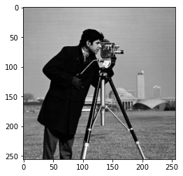
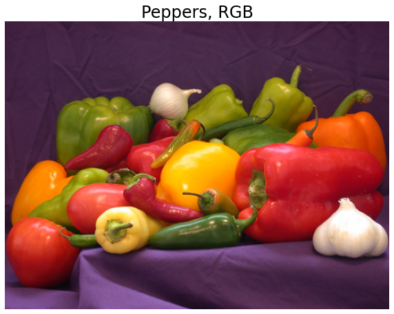
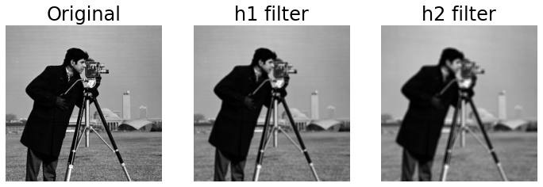
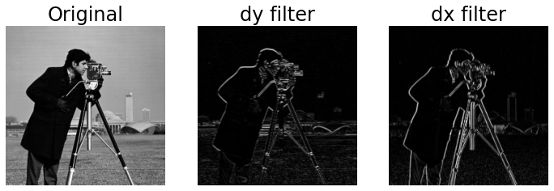

# Image Processing Fundamentals

**Last Update:** 2020/10/01 | Modified for the [2020 NMSU/USDA-ARS AI Workshops](https://kerriegeil.github.io/NMSU-USDA-ARS-AI-Workshops/)

> Copyright (C) 2020  Laura E. Boucheron
>
> This information is free; you can redistribute it and/or modify it under the terms of the GNU General Public License as published by the Free Software Foundation; either version 3 of the License, or (at your option) any later version.
>
> This work is distributed in the hope that it will be useful, but WITHOUT ANY WARRANTY; without even the implied warranty of MERCHANTABILITY or FITNESS FOR A PARTICULAR PURPOSE.  See the GNU General Public License for more details.
>
> You should have received a copy of the GNU General Public License along with this work in a file `COPYING.TXT`; if not, see <https://www.gnu.org/licenses/>.

## Overview

In this tutorial, we present a brief overview of image processing concepts necessary to understand machine learning and deep learning.  Completion of this tutorial should give participants the basic background and terminology necessary for an understanding of the basics of image processing and the common manipulations of images used for machine learning and deep learning.

This tutorial contains 5 sections:
  * **Section 0: Preliminaries**: some notes on using this notebook and how to download the two images that we will use for this tutorial
  * **Section 1: Working with Grayscale Images**: how to read, query characteristics, intepret, and display grayscale images
  * **Section 2: Working with Color Images**: how to read, query characteristics, interpret, and display color images
  * **Section 3: Transforming Images**: how to convert between grayscale and color images, how to rescale the spatial dimensions of an image through cropping and resizing, and other geometric transformations
  * **Section 4: Filtering Images**: the basics of filtering images through convolution with a filter kernel

There are subsections with the heading **<span style='color:Green'> Your turn: </span>** throughout this tutorial in which you will be asked to apply what you have learned.

# Section 0: Preliminaries

## Section 0.1 A Note on Jupyter Notebooks

A [Jupyter Notebook](https://jupyter.org/) of this pipeline is made available so you can interactively work through the tutorial.

* [Tutorial1_Image_Processing_Essentials_Boucheron.ipynb](https://geospatial.101workbook.org/tutorials/Tutorial1_Image_Processing_Essentials_Boucheron.ipynb)

The tutorial can also be run on Binder, launch below:

[](https://mybinder.org/v2/gh/ISUgenomics/geospatialworkbook.git/HEAD?filepath=tutorials%2FTutorial1_Image_Processing_Essentials.ipynb)

<!--
There are two main types of cells in this notebook: code and markdown (text).  You can add a new cell with the plus sign in the menu bar above and you can change the type of cell with the dropdown menu in the menu bar above.  As you complete this tutorial, you may wish to add additional code cells to try out your own code and markdown cells to add your own comments or notes.

Markdown cells can be augmented with a number of text formatting features, including
  - bulleted
  - lists

embedded $\LaTeX$, monotype specification of `code syntax`, **bold font**, and *italic font*.  There are many other features of markdown cells--see the jupyter documentation for more information.

You can edit a cell by double clicking on it.  If you double click on this cell, you can see how to implement the various formatting referenced above.  Code cells can be run and markdown cells can be formatted using Shift+Enter or by selecting the Run button in the toolbar above.

Once you have completed (all or part) of this notebook, you can share your results with colleagues by sending them the `.ipynb` file.  Your colleagues can then open the file and will see your markdown and code cells as well as any results that were printed or displayed at the time you saved the notebook.  If you prefer to send a notebook without results displayed (like this notebook appeared when you downloaded it), you can select ("Restart & Clear Output") from the Kernel menu above.  You can also export this notebook in a non-executable form, e.g., `.pdf` through the File, Download As or File, Export Notebook as menu.
-->

## Section 0.2 Downloading Images

First, we need to download images to work with in this tutorial.  Download `cameraman.png` and `peppers.png` and save them to the same directory as this notebook.  Both of these images are common example images used in image processing and are often included as part of the distribution of image processing toolboxes.


|cameraman.png            |  peppers.png       |
:-------------------------:|:-------------------------:
   | 

You can download the images by right clicking the images above, and saving to your computer. If you are working from an HPC or terminal, you can also use the `wget` command.

<div style="border:1px dotted; border-color:#969696; margin:10px">

```bash
wget https://geospatial.101workbook.org/tutorials/data/cameraman.png
wget https://geospatial.101workbook.org/tutorials/data/peppers.png
```

</div>

Notice how the left image `cameraman.png` is in grayscale while the `peppers.png` is in color. This means the amount of information (bands) per region of picture is going to be different.   Sometimes you want to focus on certain features which is better rendered/analyzed in grayscale or in color. You may be reducing the datasize by converting the color image to grayscale, or mapping an important band (more on that later) to a color.

## Section 0.3a Import Necessary Libraries (For users using a local machine)

First, we import necessary libraries:

  * We `import numpy as np` mostly out of habit since `numpy` contains many common mathematical and scientific functions
  * We import the `matplotlib` plotting library which provides many common plotting routines (including image visualization).  There are other plotting libraries, but `matplotlib` was designed to mimic much of the functionality of Matlab plotting and is thus very nice for those of us who transitioned from Matlab to python.
  * We specify that plots should occur inline in the notebook (rather than in external figure windows).  This is very convenient if you want a single document of your code and results.
  * We import the `imageio` library which provides functions to read common image formats.  We use imageio here since it returns images as an array.  We note that there are other powerful image libraries, including `PIL` / `pillow` which is used by the very nice `pandas` library for data manipulation.  We work with images as simple `nparrays` here since that best illustrates the basic image processing concepts.
  * We import two packages from scikit-image (`skimage`) which provides image manipulation functions
  * We import the `ndimage` package from `scipy` which provides image filtering functions

It would be best to run this next cell before the workshop starts to make sure you have all the necessary packages installed on your machine.


```python
import numpy as np
import matplotlib.pyplot as plt
%matplotlib inline
import imageio
import skimage.color
import skimage.transform
import scipy.ndimage as ndimage
```

## Section 0.3b Build the Conda Environment (For users using the ARS HPC Ceres with JupyterLab)

Open a terminal from inside JupyterLab (File > New > Terminal) and type the following commands

<div style="border:1px dotted; border-color:#969696; margin:10px;">

```
source activate
wget https://kerriegeil.github.io/NMSU-USDA-ARS-AI-Workshops/aiworkshop.yml
conda env create --prefix /project/your_project_name/envs/aiworkshop -f aiworkshop.yml
```

</div>

This will build the environment in one of your project directories. It may take 5 minutes to build the Conda environment.

See https://kerriegeil.github.io/NMSU-USDA-ARS-AI-Workshops/setup/ for more information.

When the environment finishes building, select this environment as your kernel in your Jupyter Notebook (click top right corner where you see Python 3, select your new kernel from the dropdown menu, click select)

You will want to do this BEFORE the workshop starts.

# Section 1: Working with Grayscale Images

## 1.1 Reading in the image

We can read in the images using the `imageio.imread` command.  We explicitly cast the image as an np array as this will give us access to some helpful characteristics of the image.  We begin with the grayscale `cameraman.png` image.


```python
INFILE = "data/cameraman.png"                 # path to image file
I_camera = np.asarray(imageio.imread(INFILE)) # load image and convert to array
```

## 1.2 Displaying the image

Let's display this image.  We use the `matplotlib` `imshow` command.


```python
plt.figure()                      # open a new figure window
plt.imshow(I_camera, cmap='gray') # visualize the I_camera image with a grayscale colormap
plt.show()                        # show the plot
```





### A note about coordinate conventions

By default, axis labels are included which demarcate pixel counts.  You may notice that the origin of an image is interpreted as the **upper left** corner and not the lower left corner as you might have expected.  This is a consequence of the fact that we use standard linear algebra style indexing for images where pixel \\((n,m)\\) is indexed in row, column order.  For those of you who might be particularly concerned, this coordinate system still describes a right-handed system.

This coordinate system can cause issues later on if you accidentally swap indices.  You might think you are looking in the upper right but are actually looking in the lower left.  You might think you are traversing left to right and are actually traversing up to down.

## 1.3 Changing display parameters

There are various choices in display that you can make, including:

  * scaling the figure window using `figsize=(x,y)` within the `plt.figure()` command.  In this, `x` and `y` are arbitrary units.  A reasonable choice for these units will depend on your computer's display parameters.
  * scaling the size of the text labels with the command `plt.rcParams.update({'font.size': f})` where `f` is the font size you desire in units of pt, e.g., 20.  You need to run this only once to update the font size parameters, after which all subsequent figure windows will use this new font size
  * removing the axis labels with the command `plt.axis('off')`
  * adding axis labels or a title to your plot, e.g., `plt.xlabel('flamingos')`, `plt.ylabel('emus')`, `plt.title('Emus versus flamingos')`.  Note that if you have turned the axes off, your titles will not show up.


```python
plt.rcParams.update({'font.size': 20})
plt.figure(figsize=(10,10))                # open a new figure window of size 10x10 (artbitrary units)
plt.imshow(I_camera,cmap='gray')           # visualize the I_camera image with a grayscale colormap
# plt.axis('off')                          # turn off the axis labels
plt.xlabel('title of x axis')              # provide a label for the x axis
plt.ylabel('title of y axis')              # provide a label for the y axis
plt.title('main title here')               # provide a title for the plot
plt.show()                                 # show the plot
```


## <span style='color:Green'> Your turn:  </span>
Choose a figure size so that the image fills the width of your notebook and provide a descriptive title to your image.  You may also choose to label your axes or not, per your preference.  For what it's worth, image processing people don't tend to display axis labels.


```python

```

## 1.4 Printing Image Characteristics
We can check on important characteristics of `I_camera` using the `%whos` magic ipython command.  Note--within some environments, including jupyter notebooks, you can drop the `%` althought it's probably best practice to get used to including it.

### 1.4.1 Using the %whos command


```python
%whos
```

    Variable   Type       Data/Info
    -------------------------------
    INFILE     str        data/cameraman.png
    I_camera   ndarray    256x256: 65536 elems, type `uint8`, 65536 bytes
    imageio    module     <module 'imageio' from '/<...>ges/imageio/__init__.py'>
    ndimage    module     <module 'scipy.ndimage' f<...>ipy/ndimage/__init__.py'>
    np         module     <module 'numpy' from '/sr<...>kages/numpy/__init__.py'>
    plt        module     <module 'matplotlib.pyplo<...>es/matplotlib/pyplot.py'>
    skimage    module     <module 'skimage' from '/<...>ges/skimage/__init__.py'>


### A note on common image variable types

We see that `I_camera` is an `ndarray` of size \\(256 \times 256\\) pixels and of variable type `uint8` (unsigned 8-bit integer).  Remember that computers store data natively in binary (base-2) format.  The `uint8` variable type means we have 8 bits (the `'8'` in `uint8`) to represent a range of positive (the `'u'` in `uint8`) integers (the `'int'` in `uint8`).  It is very common that image pixels are represented as `uint8` variables, which also indicates that the pixels are within the range \\([0,255]\\) (since \\(2^0-1=0\\) and \\(2^8-1=255\\)).  

Since there is only one color channel, i.e., `I_camera` is a 2D array \\(\in\mathbb{R}^{N\times M}\\) rather than a 3D array \\(\in\mathbb{R}^{N\times M\times C}\\) (more on that later), we also know that this is a grayscale image.

### 1.4.2 Printing the max and min values of an image

We can check for the actual maximum and minimum values of the image.


```python
print('The minimum value of I_camera is ' + str(I_camera.min()))
print('The maximum value of I_camera is ' + str(I_camera.max()))
```

    The minimum value of I_camera is 7
    The maximum value of I_camera is 253


### A note on image intensity conventions

We note that this ```I_camera``` image spans the range \\([7,253]\\).  In grayscale images, it is common interpretation that **darker pixels have smaller intensity values and lighter pixels have larger intensity values**.  

### 1.4.3 Printing a portion of the image

It is also important to remember that the computer "sees" only an array of values.  To reinforce this, we can "look" at what the computer "sees" in a portion of the image.


```python
print(I_camera[100:110,100:110])       # Print subregion that is 11 x 11 pixels
```

    [[  9  11  13  11  11  11  16 106 178  68]
     [ 12  12  12  11  12  11  69 181  62  15]
     [ 13  12  12  11  12  82 168  60  14  13]
     [ 11  10   9  10  69 182  67  14  12  14]
     [ 10  10  10  71 200  81  15  12  14  14]
     [ 12  12  58 204  91  17  12  14  14  17]
     [ 11  46 201 106  18  14  16  15  16  16]
     [ 34 185 122  23  10  14  17  16  13  13]
     [186 135  30  11   9   9  10  10   9  10]
     [154  33  11  13  12   9   9   9   9  11]]


## <span style='color:Green'> Your turn:  </span>

What does this printout tell us about the structure in that part of the image?  


### 1.4.4 Visualizing a portion of an image

We could use `plt.imshow` to display that small portion of the image.


```python
plt.figure()
plt.imshow(I_camera[100:110,100:110], cmap='gray')
plt.axis('off')
plt.title('Cameraman portion, grayscale')
plt.show()
```


## <span style='color:Green'> Your turn:  </span>

Does this display of the image verify your interpretation from the printout of the pixel values?


### 1.4.5 Another visualization of a portion of an image

Here, we maintain the display of the whole image, and plot a yellow box around the area that we've been discussing.  This can be a helpful visualization since it maintains the context of the box.


```python
plt.figure(figsize=(10,10))
plt.imshow(I_camera, cmap='gray')
plt.axis('off')
plt.title('Cameraman, grayscale')
plt.plot([100,100],[100,110], 'y-', linewidth=3)
plt.plot([110,110],[100,110], 'y-', linewidth=3)
plt.plot([100,110],[100,100], 'y-', linewidth=3)
plt.plot([100,110],[110,110], 'y-', linewidth=3)
plt.show()
```


## <span style='color:Green'> Your turn:  </span>

What happens if you plot the image using `imshow` but "forget" to specify the colormap as `gray`?


```python

```

### A note on colormaps

You should have found that the grayscale image now appears colored.  How can that be if the image is a single channel, i.e., grayscale image?  In this case, python is applying the default colormap to the intensities.  In this default colormap, dark pixels appear dark blue, medium intensity pixels appear green or blue, and light pixels appear yellow. (Your computer may use a different default colormap in which case the colors noted above may not be correct).

You can choose any number of colormaps (see https://matplotlib.org/3.1.0/tutorials/colors/colormaps.html for a comprehensive list and examples).

There are also many other options for `plt.imshow`, see `help(plt.imshow)` for more details.

# Section 2: Working with Color Images

## 2.1 Reading in and displaying the image

Now, we turn to the color `peppers.png` image.  We use the same command to read in the image and the same basic commands to visualize the image.  The only difference here is that we allow python to choose a default colormap for this color image.


```python
I_pepper = np.asarray(imageio.imread('data/peppers.png'))

plt.figure(figsize=(10,10))        # open a new figure window of size 10x10 (artbitrary units)
plt.imshow(I_pepper)               # visualize the I_pepper image with a default colormap
plt.axis('off')                    # turn off the axis labels
plt.title('Peppers, RGB')          # provide a title for the plot
plt.show()                         # show the plot
```





## 2.2 Printing image characteristics

We can check on important characteristics of `I_pepper`.

### 2.2.1 The %whos command


```python
%whos
```

    Variable   Type       Data/Info
    -------------------------------
    INFILE     str        data/cameraman.png
    I_camera   ndarray    256x256: 65536 elems, type `uint8`, 65536 bytes
    I_pepper   ndarray    384x512x3: 589824 elems, type `uint8`, 589824 bytes (576.0 kb)
    imageio    module     <module 'imageio' from '/<...>ges/imageio/__init__.py'>
    ndimage    module     <module 'scipy.ndimage' f<...>ipy/ndimage/__init__.py'>
    np         module     <module 'numpy' from '/sr<...>kages/numpy/__init__.py'>
    plt        module     <module 'matplotlib.pyplo<...>es/matplotlib/pyplot.py'>
    skimage    module     <module 'skimage' from '/<...>ges/skimage/__init__.py'>


### A note on color channel conventions

We see that `I_pepper` is an `ndarray` of size \\(384 \times 512 \times 3\\) pixels and of variable type `uint8` (unsigned 8-bit integer).  We thus have a 3-channel image where the three channels are assumed to be a red (R), green (G), and blue (B) channel, i.e., an RGB image.  **By convention, the first channel is assumed to be R, the second G, and the third B.**

Again, we note that image pixels are represented as `uint8` variables.  In this case, however, each pixel is associated with 3 `uint8` values, resulting in \\(2^8 2^8 2^8=2^{24}=16,777,216\\) unique colors.  **Colors which have equal contribution from R, G, and B are grayscale.**

### 2.2.2 Max and min values

We can check for the actual maximum and minimum values of the image or of the R, G, or B channels.


```python
print('Max and min values of the image:')         # Min & Max of all channels
print('    Min: ' + str(I_pepper.min()))
print('    Max: ' + str(I_pepper.max()))
print('Max and min values of the red channel:')   # The zero [:,:,0] indicates R (red) channel
print('    Min: ' + str(I_pepper[:,:,0].min()))
print('    Max: ' + str(I_pepper[:,:,0].max()))
print('Max and min values of the green channel:') # The one [:,:,1] indicates G (green) channel
print('    Min: ' + str(I_pepper[:,:,1].min()))
print('    Max: ' + str(I_pepper[:,:,1].max()))
print('Max and min values of the blue channel:')  # The two [:,:,2] indicates B (blue) channel
print('    Min: ' + str(I_pepper[:,:,2].min()))
print('    Max: ' + str(I_pepper[:,:,2].max()))
```

    Max and min values of the image:
        Min: 0
        Max: 255
    Max and min values of the red channel:
        Min: 5
        Max: 255
    Max and min values of the green channel:
        Min: 1
        Max: 255
    Max and min values of the blue channel:
        Min: 0
        Max: 255


### A note on intensity conventions in color images

We note that this ```I_pepper``` image spans the range \\([5,255]\\) in R, \\([1,255]\\) in G, and \\([0,255]\\) in B.  We also note that when we didn't specify a color channel, python returned the max and min across the three color channels.

Extending the interpretation of a single channel image in which darker pixels have smaller intensity values and lighter pixels have larger intensity values, a color is defined as the contribution of R, G, and B, where larger intensities in those channels correspond to larger contribution from those colors.  

### 2.2.3 Printing a portion of the image

Since we have three color channels in this color image, we print out each of the color channels separately for that same 11 x 11 pixel subregion.


```python
print('Red:')
print(I_pepper[100:110,100:110,0])
print('Green')
print(I_pepper[100:110,100:110,1])
print('Blue')
print(I_pepper[100:110,100:110,2])
```

    Red:
    [[ 62  60  60  61  61  61  60  57  61  67]
     [ 64  61  59  60  59  56  55  56  59  64]
     [ 62  62  61  59  56  52  62  73  85  92]
     [ 64  63  61  66  67  77  92 101 108 112]
     [ 63  60  59  71  86  96 102 109 110 114]
     [ 71  67  71  84  96 100 106 115 119 120]
     [107 104 100  99 104 109 112 123 126 127]
     [118 116 116 113 114 118 113 117 129 135]
     [120 119 117 110 105 108 110 107 114 127]
     [129 129 123 121 115 115 111 105 103 105]]
    Green
    [[ 34  35  36  36  33  32  32  34  34  38]
     [ 37  36  36  36  33  33  33  33  34  41]
     [ 35  36  37  39  38  37  44  58  72  85]
     [ 36  36  35  38  47  69  87  99 108 114]
     [ 39  37  39  57  82  97 103 107 113 117]
     [ 55  49  60  85  96 105 110 114 119 122]
     [104 100  99 101 103 108 116 119 121 124]
     [115 113 114 114 114 115 114 116 125 133]
     [116 112 110 109 105 106 107 108 111 123]
     [123 124 120 117 113 111 108 104 100  99]]
    Blue
    [[60 63 64 61 58 56 55 55 61 66]
     [66 63 61 60 60 59 56 57 55 55]
     [60 63 67 62 58 56 50 46 40 34]
     [61 61 64 60 50 44 29 21 16 11]
     [66 60 55 43 36 28 16 10 15 21]
     [49 48 37 26 22 19 13  6 10 16]
     [23 23 21 20 19 18 14  9 10  6]
     [24 21 23 24 24 30 23 17 19 22]
     [32 32 31 28 23 26 27 22 15 22]
     [32 26 15 11 12  7  8 15 12 14]]


## <span style='color:Green'> Your turn:  </span>

What does this printout tell us about the structure in that part of the image?  It can be a bit harder to interpret this sort of printout for a color image since we must keep track of multiple color channels simultaneously.  There are other color spaces in which color interpretation are easier (e.g., HSV), but that is outside the scope of this tutorial.


## <span style='color:Green'> Your turn:  </span>

Visualize where in the image we are looking by overlaying a box on the image visualization.


```python

```


# Section 3: Transforming Images

We will find that many deep learning methods are very particular about the size of input images.  This particularity about size extends across all three dimensions--the two spatial dimensions and the color dimension.  As such, it is useful to learn a couple of common methods to rescale images in all three dimensions. Here, we will learn how to **convert between RGB and grayscale**, how to **crop** images, how to **resize** images.  

## 3.1 Color to Grayscale

We can convert a color image to a grayscale image using a standard command included in Scikit-Image.  We can use the `skimage.color.rgb2gray` function to convert the RGB image `I_pepper` to a grayscale image.  The `skimage.color.rgb2gray` function applies a weighted averaging of the three color channels to yield a grayscale image.  As a note, there is no single accepted weighting to convert between a color and grayscale image, so your results using `skimage` may differ from results using other libraries or programming languages.


```python
I_pepper_gray = skimage.color.rgb2gray(I_pepper)
```

## <span style='color:Green'> Your turn:  </span>

What are the dimensions of `I_pepper_gray`?  How many channels does it have?  What is the variable type?  What are the max and min values?


```python

```

### A note about float-valued images

You will probably have noticed that the variable `I_pepper_gray` is now a float-valued array, and that the range is now within \\([0,1]\\).  This is another common range for images.  Some functions, e.g., functions that write out to standard image formats, may expect `uint8` variables.  You can always cast back to `uint8` as needed, e.g., `I_pepper_gray_uint8=(I_pepper_gray*255).astype('uint8')`.

A common issue in image processing is a mismatch between the expected and actual variable type and/or intensity range.  If a function is expecting a `float` in the range \\([0,1]\\) and gets instead a `uint8` in the range \\([0,255]\\), unexpected things can happen.  A non-exhaustive list of some of the issues you might encounter:

  * The code will throw an error.  
  * The code will intelligently convert between the variable types (but this might mean you receive a different intensity range back from the code).
  * The code will unintelligently convert between the variable types.  
  * You accidentally end up performing integer arithmetic instead of floating-point arithmentic.  This is a particularly fun one to track down.

## <span style='color:Green'> Your turn:  </span>

Display this new grayscale image `I_pepper_gray`.


```python

```

## 3.2 Grayscale to Color

We can similarly convert a grayscale image to a color image using a standard command included in Scikit-Image.  It is important to note that this conversion is really just creation of an image with a third dimension.  Each of the color channels will be identical since we cannot infer color from solely a grayscale image.


```python
I_camera_rgb = skimage.color.gray2rgb(I_camera)
```

## <span style='color:Green'> Your turn:  </span>

What are the dimensions of `I_camera_rgb`?  How many channels does it have?  What is the variable type?  What are the max and min values?


```python

```

## <span style='color:Green'> Your turn:  </span>

We expect that the three color channels in this `I_camera_rgb` image are identical.  Print out a small portion of the image to verify this to yourself.


```python

```

## <span style='color:Green'> Your turn:  </span>

Display this new RGB image `I_camera_rgb`.


```python

```

### A note about why we might convert a grayscale image to a "color" image

We note, unsurprisingly, that the `I_camera_rgb` still appears as a grayscale image.  It just happens to have 3 identical color channels.  In the meantime, we may be using three times the space to represent this image, but the fact that it now has 3 color channels instead of 1 will be key when we begin studying deep learning networks.  

# 3.3 Cropping

Suppose that we have a network that expects a \\(256 \times 256\\) image as input, i.e., the dimensionality of the `cameraman.png` image.  If we want to input `peppers.png` we have two problems: it has three color channels and it is of spatial dimension \\(384 \times 512\\).  We know that we can convert the RGB image to a grayscale image.  Now we have to figure out how to rescale the spatial dimensions

If we crop the image, we choose some \\(256 \times 256\\) pixels to retain.  For example if we kept the upper left corner of the image, we would have an image such as follows.


```python
I_pepper_gray_crop = I_pepper_gray[0:256,0:256]
plt.figure(figsize=(20,20))
plt.imshow(I_pepper_gray_crop, cmap='gray')
plt.axis('off')
plt.title('Peppers, gray, cropped')
plt.show()
```


### Cropping removes parts of the image

We note, unsurprisingly, that we have completely removed parts of the pepper image.

# 3.4 Resizing

What if the `peppers.png` image had fewer than 256 pixels?  What if we are unhappy with the loss of information associated with cropping?  Here we can use an image interpolation from the Scikit-Image transform library.  We can use the `skimage.transform.resize` function to resize the image.  In the following syntax, we are asking the function to resize `I_pepper_gray` to a size \\(256 \times 256\\) pixels.

We note that there are many options to the resize command, including specification of what form of interpolation to use, whether to anti-alias filter, and different means of specifying the scale of the output.  See `help(skimage.transform.resize)` for more information.  The syntax used here assumes defaults for all parameters (a good starting point) and provides the expected scale of the output image in an easy to understand tuple that consists of the spatial dimensions in pixels.


```python
I_pepper_gray_resize = skimage.transform.resize(I_pepper_gray, (256,256))
plt.figure(figsize=(20,20))
plt.imshow(I_pepper_gray_resize, cmap='gray')
plt.axis('off')
plt.title('Peppers, gray, resized')
plt.show()
```


### Resizing can distort the aspect ratio

Here we note that we have distorted the aspect ratio of the original ```peppers.png``` image.  In some applications this may not matter and in others it might matter a great deal.  In general, depending on the application, you may want to consider a combination of resizing and cropping.  

# 3.5 Combining Cropping and Resizing

## <span style='color:Green'> Your turn:  </span>

Combine cropping and resizing to yield a \\(256 \times 256\\) pixel grayscale peppers image that you think retains the majority of the original "intent" of the image.  Note--there is no "right" answer here...


```python

```

## <span style='color:Green'> Your turn:  </span>

How would you reconfigure the `cameraman` image to be the \\(384 \times 512 \times 3\\) size of `peppers`?  Would you find this an easier conversion to make or a more difficult one?  Note--there is no "right" answer here either...


```python

```

# Section 4: Filtering Images

We will find that a key element of convolutional neural networks (CNNs) is a convolutional layer.  It is thus critical that we understand the basics of image convolution and how to interpret those results.

Convolution is the means to filter an image in the spatial domain.  This requires the definition of a filter kernel.  The filter kernel is a 2D or 3D array of filter coefficients, generally much smaller in spatial extent than the image.

## 4.1 Low Pass (Smoothing) Filters

Many commonly used image filters are defined in `scipy.ndimage`.  Here, we explore how to explicity define a filter kernel and convolve that kernel with an image.  This will prepare us better to interpret the convolutional layers in CNNs.  We will use the `ndimage.filters.convolve` function here.

### 4.1.1 Define the filter kernels

We define two filters `h1` and `h2`.  These are very simple lowpass (smoothing) filters where all the coefficients are equal in value and are normalized such that their sum is 1.  It is generally common practice to use odd-sized filters.  This is because there is an ambiguity in determining the "center" of an even-sized filter.


```python
h1 = 1/9.*np.ones((3,3))
h2 = 1/25.*np.ones((5,5))
```

### 4.1.2 Convolving the filter kernels with an image

We compute the filtered output by convolving the image `I_camera` with each of the filter kernels using `ndimage.filters.convolve`.  We then visualize the filtered images.  We cast the image `I_camera` as a `float` to avoid integer arithmetic in the convolution operations.


```python
I_camera_h1 = ndimage.filters.convolve(I_camera.astype(float), h1)
I_camera_h2 = ndimage.filters.convolve(I_camera.astype(float), h2)

plt.figure(figsize=(12,4))

plt.subplot(1,3,1)
plt.imshow(I_camera, cmap='gray')
plt.axis('off')
plt.title('Original')

plt.subplot(1,3,2)
plt.imshow(I_camera_h1, cmap='gray')
plt.axis('off')
plt.title('h1 filter')

plt.subplot(1,3,3)
plt.imshow(I_camera_h2, cmap='gray')
plt.axis('off')
plt.title('h2 filter')

plt.show()
```





## <span style='color:Green'> Your turn:  </span>

What effect has each of the filters `h1` and `h2` had on the image?


## 4.2 High Pass (Edge Enhancing) Filters

### 4.2.1 Define the filter kernels

We define two filters `dy` and `dx`.  These are very simple highpass (edge enhancing) filters called the Sobel filters.


```python
dy = [[-1,-2,-1],[0,0,0],[1,2,1]]
dx = [[-1,0,1],[-2,0,2],[-1,0,1]]
```

### 4.2.2 Convolving the filter kernels with an image

We compute the filtered output by convolving the image `I_camera` with each of the filter kernels.  We again cast the image `I_camera` as a `float` to avoid integer arithmetic in the convolution operations.


```python
I_camera_dy = ndimage.filters.convolve(I_camera.astype(float), dy)
I_camera_dx = ndimage.filters.convolve(I_camera.astype(float), dx)
```

### A note on filtered images that have negative values

It is common that filtered images may end up with intensity values outside of the original range.  In this case, the image `I_camera` was in the range \\([0,255]\\).  If we look at the range of the filtered images, we find that the filtered images now span a much larger range:


```python
print('Max and min values of the Original image:')
print('    Min: ' + str(I_camera.min()))
print('    Max: ' + str(I_camera.max()))
print('Max and min values of the dy filtered image:')
print('    Min: ' + str(I_camera_dy.min()))
print('    Max: ' + str(I_camera_dy.max()))
print('Max and min values of the dx filtered image:')
print('    Min: ' + str(I_camera_dx.min()))
print('    Max: ' + str(I_camera_dx.max()))
```

    Max and min values of the Original image:
        Min: 7
        Max: 253
    Max and min values of the dy filtered image:
        Min: -861.0
        Max: 893.0
    Max and min values of the dx filtered image:
        Min: -900.0
        Max: 882.0


The Sobel filters are designed to approximate the first derivative of the image.  As such, we might expect that the derivative (think slope) will potentially be positive or negative and could span a different absolute range than the original \\([0,255]\\).  We can get a better sense of the edge enhancement capabilities of `dy` and `dx` if we look only at the positive values.  Looking only at the positive values rather than the absolute value will be more consistent with the activation function we will use in convolutional neural networks.  We first clip all negative values in the images to zero and then visualize the filtered output.


```python
plt.figure(figsize=(12,4))

plt.subplot(1,3,1)
plt.imshow(I_camera, cmap='gray')
plt.axis('off')
plt.title('Original')

plt.subplot(1,3,2)
#I_camera_dy[I_camera_dy<0] = 0
plt.imshow(abs(I_camera_dy), cmap='gray')
plt.axis('off')
plt.title('dy filter')

plt.subplot(1,3,3)
#I_camera_dx[I_camera_dx<0] = 0
plt.imshow(abs(I_camera_dx), cmap='gray')
plt.axis('off')
plt.title('dx filter')

plt.show()
```





When we focus only on the positive values of the filtered output, we see that the majority of the filtered image is now close to a value of 0 (i.e., black), and it is only at the edges of the image objects that we see a response (i.e., lighter values). We see that `dy` has enhanced edges oriented in a horizontal direction and `dx` has enhanced edges oriented in a vertical direction.

Combined, this let's us identify edges in a grayscale image and subsequently identify features in an image for later Machine Learning. This concludes our tutorial on loading an image, transforming that image, and identifying edges within that image.
