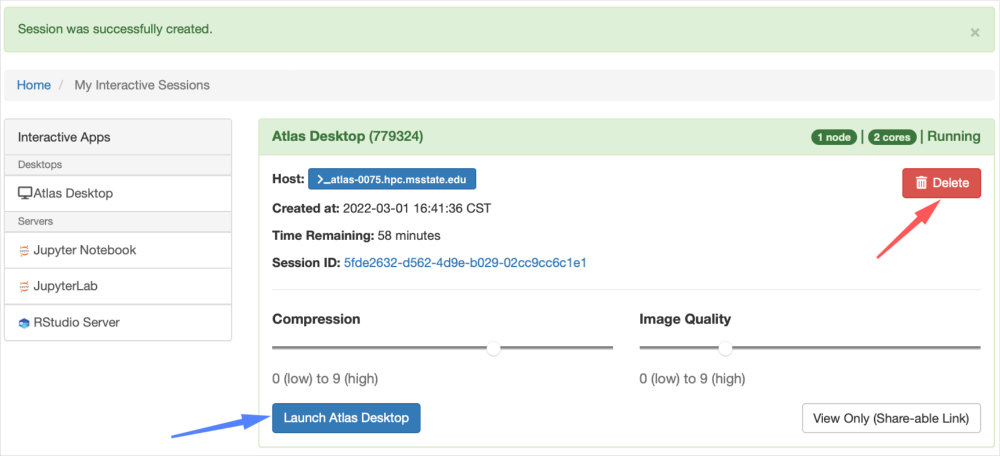
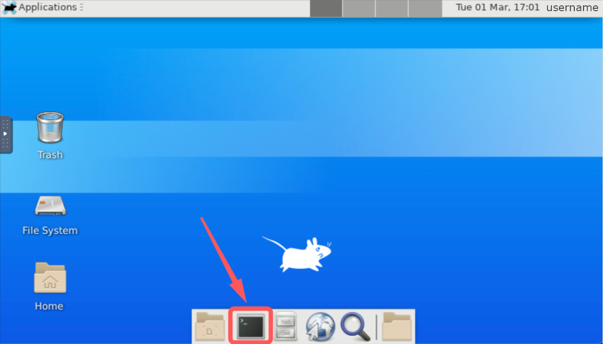



## Metashape on Atlas cluster (SCINet HPC)
The **Agisoft** is preinstalled on [Atlas](https://www.hpc.msstate.edu/computing/atlas/) SCINet HPC infrastructure as a *Metashape* distribution in version **1.7.3** and can be loaded into your computational environment with `module load` command.

### Requirements
To activate the module, you must first load the `gcc/10.2.0` package, which is the required dependency for *Metashape*.

```
module load gcc/10.2.0                          # required (always)
module load mesa/20.1.6                         # required (only when using graphical interface)
module load metashape/1.7.3                     # required (always)
```

### Platform plugin

The [Qt](https://doc.qt.io/qt-5/qtgui-index.html) is a GUI toolkit which provides modules for cross-platform development and creating graphical user interfaces. Therefore, depending on the platform you are working on, you should choose the right plugin.
There are two platform plugins available of which *xcb* is the default setting.
* `xcb` , provides the basic functionality needed by Qt GUI to run against X11 (*Xterminal graphical interface*)

   use *xcb* platform (default), when using Agisoft via the [Open OnDemand service](#access-atlas-via-open-ondemand-service)

* `offscreen` , prevents the startup of the graphical interface when using a Linux terminal system

  use *offscreen* platform, when using Agisoft via the [SSH terminal connection](#access-atlas-via-ssh-terminal-connection)

  ```
  metashape -r script.py -platform offscreen
  ```


### Access Atlas via *Open OnDemand* service

[*Open OnDemand*](https://www.hpc.msstate.edu/computing/atlas/#ondemand) (OOD) is web-based platform which provides user-friendly graphical interface directly in a web browser tab for access to the Atlas HPC infrastructure, including both the file system, GUI applications, and standalone software.

#### 1. Log in to the OOD service

To connect to Atlas via OnDemand interface, visit [https://atlas-ood.hpc.msstate.edu/](https://atlas-ood.hpc.msstate.edu/) within your web browser (*Google Chrome*, *Mozilla Firefox* or *Microsoft Edge* are preferred).


Follow the instructions provided by [hpc.msstate.edu](https://www.hpc.msstate.edu/computing/atlas/#ondemand) :
> In order to log in, users must use their SciNet credentials. The 6-digit Google Authenticator code must be entered in the same field as the password, with no spaces or other characters in-between the password and Google Authenticator code.

Your SciNet credentials includes:
* username, usually in the form `name.surname`
* password, the same password as used for ssh connection to Atlas
* Google Authenticator code, if you don't use it yet, find out more at [SCINet/GA](https://scinet.usda.gov/guide/multifactor/#google-authenticator-ga-on-android)

#### 2. Set up remote Atlas Desktop

To get a graphical interface to the file system and applications on an Atlas cluster, you first need to activate remote Atlas Desktop. For this, select `Interactive Apps` from the top menu and then `Atlas Desktop` from the dropdown options.


**Specify the the interactive job request**

Now, in your browser tab, a form should appear where you should configure the settings for the interactive job you want to complete on the Atlas cluster. When you have set the options, click the long blue *'Launch'* button.

| Param, Value | Form |
| ----------- | ----------- |
| **Account** , your project_name visible on Atlas in /project/<br><br>**Partition_Name** , 'atlas' or 'gpu' (if available)<br><br>**QOS** , 'ood'<br><br>**Number of hours** , 2 (up to 8 hours)<br><br>**Number of nodes** , 1<br><br>**Number of tasks** , 2 (tasks = cores here, with a max of 2)<br><br>**Resource Reservation** , *leave empty*<br><br>**Memory Required (In GB)** , *our example uses ~10GB*<br><br> *Check boxes if want to receive emails* | |

**Launch Atlas Desktop**

In the next step you will see your request queued and once the resources have been allocated to your job (should get an email if selected as an option), you will finally be able to `Launch Atlas Desktop` using blue button in the bottom left corner of the form. With the options *'Compression'* and *'Image Quality'* you can decide how good the graphic quality you want to get in the remote desktop view.

At any time you can remove your interactive session from the queue by pressing the red `Delete` button, available in the top right corner of the form.



#### 3. Open the terminal emulator

The Atlas Desktop should automatically open in a new tab in the same browser window in which you requested *Open OnDemand* access. You can browse the file system in graphical mode. Your home directory is visible on the desktop. At the bottom of the screen you will find quick shortcuts to applications, including the terminal. In the picture, its icon is indicated by a red arrow. Clicking on the icon will open the coding console window.




#### 4. Load dependencies

When a terminal window appears on your screen, type the following commands to load all the required dependencies. Note that in order to keep the graphical interface functional, you need to load an additional `mesa` package.

```
module load gcc/10.2.0
module load mesa/20.1.6
module load metashape
```

If you want to check the validity of the above modules for a Metashape module, you can use the command below, which will return a list of requirements.

```
module spider metashape
```

#### 5. Run Metashape Python scripts

In the Metashape analysis, you can run python scripts in two ways:

* directly in a terminal window using the `metashape` command with *-r* flag followed by the name of the python script

  ```
  metashape -r metashape_script.py
  ```

* by launching the interactive GUI for Agisoft Metashape using the `metashape` command in the terminal, and then running a python script in the Console tab of the GUI window (fourth tab from the left on the bottom menu bar in the GUI of the *Agisoft Metashape Professional*)

  ```
  metashape
  ```

<br>


<span style="color:#e30054">If you want to learn more about Agisoft Metashape analysis using python programming go to the [Metashape Python Scripting](03-MetashapePythonScripts.md) article. <br>You can also go to the [Photogrammetry Tutorial](03-Tutorial-Photogrammetry.md), which introduces you to photogrammetric analysis with a practical example of processing drone imagery in Agisoft Metashape. The automated workflow was developed and made available through the kindness of Hugh Graham, Andrew Cunliffe, Pia Benaud, and Glenn Slade.</span>

### Access Atlas via SSH terminal connection

[*SSH*](https://en.wikipedia.org/wiki/Secure_Shell) (Secure Shell) is a protocol that enables two computational machines to communicate via network. This is especially useful when you want to remotely request computations or access the data on a cluster from your local computer. The SSH connection by default does not provide a graphical interface, so file system browsing and calculations are done using commands written in the terminal window.

#### 1. Open terminal window

Depending on the operating system on your local computing machine (Windows, macOS, Linux) the way to run a terminal is slightly different but each of these systems should have at least a basic terminal pre-installed. To learn what is the difference between Terminal, Console, Shell and Kernel, check [here](https://www.geeksforgeeks.org/what-is-terminal-console-shell-and-kernel/).

**Windows**

In Microsoft Windows, a command-line shell is usually called a *Command Prompt* or more recently a *PowerShell*.<br>
Follow these steps to display the terminal window:
1. Go to Start Menu (Windows icon available on the left corner of your desktop) and type *'cmd'* or *'powershell'*.<br> The search results should display a dark square icon.
2. Click on the icon to open the terminal window.

**macOS**

In macOS you can start a terminal session by clicking on the black square icon present in the Dock bar. If the shortcut is not there by default, you can search for *'Terminal'* or '*iTerm'* in the Finder.

**Linux**

In Linux you can start a terminal session by clicking on the black square icon *'Terminal'* present in the Menu bar.

| Windows     | macOS | Linux |
| ----------- | ----------- | ----------- |
|  |  |  |

#### 2. Connect to Atlas using SSH

Once you have a terminal window open, log in to the Atlas cluster using the `ssh` command and your SCINet credentials.

```
ssh name.surname@atlas-login.hpc.msstate.edu
```

Your SciNet credentials includes:
* username, usually in the form `name.surname`; make sure username is lower case
* Google Authenticator (GA) code, if you don't use it yet, find out more at [SCINet/GA](https://scinet.usda.gov/guide/multifactor/#google-authenticator-ga-on-android)
* password, the password to Atlas is set separately than a password for Ceres cluster

**First time user's login**

* Enter `ssh name.surname@atlas-login.hpc.msstate.edu` in the terminal window and press `enter` or `return` on your keyboard.
* When prompted for verification code, enter the 6 digits generated by the GA application and press `enter` or `return` on your keyboard. <br>*Note: the code will not be shown on the screen as you enter them.*
* When prompted for your password, enter your password and press `enter` or `return` on your keyboard.
<br> *Note: the code will not be shown on the screen as you enter them.*

  * For first time user's login to Atlas use your temporary password received in the SCINet welcome email. A message will appear telling you that your password has expired.
  * When prompted for your *'current password'*, enter your temporary password once again.
  * Then you will be prompted twice to eneter your *'new password'*. <br>*When creating a new password, make sure it contains at least 12 characters of at least 3 different classes (e.g. upper/lower case, numbers and special characters: # @ $ %, etc.).*

**Exit the SSH connection**

Once you have completed your activities on the Atlas cluster, you should use a secure way to disconnect your local computer from the HPC infrastructure. To terminate the ssh connection with Atlas, type `exit` in the terminal and press `enter` on your keyboard. Then, you can close the terminal window on your computer.


#### 3. Navigate to your workdir

Once you have successfully logged in, by default you are in your **/home** directory on Atlas. You can confirm this by typing the `pwd` command. <br>*Note: any shell command require pressing enter or return to be executed.*

```
pwd
```

Home directory **is not** intended to be used as workspace. Instead, the correct location is **/project**, where you should use `ls` to find the directory for your group's project. Usually the project name matches the *'account'* field used to access the [Atlas OOD service](#set-up-remote-atlas-desktop), and formally refers to a **slurm account**, as defined at [scinet.usda.gov](https://scinet.usda.gov/guide/ceres2atlas/#slurm-account) :

> To run jobs on compute nodes of either cluster, the jobs need to be associated with a slurm account. For users that have access to one or more project directories, their slurm accounts have same names as the project directories. The slurm account for users without project directories is called scinet.

To display a list of available slurm accounts (projects), execute in terminal:

```
ls /project/
```

If you don't find an account for your group on the list, you can [request one](https://scinet.usda.gov/guide/storage/#project-directories) or you can use one of the general access projects, such as ***scinet***, ***shared*** or ***90daydata***. Navigate to `/project/<account_name>` (here we use *scinet* as an example) and create with `mkdir` a new working directory for your computing task.

```
cd /project/scinet
mkdir your_workidr_name
cd your_workidr_name
```

You can check your current location in the file system with `pwd` and display its contents with `ls`.


#### 4. Set up SLURM job

On an Atlas cluster, **computation on a *login node* is prohibited**. Therefore, all calculations must be submitted to the *compute nodes* using the SLURM task management system (learn more from the [tutorial](https://bioinformaticsworkbook.org/Appendix/HPC/SLURM/slurm-cheatsheat.html#gsc.tab=0)). In general, you can access compute nodes by:
* submitting a job to a queue using the `sbatch` command
* starting an interactive session with the `salloc` command

For projects using Metashape analytics, running **an interactive session is not recommended** due to the high-impact processes that result in a violation of the resource usage policy. As a consequence, the user will receive a penalty status that will reduce their original computing power limits (e.g., status *penalty1* limits to 80% of CPU and memory usage). So, if you need to test your protocol with an interactive preview of the computation progress, use [Atlas OOD service](#set-up-remote-atlas-desktop).


Once your computation protocol is steady or if you want to use the scripts available in the [Photogrammetry Tutorial](03-Tutorial-Photogrammetry.md), follow the steps below to prepare the job for submission into the queue with `sbatch` command.

**1. Create SLURM submission script**

At the command line, you can easily create a new empty file with the `touch` command.

```
touch submit_metashape.sh
```

**2. Copy-paste the basic content of the SLURM script**

First, open the submission script file `submit_metashape.sh` in text editor of your choice (usually *nano* or *vim*) by typing in the command-line the name of the editor followed by the name of the file.

```
nano submit_metashape.sh
```

In the text editor paste the text passage copied from the code block provided below. Use arrows keys on your keyboard to navigate and change values of variables according to your preference.
* SLURM VARIABLES:
  * *job-name*, name of your job visible in the queue with `squeue -u user.name` command
  * *account*, your slurm account, for details see section [3. Navigate to your workdir](3.-navigate-to-your-workdir)
  * *mail-user*, provide email of your choice
* CODE VARIABLES:
  * *workdir*, provide the full path to the directory with the python script
  * *script_name*, provide the filename of python script used in this job

Then, press `control` and `x` to exit, then press `y` for *yes* to save changes.

```
#!/bin/bash

# job standard output will go to the file slurm-%j.out (where %j is the job ID)
# DEFINE SLURM VARIABLES
#SBATCH --job-name="metashape"
#SBATCH --partition=gpu                   # GPU node(s)
#SBATCH --nodes=1                         # number of nodes
#SBATCH --ntasks=48                       # 24 processor core(s) per node X 2 threads per core
#SBATCH --time=01:00:00                   # walltime limit (HH:MM:SS)
#SBATCH --account=scinet
#SBATCH --mail-user=your.email@usda.gov   # email address
#SBATCH --mail-type=BEGIN                 # email notice of job started
#SBATCH --mail-type=END                   # email notice of job finished
#SBATCH --mail-type=FAIL                  # email notice of job failure


# LOAD MODULES, INSERT CODE, AND RUN YOUR PROGRAMS HERE
module load gcc                           # load gcc dependency
module load metashape                     # load metashape, then run script with x11 turned off

# DEFINE CODE VARIABLES
workdir=/project/scinet/your_workdir      # path to your workdir (can check with 'pwd' in terminal)
script_name=metashape_part1_SPC_linux.py  # the filename of the python script you want to run

# DEFINE METASHAPE COMMAND
metashape -r $your_workdir/$script_name -platform offscreen
```

**2. Submit your job to the queue**

Make sure all required files are in the current directory. You can display its contents with `ls`.
<br>The required files include:
* SLURM script: e.g., *submit_metashape.sh*
* Python script: e.g., *metashape_part1_SPC_linux.py*, available for download from [here]()
* Input files (example dataset is available for download from [here]()):
  * config file: e.g., *input_file.csv*, column-type text file with key-value pairs of initial parameters used in the Python scripts
  * input folder: e.g., *input_data*, the directory that contains photos in DNG format  

Finally, to sumbit your job use `sbatch` command followed by your SLURM script name, and press `enter`. If successfully submitted into a batch, the job number will be displayed on your screen.
```
sbatch submit_metashape.sh
```
> Atlas-login-1[31] user.name$ sbatch submit_metashape.sh    
> Submitted batch job 726220

If you have used the email notification option, you will receive emails 1) when the job is queued, 2) when the job has completed running, and eventually 3) when the job has failed due to an error (e.g., exceeding of reserved resources such as walltime or memory).

**3. Trace the output file**

It is useful to trace the contents of the output file (slurm-*job_id*.out, e.g., slurm-726219.out for this example) that collects the results from the standard output & error. This can help you detect the case of job failure, but also to analyze the performance and efficiency of the computation in the case of a successful job.
<br>*Note: If you don't remember the job_id for your job, then display the contents of your project directory and filter out the results that have the 'out' extension.*

```
ls | grep "out"
```
> slurm-726219.out

To preview the content of this file use `less` command, followed by the *filename* and press `enter`. *less* is a read-only viewer, so you don't have to worry about accidentally making any changes.

```
less slurm-726219.out
```

*Note: In the viewer, use arrow keys and/or *'page'*, *'button'* keys on your keyboard, to smoothly navigate through the file.*

In the file view, check analysis for % of cameras aligned and not aligned. That the mean reprojections values are within the threshold. Use `q` letter on the keyboard to exit viewer.

Once you have completed your activities on the Atlas cluster, you can disconnect your local computer from the HPC infrastructure using `exit` command followed by pressing `enter` on your keyboard. 
