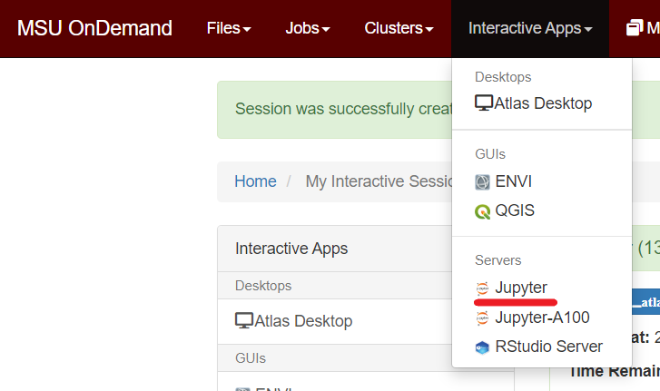
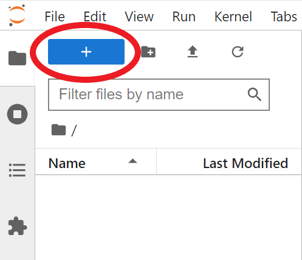
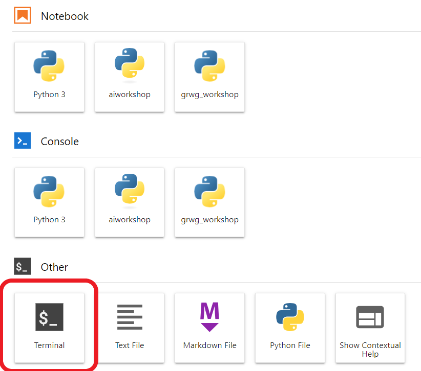
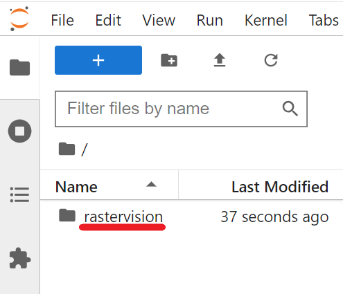
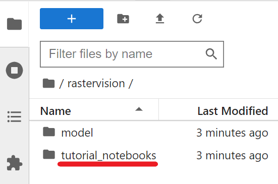
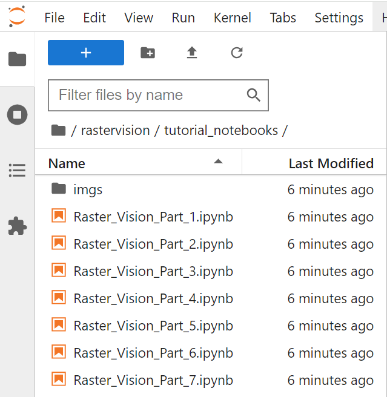
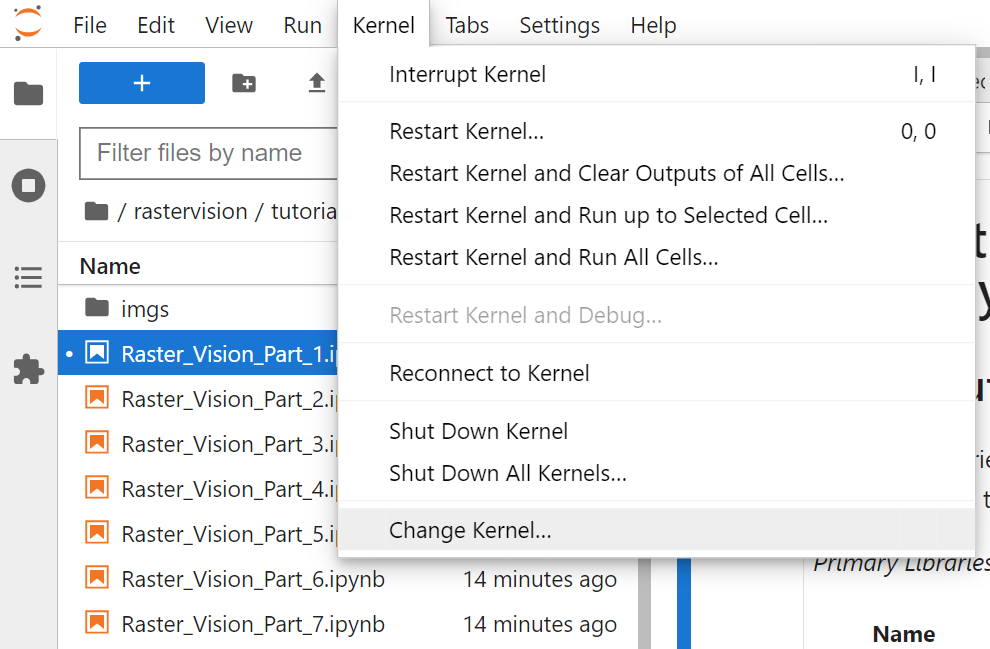
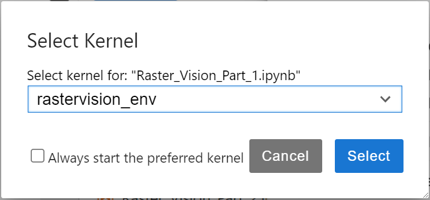

# Semantic Segmentation of Aerial Imagery with Raster Vision 
## Part 1: Tutorial Setup on SCINet

This tutorial series walks through an example of using [Raster Vision](https://rastervision.io/) to train a deep learning model to identify buildings in satellite imagery. 

*Primary Libraries and Tools*:

|Name|Description|Link|
|-|-|-|
| `Raster Vision ` | Library and framework for geospatial semantic segmentation, object detection, and chip classification in python| https://rastervision.io/ |
| `Apptainer` | Containerization software that allows for transportable and reproducible software | https://apptainer.org/ |
| `pandas` | Python library supporting dataframes and other datatypes for data analysis and manipulation | https://pandas.pydata.org/ |
| `geopandas` | Python library that extends pandas to support geospatial vector data and spatial operations | https://geopandas.org/en/stable/ |
| `rioxarray` | Python library supporting data structures and operations for geospatial raster data | https://github.com/corteva/rioxarray |
| `pathlib` | A Python library for handling files and paths in the filesystem | https://docs.python.org/3/library/pathlib.html |

*Prerequisites*:
  * Basic understanding of navigating the Linux command line, including navigating among directories and editing text files
  * Basic python skills, including an understanding of object-oriented programming, function calls, and basic data types
  * Basic understanding of shell scripts and job scheduling with SLURM for running code on Atlas
  * A SCINet account for running this tutorial on Atlas

*Tutorials in this Series*:
  * 1\. **Tutorial Setup on SCINet _(You are here)_**
  * 2\. **Overview of Deep Learning for Imagery and the Raster Vision Pipeline**
  * 3\. **Constructing and Exploring the Apptainer Image**
  * 4\. **Exploring the Dataset and Problem Space**
  * 5\. **Overview of Raster Vision Model Configuration and Setup**
  * 6\. **Breakdown of Raster Vision Code Version 1**
  * 7\. **Evaluating Training Performance and Visualizing Predictions**
  * 8\. **Modifying Model Configuration - Hyperparameter Tuning**

## Tutorial Setup

To kick off this series of tutorials, we will begin with a tutorial dedicated to setting up your computational environment on Atlas! First, launch [Open OnDemand](https://atlas-ood.hpc.msstate.edu/pun/sys/dashboard) in your browser. Log in with your SCINet credentials.  

#### Project Group Identification
This tutorial requires users to specify an account name. This name will be used to launch a jupyter session in this tutorial, and to run batch scripts through SLURM in future tutorials. If you are a part of a project group, then you can use that project group name as your account name to launch jupyter run scripts. The following steps will allow you to see what project groups you are a part of.    
From [MSU OnDemand](https://atlas-ood.hpc.msstate.edu/pun/sys/dashboard), click <b>Clusters</b>, then <b>Atlas Shell Access</b>.  
  
This will open up a terminal tab in another browser window. Log in with your SCINet credentials, then run the following command:  
`sacctmgr -Pns show user format=account where user=$USER`    
This will output a list of project groups you are a part of. If you are a part of a project group, you can use any of these project group names to launch jobs for this tutorial.    
<b>Note</b>: If you only see the project group name `sandbox`, then you are not a part of a project group yet. We advise against using the `sandbox` account name for launching scripts in tutorials 6 and on, since only a very limited amount of computational resources will be available to you.    
If you are <b>not</b> a part of a project group, you can request an account [here](https://scinet.usda.gov/support/request), and use the `sandbox` account name to complete the first 5 tutorials while your request is processing.   
Take note of the project group name you would like to use, as we will need it in the next section.

#### Picking a Project Directory
Next, decide on a project directory location. We recommend not using your home directory since you will quickly run out of space. Instead, we recommend either using `/90daydata/shared/$USER/whatever_subdirectory`, or a `/project/project_group_name/whatever_subdirectory` directory if you have one. Make a note of the directory you would like to use - in the following steps, we will create a `rastervision` directory here, and transfer the needed files to this directory.

#### Launching JupyterLab
Click on <b> Interactive Apps </b>, then <b>Jupyter</b>.  
  
Input the following job specifications, replacing "Account Name" with your project group name, and "Working Directory" with the directory you chose above. You may also wish to change the number of hours based on how long you intend to work on this tutorial for now.  
- Working Directory: <b> path to desired project directory</b>, ie /90daydata/shared/$USER 
- Account Name: <b> project group name</b>, ie geospatialworkshop
- Partition Name: atlas
- QOS: ood – Max Time: 8-00:00:00
- Number of hours: 4
- Number of nodes: 1
- Number of tasks: 1
- Additional Slurm Parameters: --mem=32gb

Then click the `Launch` button at the bottom of the page. Once your session loads, click the `Connect to Jupyter` button.

Once the jupyter session is launched, we will open up a terminal. Click the `+` button on the top left, above the navigation pane. 
 
Then click on the `Terminal` button.  
  

#### Setting Project Shell Variables
<b>Navigate to your project directory</b>, (ie with `cd /90daydata/shared/$USER`) and run the following two commands. This will create a directory called `rastervision/` for all of your Raster Vision tutorials and materials, and store the the path to this `rastervision/` directory into the shell variable `project_dir`.   
`mkdir rastervision`  
``project_dir=`pwd`/rastervision``  

Then, run this command to store your project group name into a shell variable. If you are not a part of the geospatialworkshop project group, replace "geospatialworkshop" with the name of a project group you are a part of.  
`project_name="geospatialworkshop"`

#### Transferring Workshop Files to Project Directory
This workshop refers to files stored in the `/reference/workshops/rastervision` folder. We will only transfer some of the contents of `/reference/workshops/rastervision` to our project directory because some of the files are very large and can be referenced in-place.

Use the following commands to copy the reference files to your project directory.  
`cd $project_dir`  
`cp -r /reference/workshops/rastervision/model/ .`  
`cp -r /reference/workshops/rastervision/tutorial_notebooks/ .`  

Here, the `model/` directory contains all of our code to create our container and train our model. The `tutorial_notebooks` folder contains all of the jupyter notebooks for this series, in addition to the `imgs/` folder which includes images used in the tutorials.

#### Creating the Kernel

Run these commands in the terminal to create the jupyter kernel. You can copy and paste this entire block into your terminal.  
`source /reference/workshops/rastervision/rastervision_env/bin/activate`  
`module load python`  
`ipython kernel install --name "rastervision_env" --user`  
`cp /reference/workshops/rastervision/rastervision_env/rastervision_env.json ~/.local/share/jupyter/kernels/rastervision_env/kernel.json`  

#### Open Workbook

From the navigation pane on the left side of the screen, navigate to your `rastervision` directory. 
 
  
Here, you will see the two folders you just copied over: `model/` and `tutorial_notebooks/`. Click on `tutorial_notebooks/`.

Here, you will see all of the Raster Vision tutorial notebooks including this notebook, and the `imgs/` directory. You can go ahead and open up all of the notebooks in the series if you'd like, or just open up the first few. 
  

Lastly, set the kernel by clicking on the `Kernel` tab, selecting `Change Kernel...`, and then selecting the `rastervision_env` kernel.  

#### Conclusion
You are now all ready to work through this tutorial series! Next, now open up Raster_Vision_Part_2.ipynb to learn more about Deep Learning and the Raster Vision Pipeline.
