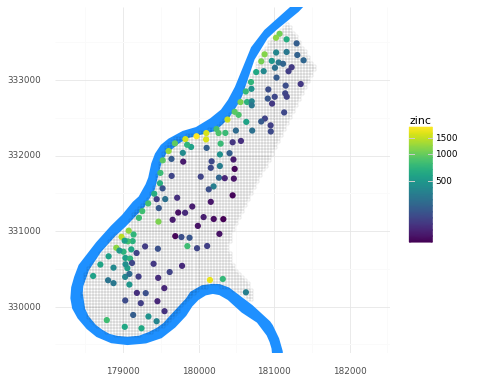
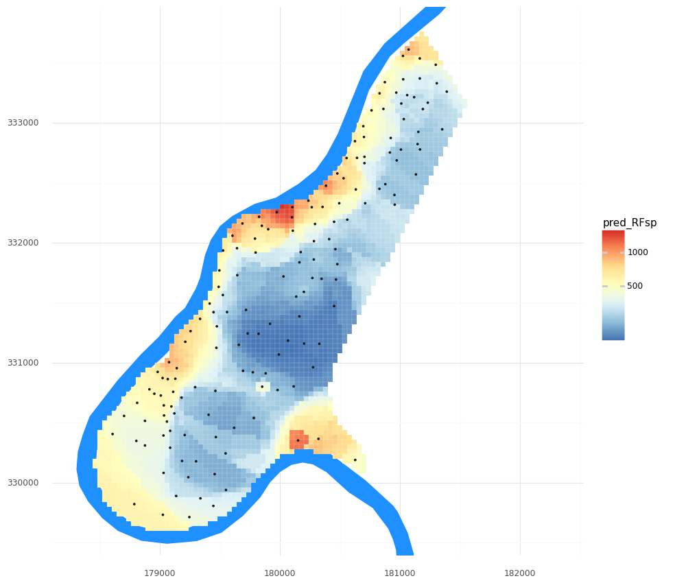
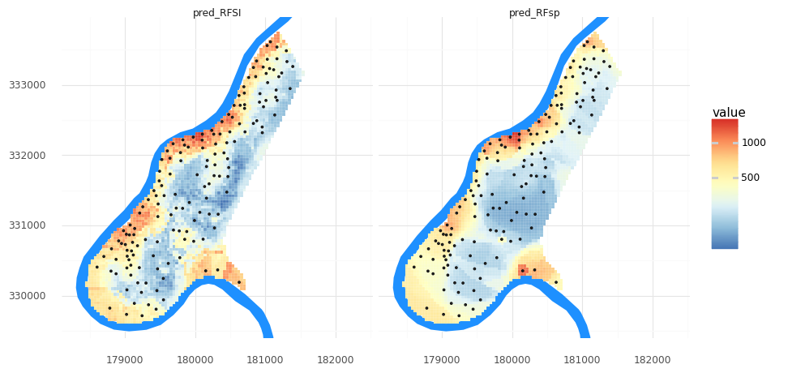
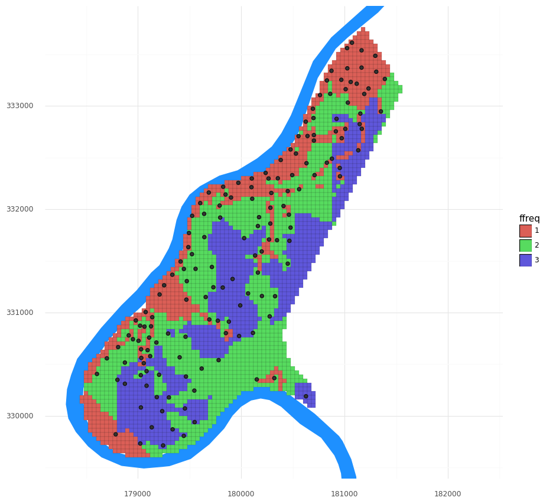
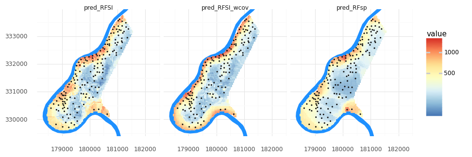

**Last Update:** 4 January 2024 <br />
**Download Jupyter Notebook**: [GRWG23_spatial_modeling_ml.ipynb](https://geospatial.101workbook.org/tutorials/GRWG23_spatial_modeling_ml.ipynb)

## Overview

This tutorial will implement and compare machine learning techniques with two approaches to including spatial proximity for spatial modeling tasks:
  * Spatial interpolation from point observations
  * Spatial prediction from point observations and gridded covariates

*Language*: `Python`

*Primary Libraries/Packages*:

|Name|Description|Link|
|-|-|-|
| `pandas` | Dataframes and other datatypes for data analysis and manipulation | https://pandas.pydata.org/ |
| `geopandas` | Extends datatypes used by pandas to allow spatial operations on geometric types | https://geopandas.org/en/stable/ |
| `scikit-learn` | Machine Learning in Python | https://scikit-learn.org/stable/ |
| `plotnine` | A plotting library for Python modeled after R's [ggplot2](https://ggplot2.tidyverse.org/) | https://plotnine.readthedocs.io/en/v0.12.3/ |


## Nomenclature

  * *(Spatial) Interpolation*: Using observations of dependent and
    independent variables to estimate the value of the dependent
    variable at unobserved independent variable values. For spatial
    applications, this can be the case of having point observations
    (i.e., variable observations at known x-y coordinates) and then
    predicting a gridded map of the variable (i.e., estimating the
    variable at the remaining x-y cells in the study area).
  * *Random Forest*: A supervised machine learning algorithm that 
    uses an ensemble of decision trees for regression or 
    classification. 

## Tutorial Steps

  * 1\. **[Read in and visualize point observations](#step_1)**
  * 2\. **[Random Forest for spatial interpolation](#step_2)**
    Use Random Forest to interpolate zinc concentrations across the study area in two ways:
    * 2.a. *RFsp*: distance to all observations
    * 2.b. *RFSI*: n observed values and distance to those n observation locations
  * 3\. **[Bringing in gridded covariates](#step_3)**

## Step 0: Load libraries and define function

First, we will import required packages and set a large default figure size. We will also define a function to print model metrics.


```python
from sklearn.ensemble import RandomForestRegressor
from sklearn.metrics import r2_score, mean_squared_error
from sklearn.model_selection import train_test_split, RandomizedSearchCV
from scipy.stats import randint
import geopandas as gpd
import pandas as pd
import numpy as np
import plotnine as pn

pn.options.figure_size = (10, 10)
```


```python
def print_metrics(y_test, y_pred):
    """
    Given observed and predicted y values, print the R^2 and RMSE metrics.

    y_test (Series): The observed y values.
    y_pred (Series): The predicted y values.
    """
    # R^2
    r2 = r2_score(y_test, y_pred)
    # Root mean squared error - RMSE
    rmse = mean_squared_error(y_test, y_pred, squared = False)
    print("R^2 = {0:3.2f}, RMSE = {1:5.0f}".format(r2,rmse))
```

<a id='step_1'></a>
## Step 1: Read in and visualize point observations

We will open three vector datasets representing the point observations, the grid across which we want to predict, and the location of the river surrounding the study area. 

This dataset gives locations and topsoil heavy metal concentrations, along with a number of soil and landscape variables at the observation locations, collected in a flood plain of the river Meuse, near the village of Stein (NL). Heavy metal concentrations are from composite samples of an area of approximately 15 m x 15 m. The data were extracted from the [`sp` R package](https://cran.r-project.org/web/packages/sp/index.html).


```python
dnld_url = 'https://geospatial.101workbook.org/SpatialModeling/assets/'
# Point observations and study area grid
meuse_obs = gpd.read_file(dnld_url + 'meuse_obs.zip')
meuse_grid = gpd.read_file(dnld_url + 'meuse_grid.zip')

# Extra information for visualization:
xmin, ymin, xmax, ymax = meuse_grid.total_bounds
meuse_riv = gpd.read_file(dnld_url + 'meuse_riv.zip')
```

Let’s take a quick look at the dataset. Below is a map of the study area grid and the observation locations, plus the location of the river Meuse for reference. We can see that observed zinc concentrations tend to be higher closer to the river.


```python
(pn.ggplot()
    + pn.geom_map(meuse_riv, fill = '#1e90ff', color = None)
    + pn.geom_map(meuse_grid, fill = None, size = 0.05)
    + pn.geom_map(meuse_obs, pn.aes(fill = 'zinc'), color = None, size = 3)
    + pn.scale_y_continuous(limits = [ymin, ymax]) 
    + pn.scale_fill_continuous(trans = 'log1p') 
    + pn.theme_minimal() 
    + pn.coord_fixed()
)
```


    



<a id='step_2'></a>
## Step 2: Random Forest for spatial interpolation

We will explore two methods from recent literature that combine spatial proximity information as variables in fitting Random Forest models for spatial interpolation. 

### Step 2a: *RFsp*: distance to all observations

First, we will implement the *RFsp* method from [Hengl et al 2018](https://doi.org/10.7717/peerj.5518). This method involves using the distance to every observation as a predictor. For example, if there are 10 observations of the target variable, then there would be 10 predictor variables with the ith predictor variable representing the distance to the ith observation. 

If you want to learn more about this approach, see the [thengl/GeoMLA](https://github.com/thengl/GeoMLA) GitHub repo or the [Spatial and spatiotemporal interpolation using Ensemble Machine Learning](https://opengeohub.github.io/spatial-prediction-eml/index.html) site from the same creators. Note: these resources are for R, but the latter does mention the `scikit-learn` library in Python that we will be using in this tutorial.

To start, we will generate two DataFrames of distances:
* One with rows representing observations and columns representing observations (these will be our data for fitting and testing the model)
* One with rows representing grid cell centers and columns representing observations (these will be how we estimate maps of our target variable with the final model)


```python
# Get coordinates of grid cell centers - these are our locations at which we will
# want to interpolate our target variable.
grid_centers = meuse_grid.centroid

# Generate a grid of distances to each observation
grid_distances = pd.DataFrame()
# We also need the distance values among our observations
obs_distances = pd.DataFrame()

# We need a dataframe with rows representing prediction grid cells
# (or observations)
# and columns representing observations
for obs_index in range(meuse_obs.geometry.size):
    cur_obs = meuse_obs.geometry.iloc[obs_index]
    obs_name = 'obs_' + str(obs_index)
    
    cell_to_obs = grid_centers.distance(cur_obs).rename(obs_name)
    grid_distances = pd.concat([grid_distances, cell_to_obs], axis=1)

    obs_to_obs = meuse_obs.distance(cur_obs).rename(obs_name)
    obs_distances = pd.concat([obs_distances, obs_to_obs], axis=1)
    
```

Before moving on to model fitting, let's take a look at the distance matrices we created.


```python
obs_distances
```


<div style="height:600px;overflow:auto;">
<style scoped>
    .dataframe tbody tr th:only-of-type {
        vertical-align: middle;
    }

    .dataframe tbody tr th {
        vertical-align: top;
    }

    .dataframe thead th {
        text-align: right;
    }
</style>
<table border="1" class="dataframe">
  <thead>
    <tr style="text-align: right;">
      <th></th>
      <th>obs_0</th>
      <th>obs_1</th>
      <th>obs_2</th>
      <th>obs_3</th>
      <th>obs_4</th>
      <th>obs_5</th>
      <th>obs_6</th>
      <th>obs_7</th>
      <th>obs_8</th>
      <th>obs_9</th>
      <th>...</th>
      <th>obs_145</th>
      <th>obs_146</th>
      <th>obs_147</th>
      <th>obs_148</th>
      <th>obs_149</th>
      <th>obs_150</th>
      <th>obs_151</th>
      <th>obs_152</th>
      <th>obs_153</th>
      <th>obs_154</th>
    </tr>
  </thead>
  <tbody>
    <tr>
      <th>0</th>
      <td>0.000000</td>
      <td>70.837843</td>
      <td>118.848643</td>
      <td>259.239272</td>
      <td>366.314073</td>
      <td>473.629602</td>
      <td>258.321505</td>
      <td>252.049598</td>
      <td>380.189426</td>
      <td>471.008492</td>
      <td>...</td>
      <td>4304.014173</td>
      <td>4385.565870</td>
      <td>4425.191182</td>
      <td>4194.974374</td>
      <td>4077.205538</td>
      <td>3914.407363</td>
      <td>3868.323926</td>
      <td>3964.443088</td>
      <td>3607.233843</td>
      <td>3449.821155</td>
    </tr>
    <tr>
      <th>1</th>
      <td>70.837843</td>
      <td>0.000000</td>
      <td>141.566239</td>
      <td>282.851551</td>
      <td>362.640318</td>
      <td>471.199533</td>
      <td>234.401365</td>
      <td>195.010256</td>
      <td>328.867755</td>
      <td>441.530293</td>
      <td>...</td>
      <td>4236.122756</td>
      <td>4316.784220</td>
      <td>4355.550137</td>
      <td>4126.296645</td>
      <td>4007.817486</td>
      <td>3845.342247</td>
      <td>3798.730841</td>
      <td>3894.291848</td>
      <td>3538.899546</td>
      <td>3391.434505</td>
    </tr>
    <tr>
      <th>2</th>
      <td>118.848643</td>
      <td>141.566239</td>
      <td>0.000000</td>
      <td>143.171226</td>
      <td>251.023903</td>
      <td>356.866922</td>
      <td>167.000000</td>
      <td>222.081066</td>
      <td>323.513524</td>
      <td>375.033332</td>
      <td>...</td>
      <td>4278.052010</td>
      <td>4365.122793</td>
      <td>4411.447155</td>
      <td>4173.908121</td>
      <td>4061.434476</td>
      <td>3896.201483</td>
      <td>3854.403326</td>
      <td>3956.156721</td>
      <td>3584.262407</td>
      <td>3389.963569</td>
    </tr>
    <tr>
      <th>3</th>
      <td>259.239272</td>
      <td>282.851551</td>
      <td>143.171226</td>
      <td>0.000000</td>
      <td>154.262763</td>
      <td>242.156974</td>
      <td>175.171345</td>
      <td>296.786118</td>
      <td>347.351407</td>
      <td>322.818835</td>
      <td>...</td>
      <td>4292.750750</td>
      <td>4386.465206</td>
      <td>4440.764349</td>
      <td>4194.687712</td>
      <td>4088.695146</td>
      <td>3920.739726</td>
      <td>3884.100024</td>
      <td>3992.349935</td>
      <td>3603.447377</td>
      <td>3361.647959</td>
    </tr>
    <tr>
      <th>4</th>
      <td>366.314073</td>
      <td>362.640318</td>
      <td>251.023903</td>
      <td>154.262763</td>
      <td>0.000000</td>
      <td>108.577162</td>
      <td>147.526269</td>
      <td>281.937936</td>
      <td>266.101484</td>
      <td>178.518907</td>
      <td>...</td>
      <td>4162.607356</td>
      <td>4260.340127</td>
      <td>4319.896411</td>
      <td>4068.314639</td>
      <td>3966.640014</td>
      <td>3796.976824</td>
      <td>3763.871411</td>
      <td>3876.723488</td>
      <td>3476.475514</td>
      <td>3212.786952</td>
    </tr>
    <tr>
      <th>...</th>
      <td>...</td>
      <td>...</td>
      <td>...</td>
      <td>...</td>
      <td>...</td>
      <td>...</td>
      <td>...</td>
      <td>...</td>
      <td>...</td>
      <td>...</td>
      <td>...</td>
      <td>...</td>
      <td>...</td>
      <td>...</td>
      <td>...</td>
      <td>...</td>
      <td>...</td>
      <td>...</td>
      <td>...</td>
      <td>...</td>
      <td>...</td>
    </tr>
    <tr>
      <th>150</th>
      <td>3914.407363</td>
      <td>3845.342247</td>
      <td>3896.201483</td>
      <td>3920.739726</td>
      <td>3796.976824</td>
      <td>3786.887904</td>
      <td>3753.359162</td>
      <td>3676.331051</td>
      <td>3579.912988</td>
      <td>3620.842443</td>
      <td>...</td>
      <td>471.958685</td>
      <td>476.656060</td>
      <td>536.660041</td>
      <td>296.082759</td>
      <td>183.619171</td>
      <td>0.000000</td>
      <td>147.989865</td>
      <td>334.846233</td>
      <td>345.144897</td>
      <td>1443.022176</td>
    </tr>
    <tr>
      <th>151</th>
      <td>3868.323926</td>
      <td>3798.730841</td>
      <td>3854.403326</td>
      <td>3884.100024</td>
      <td>3763.871411</td>
      <td>3757.931479</td>
      <td>3714.900268</td>
      <td>3633.511387</td>
      <td>3540.952697</td>
      <td>3589.008916</td>
      <td>...</td>
      <td>599.736609</td>
      <td>562.318415</td>
      <td>557.046677</td>
      <td>405.097519</td>
      <td>217.082933</td>
      <td>147.989865</td>
      <td>0.000000</td>
      <td>210.857772</td>
      <td>391.256949</td>
      <td>1545.369859</td>
    </tr>
    <tr>
      <th>152</th>
      <td>3964.443088</td>
      <td>3894.291848</td>
      <td>3956.156721</td>
      <td>3992.349935</td>
      <td>3876.723488</td>
      <td>3875.800046</td>
      <td>3821.201513</td>
      <td>3734.408655</td>
      <td>3647.002194</td>
      <td>3703.768081</td>
      <td>...</td>
      <td>702.359595</td>
      <td>596.896138</td>
      <td>497.033198</td>
      <td>494.814107</td>
      <td>276.524863</td>
      <td>334.846233</td>
      <td>210.857772</td>
      <td>0.000000</td>
      <td>595.131078</td>
      <td>1756.173397</td>
    </tr>
    <tr>
      <th>153</th>
      <td>3607.233843</td>
      <td>3538.899546</td>
      <td>3584.262407</td>
      <td>3603.447377</td>
      <td>3476.475514</td>
      <td>3462.718152</td>
      <td>3438.127688</td>
      <td>3365.864673</td>
      <td>3265.476382</td>
      <td>3299.412827</td>
      <td>...</td>
      <td>702.659235</td>
      <td>784.390209</td>
      <td>880.273253</td>
      <td>592.150319</td>
      <td>528.674758</td>
      <td>345.144897</td>
      <td>391.256949</td>
      <td>595.131078</td>
      <td>0.000000</td>
      <td>1176.606136</td>
    </tr>
    <tr>
      <th>154</th>
      <td>3449.821155</td>
      <td>3391.434505</td>
      <td>3389.963569</td>
      <td>3361.647959</td>
      <td>3212.786952</td>
      <td>3163.395170</td>
      <td>3225.188987</td>
      <td>3198.113350</td>
      <td>3071.672183</td>
      <td>3038.833493</td>
      <td>...</td>
      <td>1461.677119</td>
      <td>1666.870721</td>
      <td>1877.419772</td>
      <td>1521.862017</td>
      <td>1600.647681</td>
      <td>1443.022176</td>
      <td>1545.369859</td>
      <td>1756.173397</td>
      <td>1176.606136</td>
      <td>0.000000</td>
    </tr>
  </tbody>
</table>
<p>155 rows × 155 columns</p>
</div>


For fitting our model, we will use the distances among observations as our predictors and observed zinc concentration at those observations as our target variable.


```python
# matrix of distance to observations as predictors
RFsp_X = obs_distances
# vector of observed zinc concentration as target variable
y = meuse_obs['zinc']

# We need to split our dataset into train and test datasets. We'll use 80% of
# the data for model training.
RFsp_X_train, RFsp_X_test, RFsp_y_train, RFsp_y_test = train_test_split(RFsp_X, y, train_size=0.8)

```

Machine learning algorithms typically have hyperparameters that can be tuned per application. Here, we will tune the number of trees in the random forest model and the maximum depth of the trees in the the random forest model. We use the training subset of our data for this fitting and tuning process. After the code chunk below, the best parameter values from our search are printed. 


```python
r_state = 0

# Define the parameter space that will be searched over.
param_distributions = {'n_estimators': randint(1, 100),
                       'max_depth': randint(5, 10)}

# Now create a searchCV object and fit it to the data.
tuned_RFsp = RandomizedSearchCV(estimator=RandomForestRegressor(random_state=r_state),
                            n_iter=10,
                            param_distributions=param_distributions,
                            random_state=r_state).fit(RFsp_X_train, RFsp_y_train)
tuned_RFsp.best_params_
```


    {'max_depth': 7, 'n_estimators': 37}


We can now use our testing subset of the data to quantify the model performance, i.e. how well did the model predict the remaining observed values? There are many potential metrics - see all the metrics `scikit-learn` supports [here](https://scikit-learn.org/stable/modules/model_evaluation.html#). The two we show below are the coefficient of determination ($R^2$) and the root mean square error ($RMSE$), two metrics that are likely familiar from outside machine learning as well.


```python
print_metrics(RFsp_y_test, tuned_RFsp.predict(RFsp_X_test))
```

    R^2 = 0.50, RMSE =   286


Our $R^2$ is not awesome! We typically want $R^2$ values closer to $1$ and RMSE values closer to $0$. Note: $RMSE$ is in the units of the target variable, so our zinc concentrations. You can see the range of values of zinc concentrations in the legend in the figure above, from which you can get a sense of our error.  

**Excercise:** Modify the `param_distributions` and `n_iter` values above - can you improve the metrics? Note that you may also increase the processing time.

Once we are happy with (or at least curious about!) the model, we can predict and visualize our zinc concentration field.


```python
# Predict the value from all grid cells using their distances we determined above. 
meuse_grid['pred_RFsp'] = tuned_RFsp.predict(grid_distances)

(pn.ggplot()
    + pn.geom_map(meuse_riv, fill = '#1e90ff', color = None)
    + pn.geom_map(meuse_grid, pn.aes(fill = 'pred_RFsp'), color = 'white', size = 0.05)
    + pn.geom_map(meuse_obs)
    + pn.scale_y_continuous(limits = [ymin, ymax]) 
    + pn.scale_fill_distiller(type = 'div', palette = 'RdYlBu',trans = 'log1p') 
    + pn.theme_minimal() 
    + pn.coord_fixed()
)
```


    



### 2b: *RFSI*: n observed values and distance to those n observation locations

Now, we will try the the *RFSI* method from [Sekulić et al 2020](https://doi.org/10.3390/rs12101687). In this method, instead of using distances to *all* observations as our predictors, we will use distances to the _n_ closest observations as well as the observed values at those locations as our predictors.

Below, we define a function to find the _n_ closest observations and record their distances and values.


```python
def nclosest_dist_value(dist_ij, obs_i, n = 3):
    """
    Given a distance matrix among i locations and j observation 
    locations, j observed values, and the number of close
    observations desired, generates a dataframe of distances to
    and values at n closest observations for each of the i 
    locations.

    dist_ij (DataFrame): distance matrix among i locations and j 
    observation locations
    obs_i (Series): The i observed values
    n (int): The desired number of closest observations
    """
    # Which observations are the n closest? 
    # But do not include distance to oneself. 
    # Note: ranks start at 1, not 0.
    nclosest_dist_ij =  dist_ij.replace(0.0,np.nan).rank(axis = 1, method = 'first') <= n
    
    nclosest = pd.DataFrame()

    # For each observation, find the n nearest observations and
    # record the distance and target variable pairs
    for i in range(dist_ij.shape[0]):
        # Which obs are the n closest to the ith location?
        nclosest_j_indices = np.where(nclosest_dist_ij.iloc[i,:])

        # Save the distance to and observed value at the n closest
        # observations from the ith location
        i_loc_dist = dist_ij.iloc[i].iloc[nclosest_j_indices]
        sort_indices = i_loc_dist.values.argsort()
        i_loc_dist = i_loc_dist.iloc[sort_indices]
        i_loc_dist.rename(lambda x: 'dist' + str(np.where(x == i_loc_dist.index)[0][0]), inplace=True)
        
        i_loc_value = obs_i.iloc[nclosest_j_indices]
        i_loc_value = i_loc_value.iloc[sort_indices]
        i_loc_value.rename(lambda x: 'obs' + str(np.where(x == i_loc_value.index)[0][0]), inplace=True)
        i_loc = pd.concat([i_loc_dist,i_loc_value],axis = 0)
        nclosest = pd.concat([nclosest, pd.DataFrame(i_loc).transpose()], axis = 0)

    return nclosest
```

Let's now use that function to find and describe the n closest observations to each obsersevation and each grid cell. Note that we are taking advantage of the `obs_distances` and `grid_distances` variables we created for the *RFsp* approach. 


```python
n = 10
obs_nclosest_obs = nclosest_dist_value(obs_distances, meuse_obs['zinc'], n)
grid_nclosest_obs = nclosest_dist_value(grid_distances, meuse_obs['zinc'], n)
```

Let's take a closer look at our new distance matrices.


```python
obs_nclosest_obs
```


<div style="height:600px;overflow:auto;">
<style scoped>
    .dataframe tbody tr th:only-of-type {
        vertical-align: middle;
    }

    .dataframe tbody tr th {
        vertical-align: top;
    }

    .dataframe thead th {
        text-align: right;
    }
</style>
<table border="1" class="dataframe">
  <thead>
    <tr style="text-align: right;">
      <th></th>
      <th>dist0</th>
      <th>dist1</th>
      <th>dist2</th>
      <th>dist3</th>
      <th>dist4</th>
      <th>dist5</th>
      <th>dist6</th>
      <th>dist7</th>
      <th>dist8</th>
      <th>dist9</th>
      <th>obs0</th>
      <th>obs1</th>
      <th>obs2</th>
      <th>obs3</th>
      <th>obs4</th>
      <th>obs5</th>
      <th>obs6</th>
      <th>obs7</th>
      <th>obs8</th>
      <th>obs9</th>
    </tr>
  </thead>
  <tbody>
    <tr>
      <th>0</th>
      <td>70.837843</td>
      <td>118.848643</td>
      <td>252.049598</td>
      <td>258.321505</td>
      <td>259.239272</td>
      <td>336.434243</td>
      <td>366.314073</td>
      <td>373.483601</td>
      <td>380.189426</td>
      <td>399.656102</td>
      <td>1141.0</td>
      <td>640.0</td>
      <td>406.0</td>
      <td>346.0</td>
      <td>257.0</td>
      <td>1096.0</td>
      <td>269.0</td>
      <td>504.0</td>
      <td>347.0</td>
      <td>279.0</td>
    </tr>
    <tr>
      <th>0</th>
      <td>70.837843</td>
      <td>141.566239</td>
      <td>195.010256</td>
      <td>234.401365</td>
      <td>266.011278</td>
      <td>282.851551</td>
      <td>311.081983</td>
      <td>328.867755</td>
      <td>356.349547</td>
      <td>362.640318</td>
      <td>1022.0</td>
      <td>640.0</td>
      <td>406.0</td>
      <td>346.0</td>
      <td>1096.0</td>
      <td>257.0</td>
      <td>504.0</td>
      <td>347.0</td>
      <td>279.0</td>
      <td>269.0</td>
    </tr>
    <tr>
      <th>0</th>
      <td>118.848643</td>
      <td>141.566239</td>
      <td>143.171226</td>
      <td>167.000000</td>
      <td>222.081066</td>
      <td>251.023903</td>
      <td>323.513524</td>
      <td>326.401593</td>
      <td>345.891602</td>
      <td>351.973010</td>
      <td>1022.0</td>
      <td>1141.0</td>
      <td>257.0</td>
      <td>346.0</td>
      <td>406.0</td>
      <td>269.0</td>
      <td>347.0</td>
      <td>279.0</td>
      <td>504.0</td>
      <td>1096.0</td>
    </tr>
    <tr>
      <th>0</th>
      <td>143.171226</td>
      <td>154.262763</td>
      <td>175.171345</td>
      <td>242.156974</td>
      <td>259.239272</td>
      <td>282.851551</td>
      <td>296.786118</td>
      <td>322.818835</td>
      <td>324.499615</td>
      <td>347.351407</td>
      <td>640.0</td>
      <td>269.0</td>
      <td>346.0</td>
      <td>281.0</td>
      <td>1022.0</td>
      <td>1141.0</td>
      <td>406.0</td>
      <td>183.0</td>
      <td>279.0</td>
      <td>347.0</td>
    </tr>
    <tr>
      <th>0</th>
      <td>108.577162</td>
      <td>147.526269</td>
      <td>154.262763</td>
      <td>178.518907</td>
      <td>221.758878</td>
      <td>244.296950</td>
      <td>251.023903</td>
      <td>266.101484</td>
      <td>281.937936</td>
      <td>340.847473</td>
      <td>281.0</td>
      <td>346.0</td>
      <td>257.0</td>
      <td>183.0</td>
      <td>279.0</td>
      <td>189.0</td>
      <td>640.0</td>
      <td>347.0</td>
      <td>406.0</td>
      <td>326.0</td>
    </tr>
    <tr>
      <th>...</th>
      <td>...</td>
      <td>...</td>
      <td>...</td>
      <td>...</td>
      <td>...</td>
      <td>...</td>
      <td>...</td>
      <td>...</td>
      <td>...</td>
      <td>...</td>
      <td>...</td>
      <td>...</td>
      <td>...</td>
      <td>...</td>
      <td>...</td>
      <td>...</td>
      <td>...</td>
      <td>...</td>
      <td>...</td>
      <td>...</td>
    </tr>
    <tr>
      <th>0</th>
      <td>117.038455</td>
      <td>145.602198</td>
      <td>147.989865</td>
      <td>183.619171</td>
      <td>217.117480</td>
      <td>262.619497</td>
      <td>269.818457</td>
      <td>293.400750</td>
      <td>296.082759</td>
      <td>334.846233</td>
      <td>224.0</td>
      <td>189.0</td>
      <td>496.0</td>
      <td>214.0</td>
      <td>187.0</td>
      <td>400.0</td>
      <td>296.0</td>
      <td>154.0</td>
      <td>258.0</td>
      <td>342.0</td>
    </tr>
    <tr>
      <th>0</th>
      <td>116.361506</td>
      <td>141.000000</td>
      <td>147.989865</td>
      <td>160.863296</td>
      <td>210.857772</td>
      <td>217.082933</td>
      <td>219.665655</td>
      <td>243.772435</td>
      <td>273.791892</td>
      <td>287.702972</td>
      <td>400.0</td>
      <td>296.0</td>
      <td>166.0</td>
      <td>187.0</td>
      <td>342.0</td>
      <td>214.0</td>
      <td>539.0</td>
      <td>224.0</td>
      <td>451.0</td>
      <td>332.0</td>
    </tr>
    <tr>
      <th>0</th>
      <td>81.412530</td>
      <td>174.942848</td>
      <td>205.000000</td>
      <td>210.857772</td>
      <td>242.866218</td>
      <td>270.351623</td>
      <td>276.524863</td>
      <td>286.225436</td>
      <td>296.278585</td>
      <td>301.317109</td>
      <td>332.0</td>
      <td>400.0</td>
      <td>420.0</td>
      <td>496.0</td>
      <td>296.0</td>
      <td>539.0</td>
      <td>214.0</td>
      <td>553.0</td>
      <td>451.0</td>
      <td>577.0</td>
    </tr>
    <tr>
      <th>0</th>
      <td>158.294030</td>
      <td>170.390727</td>
      <td>195.747286</td>
      <td>260.555176</td>
      <td>260.823695</td>
      <td>309.161770</td>
      <td>345.144897</td>
      <td>353.747085</td>
      <td>384.532183</td>
      <td>385.020779</td>
      <td>155.0</td>
      <td>199.0</td>
      <td>180.0</td>
      <td>187.0</td>
      <td>224.0</td>
      <td>154.0</td>
      <td>166.0</td>
      <td>157.0</td>
      <td>296.0</td>
      <td>226.0</td>
    </tr>
    <tr>
      <th>0</th>
      <td>353.004249</td>
      <td>503.135171</td>
      <td>799.335974</td>
      <td>848.958185</td>
      <td>870.917907</td>
      <td>914.617406</td>
      <td>986.887025</td>
      <td>1013.126349</td>
      <td>1038.171469</td>
      <td>1043.985153</td>
      <td>722.0</td>
      <td>1672.0</td>
      <td>192.0</td>
      <td>130.0</td>
      <td>203.0</td>
      <td>157.0</td>
      <td>778.0</td>
      <td>113.0</td>
      <td>240.0</td>
      <td>199.0</td>
    </tr>
  </tbody>
</table>
<p>155 rows × 20 columns</p>
</div>


We will then use the same model fitting process as for *RFsp*.


```python
# matrix of distances to and observed values at the n closest observations as predictors
RFSI_X = obs_nclosest_obs

# We need to split our dataset into train and test datasets. We'll use 80% of
# the data for model training.
RFSI_X_train, RFSI_X_test, RFSI_y_train, RFSI_y_test = train_test_split(RFSI_X, y, train_size=0.8)

param_distributions = {'n_estimators': randint(1, 100),
                       'max_depth': randint(5, 10)}
tuned_RFSI  = RandomizedSearchCV(estimator=RandomForestRegressor(random_state=r_state),
                            n_iter=10,
                            param_distributions=param_distributions,
                            random_state=r_state).fit(RFSI_X_train, RFSI_y_train)
tuned_RFSI.best_params_

```


    {'max_depth': 9, 'n_estimators': 59}


```python
print_metrics(RFSI_y_test, tuned_RFSI.predict(RFSI_X_test))
```

    R^2 = 0.45, RMSE =   302


How does *RFSI*'s metrics compare to *RFsp*'s? What if you modify n, the number of closest observations? What if you modify the `param_distributions` and `n_iter` values like above?

Let's visualize the two maps from these two methods together. To do so, we will need to transform our `meuse_grid` DataFrame into a longer format for plotting with facets in `plotnine`.


```python
meuse_grid['pred_RFSI'] = tuned_RFSI.predict(grid_nclosest_obs)
meuse_grid_long = pd.melt(meuse_grid, id_vars= 'geometry', value_vars=['pred_RFsp','pred_RFSI'])

(pn.ggplot()
    + pn.geom_map(meuse_riv, fill = '#1e90ff', color = None)
    + pn.geom_map(meuse_grid_long, pn.aes(fill = 'value'), color = 'white', size = 0.05)
    + pn.geom_map(meuse_obs)
    + pn.scale_y_continuous(limits = [ymin, ymax]) 
    + pn.scale_fill_distiller(type = 'div', palette = 'RdYlBu',trans = 'log1p') 
    + pn.theme_minimal() 
    + pn.coord_fixed() 
    + pn.facet_wrap('variable')
)
```


    



<a id='step_3'></a>
## Step 3: Bringing in gridded covariates

This dataset has three covariates supplied with the grid and the observations:
* dist: the distance to the river
* ffreq: a category describing the flooding frequency
* soil: a cateogory of soil type

We can extend this spatial interpolation task into a more general spatial prediction task by including these co-located observations and gridded covariates. Let's visualize the flooding frequency: 


```python
(pn.ggplot()
    + pn.geom_map(meuse_riv, fill = '#1e90ff', color = None)
    + pn.geom_map(meuse_grid, pn.aes(fill = 'ffreq'), size = 0.05)
    + pn.geom_map(meuse_obs, size = 2)
    + pn.scale_y_continuous(limits = [ymin, ymax]) 
    + pn.theme_minimal() 
    + pn.coord_fixed()
)
```


    



**Exercise**: Also visualize the other covariates. (Either one at a time, or try `melt`ing like above to use facets!). Do you expect these variables to improve the model?

Adding these covariates to the RF model, either method, is straightforward. We will stick to just the *RFSI* model here. All that needs to be done is to concatenate these three columns to our distance (and observed values) dataset and repeat the modeling fitting process.


```python
# matrix of distances to and observed values at the n closest observations as predictors
RFSI_wcov_X = pd.concat([obs_nclosest_obs.reset_index(),meuse_obs[['dist','ffreq','soil']]], axis=1)

# We need to split our dataset into train and test datasets. We'll use 80% of
# the data for model training.
RFSI_wcov_X_train, RFSI_wcov_X_test, RFSI_wcov_y_train, RFSI_wcov_y_test = train_test_split(RFSI_wcov_X, y, train_size=0.8)

param_distributions = {'n_estimators': randint(1, 100),
                       'max_depth': randint(5, 10)}
tuned_RFSI_wcov = RandomizedSearchCV(estimator=RandomForestRegressor(random_state=r_state),
                            n_iter=10,
                            param_distributions=param_distributions,
                            random_state=r_state).fit(RFSI_wcov_X_train, RFSI_wcov_y_train)
tuned_RFSI_wcov.best_params_
```


    {'max_depth': 5, 'n_estimators': 68}


```python
print_metrics(RFSI_wcov_y_test, tuned_RFSI_wcov.predict(RFSI_wcov_X_test))
```

    R^2 = 0.56, RMSE =   260


How did the new covariates change our metrics? Was it as you'd expect? 


```python
grid_nclosest_obs_wcov = pd.concat([grid_nclosest_obs.reset_index(),meuse_grid[['dist','ffreq','soil']]], axis=1)
meuse_grid['pred_RFSI_wcov'] = tuned_RFSI_wcov.predict(grid_nclosest_obs_wcov)

meuse_grid_long = pd.melt(meuse_grid, id_vars= 'geometry', value_vars=['pred_RFsp','pred_RFSI','pred_RFSI_wcov'])


(pn.ggplot()
    + pn.geom_map(meuse_riv, fill = '#1e90ff', color = None)
    + pn.geom_map(meuse_grid_long, pn.aes(fill = 'value'), color = 'white', size = 0.05)
    + pn.geom_map(meuse_obs, size = 0.25)
    + pn.scale_y_continuous(limits = [ymin, ymax]) 
    + pn.scale_fill_distiller(type = 'div', palette = 'RdYlBu',trans = 'log1p') 
    + pn.theme_minimal() 
    + pn.coord_fixed() 
    + pn.facet_wrap('variable')
)
```


    



Use the covariates to create a `RFsp_wcov` model and add it to the figure. How do the metrics compare to the other results?
