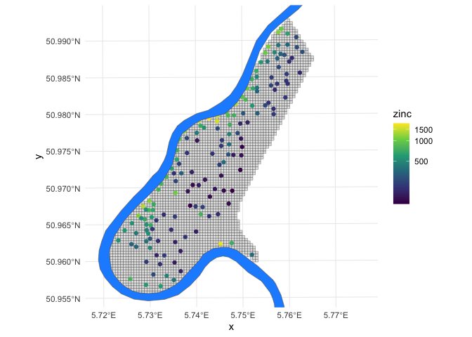
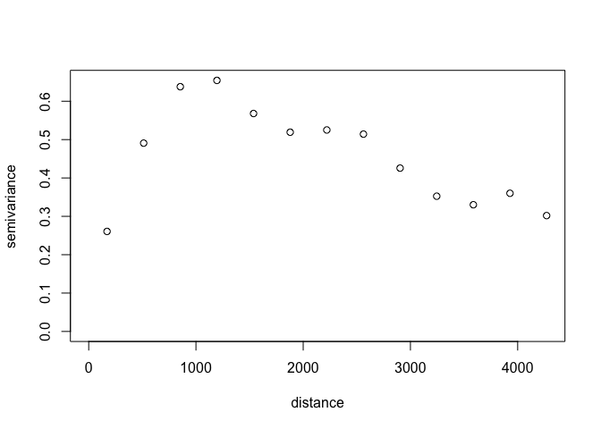
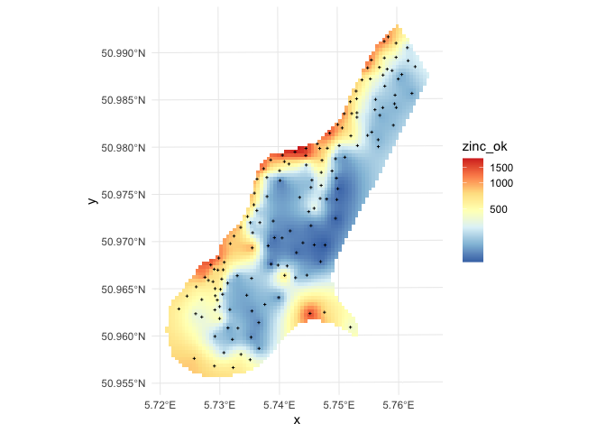
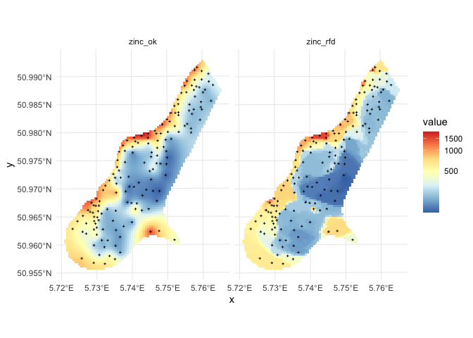
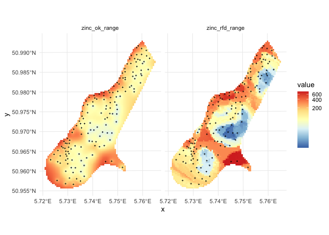

**Last Update:** 17 September 2023   **Download RMarkdown**:
[GRWG\_SpatialInterpolation.Rmd](https://geospatial.101workbook.org/tutorials/GRWG_SpatialInterpolation.Rmd)

## Overview

This tutorial compares two spatial interpolation techniques that predict
gridded maps of a target variable given point observations and,
potentially, gridded covariates. The content of this tutorial is
modified from the [tutorial](https://github.com/thengl/GeoMLA) that is
supplementary material to the scientific article: Hengl, T., Nussbaum,
M., Wright, M. and Heuvelink, G.B.M., 2018. [*“Random Forest as a
Generic Framework for Predictive Modeling of Spatial and Spatio-temporal
Variables”*](https://doi.org/10.7717/peerj.5518). Modifications include
limiting the number of examples and re-ordering examples, using more
up-to-date R packages, and cutting and supplementing the commentary
text.

To download the Rmarkdown file for this tutorial to either Ceres or
Atlas within Open on Demand, you can use the following lines:

    library(httr)
    tutorial_name <- 'GRWG_SpatialInterpolation.Rmd'
    GET(paste0('https://geospatial.101workbook.org/tutorials/',tutorial_name), 
        write_disk(tutorial_name))

*Language:* `R`

*Primary Libraries/Packages:*

| Name | Description | Link |
|:--|:--|:--|
| geoR | Analysis of Geostatistical Data | https://cran.r-project.org/web/packages/geoR/index.html |
| ranger | A Fast Implementation of Random Forests | https://cran.r-project.org/web/packages/ranger/index.html |

## Nomenclature

-   *(Spatial) Interpolation:* Using observations of dependent and
    independent variables to estimate the value of the dependent
    variable at unobserved independent variable values. For spatial
    applications, this can be the case of having point observations
    (i.e., variable observations at known x-y coordinates) and then
    predicting a gridded map of the variable (i.e., estimating the
    variable at the remaining x-y cells in the study area).
-   *Geostatistics:* Statistics focusing on spatial datasets,
    e.g. treating spatially heterogeneous variables as random variables
    with covariance structures describing spatial dependence.
-   *Kriging:* A geostatistical approach for spatial interpolatation. It
    uses a variogram model fitted to point observations to define
    spatial dependence.
-   *Variogram:* A model describing the relationship between variance
    between values of pairs of points as a function of the spatial
    distance between those points.
-   *Random Forest:* A machine learning algorithm that uses an ensemble
    of decision trees.

## Data Details

-   Data: `meuse` data set
-   Link: [`sp`
    package](https://cran.r-project.org/web/packages/sp/index.html)
-   Other Details: This dataset gives locations and topsoil heavy metal
    concentrations, along with a number of soil and landscape variables
    at the observation locations, collected in a flood plain of the
    river Meuse, near the village of Stein (NL). Heavy metal
    concentrations are from composite samples of an area of
    approximately 15 m x 15 m.

## Analysis Steps

-   Pre-process the `meuse` data set to be `sf` and `raster` objects
-   Use kriging to interpolate zinc concentrations across the study area
-   Use Random Forest to interpolate zinc concentrations across the
    study area
-   Compare predictions and prediction error between the two
    interpolation methods

## Step 0: Import Libraries/Packages

For this tutorial, we will use several packages for processing spatial
data. The `sf` and `raster` packages help us store the `meuse`
observations and grid in spatial data structures. `geoR` contains
functions for fitting variograms and performing kriging. `ranger`
contains functions to fit Random Forest models and make predictions from
them.

    # spatial data
    library(sf)     # vector data
    library(raster) # raster data

    # geostatistics
    library(geoR)

    # random forest
    library(ranger) 

    # general data manipulation
    library(tidyr)
    library(dplyr)

    # visualizations
    library(ggplot2)

## Step 1: Pre-process `meuse` dataset

Our dataset is contained in the `sp` package. We can use the `demo`
function to load both the point observation data (new variable `meuse`)
and the study area’s grid (new variable `meuse.grid`) as `sp` objects.
Note that in most cases, defining the grid (e.g., determining the
appropriate spatial resolution and extent) would be a necessary initial
step based on the science question.

    # This dataset is from the `sp` package, which the `raster` package
    # loaded for us above.
    # point observations: meuse
    # study area grid: meuse.grid
    demo('meuse', echo = FALSE)

We will translate these into data objects that are compatible with more
recent or widely-used R packages: zinc concentration point observations
into a `sf` object and the study area grid into a `raster` object.

    obs_sf <- meuse['zinc'] %>%
      st_as_sf()

    grid_raster <- raster(meuse.grid['soil'])

Let’s take a quick look at the dataset. Below is a map of the study area
grid and the observation locations, plus the location of the river Meuse
for reference (the `demo` call also created the `meuse.riv` variable,
though we will only use it for visualization purposes).

    grid_raster %>% 
      as.data.frame(xy = TRUE) %>%
      filter(!is.na(soil_levels)) %>% # study area only
      ggplot() +
      geom_tile(aes(x,y),
                fill = 'gray90',
                color = 'black') +
      geom_sf(data=obs_sf,
              aes(color = zinc)) +
      geom_sf(data = meuse.riv %>%
                st_as_sf(),
              fill = 'dodgerblue') +
      theme_minimal() +
      scale_y_continuous(limits = extent(grid_raster)[c(3,4)]) +
      scale_color_viridis_c(trans = 'log1p')

## Step 2: Interpolate map from point observations using kriging

The first step to perform the interpolation by kriging is to fit a
variogram to the point observations. Variograms are typically fit by
weighted ordinary least squares with higher weights on shorter
distances. Since the variogram is a non-linear function, non-linear
least squares is performed. Unlike simple linear regression, initial
values are required for parameters are required for non-linear least
squares. So we will first plot the empirical variogram
(semivariance-distance values based on observations) to inform our
initial values. The `geoR` package has a function `variog` to calculate
the empirical variogram and it comes with a general plotting function
for plotting that empirical variogram.

    variog(data = log1p(obs_sf$zinc),
           coords = obs_sf %>%
             st_coordinates()) %>% 
      plot()

    #> variog: computing omnidirectional variogram

In the original tutorial, the initial value of the partial sill
parameter was taken from the sample variance of all natural
log-transformed zinc concentration observations and the initial values
of the range parameter was 500 m. We will use these values as well.

The `likfit` function performs the variogram fitting based on the
initial values and the empirical variogram. Zinc concentration is
natural log-transformed to help meet the assumption of normality (and
this is why the Box-Cox parameter `lambda` is set to zero).

    initial_psill <- var(log1p(obs_sf$zinc))
    initial_range <- 500 # meters
    ini.v <- c(initial_psill,initial_range)
    zinc_vgm <- likfit(data = obs_sf$zinc, 
                       coords = obs_sf %>%
                         st_coordinates(),
                       lambda=0, 
                       ini=ini.v, 
                       cov.model="exponential")

    #> kappa not used for the exponential correlation function
    #> ---------------------------------------------------------------
    #> likfit: likelihood maximisation using the function optim.
    #> likfit: Use control() to pass additional
    #>          arguments for the maximisation function.
    #>         For further details see documentation for optim.
    #> likfit: It is highly advisable to run this function several
    #>         times with different initial values for the parameters.
    #> likfit: WARNING: This step can be time demanding!
    #> ---------------------------------------------------------------
    #> likfit: end of numerical maximisation.

    zinc_vgm

    #> likfit: estimated model parameters:
    #>       beta      tausq    sigmasq        phi 
    #> "  6.1553" "  0.0164" "  0.5928" "500.0001" 
    #> Practical Range with cor=0.05 for asymptotic range: 1497.866
    #> 
    #> likfit: maximised log-likelihood = -1014

To generate predictions and kriging variance using `geoR` we run:

    zinc_ok <- krige.conv(data = obs_sf$zinc, 
                          coords = obs_sf %>%
                            st_coordinates(),
                          locations=coordinates(grid_raster), 
                          krige=krige.control(obj.model=zinc_vgm)) # our fitted variogram

    #> krige.conv: model with constant mean
    #> krige.conv: performing the Box-Cox data transformation
    #> krige.conv: back-transforming the predicted mean and variance
    #> krige.conv: Kriging performed using global neighbourhood

    grid_raster$zinc_ok <- zinc_ok$predict
    grid_raster$zinc_ok_range <- sqrt(zinc_ok$krige.var)

    grid_raster %>% 
      as.data.frame(xy = TRUE) %>%
      filter(!is.na(soil_levels)) %>% # study area only
      ggplot() +
      geom_tile(aes(x,y,fill=zinc_ok)) +
      geom_sf(data=obs_sf,
              shape = 3,
              size = 0.5) +
      scale_fill_distiller(palette = 'RdYlBu',
                           trans = 'log1p',
                           na.value = NA) +
      theme_minimal() 

in this case geoR automatically back-transforms values to the original
scale, which is a recommended feature.

## Step 3: Interpolate map from point observations using Random Forest

We can derive buffer distances by generating N rasters of distances to
each i=1,..,N point observations. This can be coded in multiple
different ways, but the code chunk below takes the approach of using
`sf::st_distance()` to calculate the distances.

First, we will create a list of grid cell coordinates into a `sf`
object. Then, we iterative fill out layers in a raster brick (one layer
for each observation) with the distances to each observation from every
cell in the raster.

    # Create a `sf` object from the raster cell center coordinates
    grid_sf <- grid_raster %>%
      coordinates() %>%  # extract cell coordinates
      as_tibble() %>%  # or as.data.frame, because st_as_sf() doesn't like matrices
      st_as_sf(coords = c('x','y'),
               crs = st_crs(obs_sf)) # keep dataset's CRS

    # Define an empty raster brick with N la
    grid_distances <- brick(grid_raster,
                        values = FALSE,
                        nl = nrow(obs_sf))
    for(i in 1:nrow(obs_sf)){
      target_pt <- obs_sf[i,]
      grid_distances[[i]] <- st_distance(grid_sf, target_pt)
    }

    #> Warning in readAll(x): cannot read values; there is no file associated with this RasterBrick

which takes few seconds as it generates 155 gridded maps. The value of
the target variable `zinc` can be now modeled as a function of buffer
distances:

    ### For each observation, what layer distance
    dn0 <- paste(names(grid_distances), collapse="+")
    fm0 <- as.formula(paste("zinc ~ ", dn0))
    fm0

    #> zinc ~ layer.1 + layer.2 + layer.3 + layer.4 + layer.5 + layer.6 + 
    #>     layer.7 + layer.8 + layer.9 + layer.10 + layer.11 + layer.12 + 
    #>     layer.13 + layer.14 + layer.15 + layer.16 + layer.17 + layer.18 + 
    #>     layer.19 + layer.20 + layer.21 + layer.22 + layer.23 + layer.24 + 
    #>     layer.25 + layer.26 + layer.27 + layer.28 + layer.29 + layer.30 + 
    #>     layer.31 + layer.32 + layer.33 + layer.34 + layer.35 + layer.36 + 
    #>     layer.37 + layer.38 + layer.39 + layer.40 + layer.41 + layer.42 + 
    #>     layer.43 + layer.44 + layer.45 + layer.46 + layer.47 + layer.48 + 
    #>     layer.49 + layer.50 + layer.51 + layer.52 + layer.53 + layer.54 + 
    #>     layer.55 + layer.56 + layer.57 + layer.58 + layer.59 + layer.60 + 
    #>     layer.61 + layer.62 + layer.63 + layer.64 + layer.65 + layer.66 + 
    #>     layer.67 + layer.68 + layer.69 + layer.70 + layer.71 + layer.72 + 
    #>     layer.73 + layer.74 + layer.75 + layer.76 + layer.77 + layer.78 + 
    #>     layer.79 + layer.80 + layer.81 + layer.82 + layer.83 + layer.84 + 
    #>     layer.85 + layer.86 + layer.87 + layer.88 + layer.89 + layer.90 + 
    #>     layer.91 + layer.92 + layer.93 + layer.94 + layer.95 + layer.96 + 
    #>     layer.97 + layer.98 + layer.99 + layer.100 + layer.101 + 
    #>     layer.102 + layer.103 + layer.104 + layer.105 + layer.106 + 
    #>     layer.107 + layer.108 + layer.109 + layer.110 + layer.111 + 
    #>     layer.112 + layer.113 + layer.114 + layer.115 + layer.116 + 
    #>     layer.117 + layer.118 + layer.119 + layer.120 + layer.121 + 
    #>     layer.122 + layer.123 + layer.124 + layer.125 + layer.126 + 
    #>     layer.127 + layer.128 + layer.129 + layer.130 + layer.131 + 
    #>     layer.132 + layer.133 + layer.134 + layer.135 + layer.136 + 
    #>     layer.137 + layer.138 + layer.139 + layer.140 + layer.141 + 
    #>     layer.142 + layer.143 + layer.144 + layer.145 + layer.146 + 
    #>     layer.147 + layer.148 + layer.149 + layer.150 + layer.151 + 
    #>     layer.152 + layer.153 + layer.154 + layer.155

Further analysis is similar to any regression analysis using the [ranger
package](https://github.com/imbs-hl/ranger). First we overlay points and
grids to create a regression matrix:

    ### What are those layer values at each of the observations
    obs_dist <- raster::extract(grid_distances, obs_sf)
    rm_zinc <- cbind(obs_sf["zinc"], obs_dist) %>%
      as_tibble()

To also estimate the prediction error variance i.e. prediction intervals
we set `quantreg=TRUE` which initiates the Quantile Regression RF
approach:

    m.zinc <- ranger(fm0, rm_zinc, quantreg=TRUE, num.trees=150, seed=1)
    m.zinc

    #> Ranger result
    #> 
    #> Call:
    #>  ranger(fm0, rm_zinc, quantreg = TRUE, num.trees = 150, seed = 1) 
    #> 
    #> Type:                             Regression 
    #> Number of trees:                  150 
    #> Sample size:                      155 
    #> Number of independent variables:  155 
    #> Mtry:                             12 
    #> Target node size:                 5 
    #> Variable importance mode:         none 
    #> Splitrule:                        variance 
    #> OOB prediction error (MSE):       68003.69 
    #> R squared (OOB):                  0.4953088

This shows that, only buffer distance explain almost 50% of variation in
the target variable. To generate prediction for the `zinc` variable and
using the RFsp model, we use:

    ## 1 s.d. quantiles
    quantiles = c((1-.682)/2, 0.5, 1-(1-.682)/2)
    zinc_rfd <- predict(m.zinc, 
                        values(grid_distances), 
                        quantiles=quantiles, 
                        type="quantiles")$predictions
    str(zinc_rfd)

    #>  num [1:8112, 1:3] 281 281 281 281 281 281 281 281 281 281 ...
    #>  - attr(*, "dimnames")=List of 2
    #>   ..$ : NULL
    #>   ..$ : chr [1:3] "quantile= 0.159" "quantile= 0.5" "quantile= 0.841"

this will estimate 67% probability lower and upper limits and median
value. Note that “median” can often be different from the “mean”, so if
you prefer to derive mean, then the `quantreg=FALSE` needs to be used as
the Quantile Regression Forests approach can only derive median.

## Step 4: Compare predictions and prediction error between the two interpolation methods

Comparison of predictions and prediction error maps produced using geoR
(ordinary kriging) and RFsp (with buffer distances and by just using
coordinates) is given below.

    grid_raster$zinc_rfd = zinc_rfd[,2]
    grid_raster$zinc_rfd_range = (zinc_rfd[,3]-zinc_rfd[,1])/2
    grid_raster <- mask(grid_raster, grid_raster[[1]]) 

    grid_raster  %>%
      as.data.frame(xy=TRUE) %>%
      dplyr::select(x,y,zinc_ok, zinc_rfd) %>%
      pivot_longer(-c(x,y)) %>%
      ggplot() +
      geom_tile(aes(x,y,fill=value)) +
      geom_sf(data=obs_sf,
              shape = 3,
              size = 0.5,
              color = 'black') +
      scale_fill_distiller(palette = 'RdYlBu',
                           trans = 'log1p',
                           na.value = NA) +
      theme_minimal() +
      facet_wrap(~name)

    grid_raster  %>%
      as.data.frame(xy=TRUE) %>%
      dplyr::select(x,y,zinc_ok_range, zinc_rfd_range) %>%
      pivot_longer(-c(x,y)) %>%
      ggplot() +
      geom_tile(aes(x,y,fill=value)) +
      geom_sf(data=obs_sf,
              shape = 3,
              size = 0.5,
              color = 'black') +
      scale_fill_distiller(palette = 'RdYlBu',
                           trans = 'log1p',
                           na.value = NA) +
      theme_minimal() +
      facet_wrap(~name)

*Figure: Comparison of predictions based on ordinary kriging as
implemented in the geoR package (left) and random forest (right) for
Zinc concentrations, Meuse data set: (first row) predicted
concentrations in log-scale and (second row) standard deviation of the
prediction errors for OK and RF methods.*

From the plot above, it can be concluded that RFsp gives very similar
results as ordinary kriging via geoR. The differences between geoR and
RFsp, however, are:

-   RF requires no transformation i.e. works equally good with skewed
    and normally distributed variables; in general RF, has much less
    statistical assumptions than model-based geostatistics,
-   RF prediction error variance in average shows somewhat stronger
    contrast than OK variance map i.e. it emphasizes isolated less
    probable local points much more than geoR,
-   RFsp is significantly more computational as distances need to be
    derived from any sampling point to all new predictions locations,
-   geoR uses global model parameters and as such also prediction
    patterns are relatively uniform, RFsp on the other hand (being a
    tree-based) will produce patterns that as much as possible match
    data,

## Further reading / more complicated examples

Please see the [original tutorial](https://github.com/thengl/GeoMLA) if
you would like to see more coding examples of these two techniques that
include:

-   additional gridded covariates (e.g., elevation)
-   categorical target variables
-   temporally-variable target variables
-   and more!
