**Last Update:** 11 September 2023   **Download RMarkdown**:
[GRWG\_Maps.Rmd](https://geospatial.101workbook.org/tutorials/GRWG_Maps.Rmd)

## Overview

This tutorial covers creating maps in R using the `sf` and `ggplot2`
packages.

To download the Rmarkdown file for this tutorial to your local machine
(or any SCINet cluster within OoD), you can use the following lines:

    library(httr)
    tutorial_name <- 'GRWG_Maps.Rmd'
    GET(paste0('https://geospatial.101workbook.org/tutorials/',tutorial_name), 
        write_disk(tutorial_name))

*Language:* `R`

*Primary Libraries/Packages:*

| Name | Description | Link |
|:--|:--|:--|
| sf | Simple Features for R | https://r-spatial.github.io/sf/ |
| ggplot2 | Create Elegant Data Visualizations Using the Grammar of Graphics | https://ggplot2.tidyverse.org/ |

## Nomenclature

-   *Raster:* Data defined on a grid of geospatial coordinates
-   *CRS:* Coordinate Reference System, also known as a spatial
    reference system. A system for defining geospatial coordinates.

## Data Details

-   Data:
-   Link: 
-   Other Details:

## Steps

-   Acquire data:
    -   Access informational boundaries.
    -   Define study area and points.
    -   Download raster to fill study area.
-   Incrementally plot:
    -   Map background
    -   Raster
    -   Study area
    -   Points
    -   Annotations
-   Format legends, axes, and map scale

## Step 0: Import Libraries/Packages

    library(httr)           # Access data from online resources
    library(sf)             # Handle vector data
    library(terra)          # Handle raster data
    library(USAboundaries)  # US boundaries vector data
    library(dplyr)          # General data manipulation
    library(ggplot2)        # Visualizations
    library(ggspatial)      # Extra geospatial annotations for maps

## Step 1: Acquire data

We can use the `us_states()` function from the `USABoundaries` packages
to easily define a study area based on states. This function returns a
`sf` object. For `sf` objects, there is a default plotting method that
can be used.

    # Pull the boundaries for some select states for our study area
    my_area <- us_states(states = c('LA','MS','AL','GA','FL'))

    # Save the bounding box for later use
    my_bbox <- my_area %>%
      st_bbox()

    # Plot using the default plotting method for `sf` objects
    plot(my_area['name'])

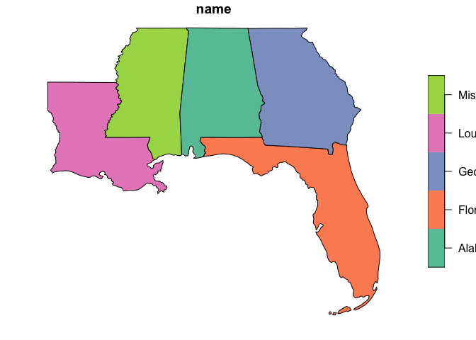

But we will use the `ggplot2` functions to build more complicated maps.
With both the `ggplot2` and `sf` packages, we can take advantage of the
`geom_sf()` function to quickly plot `sf` objects in the `ggplot2`
framework. Unlike most `ggplot()` uses, you don’t have to specify the
`x` and `y` mapping aesthetic for `geom_sf()` since that will be assumed
from the geometry column.

    ggplot() +
      geom_sf(data=my_area)

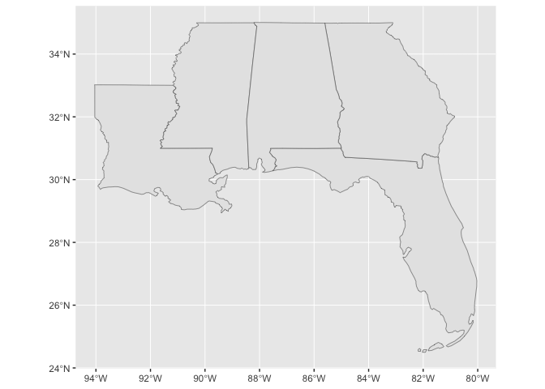

Say you want to use a certain CRS in the project for which you are
making your map. This can affect the plotted map.

    # Specify the target CRS
    target_crs <- 5070
    target_crs_str <- paste0('EPSG:',target_crs)

    # Transform area to that CRS and save the bounding box in the CRS for later use
    my_area_tcrs <- my_area %>%
      st_transform(target_crs)
    my_bbox_tcrs <- my_area_tcrs %>%
      st_bbox()

    # Plot the transformed area
    ggplot() +
      geom_sf(data=my_area_tcrs) 

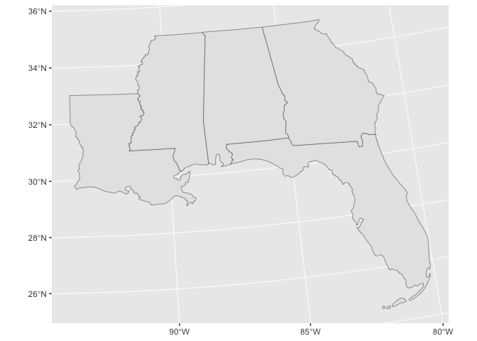 

The plot
coordinate system depends on the order of the `geom_sf()` calls, or
what’s specifically stated in `coord_sf()`.

Let’s now consider another vector dataset we’d like to plot within our
study area. We can use the GeoPlatform API to download a subset of the
*FS National Forests Dataset (US Forest Service Proclaimed Forests)*
dataset from the US Forest Service.

    # GeoPlatform API url
    api_url <- 'https://geoapi.geoplatform.gov'

    # Read collections catalog
    collections_url <- paste0(api_url,'/collections')
    collections_content <- GET(collections_url) %>%
      content() 
    collections_md <- collections_content$collections

    # Get collection ID for collection with 'forest' in the title
    search_term <- 'forest'
    collection_titles <- sapply(collections_md, function(col) tolower(col$title))
    collection_id <- collections_md[[grep(search_term,collection_titles)]]$id

    # Download data within bounding box from collection 
    bbox_str <- paste0(my_bbox,collapse = ',')
    data_url <- paste0(collections_url, "/" ,collection_id,
                      "/items?limit=10000&bbox=", bbox_str)
    tmp_file <- 'temp.zip'
    GET(data_url, write_disk(tmp_file,overwrite=TRUE))

    collection_sf <- st_read(tmp_file)

    # View shape
    ggplot() +
      geom_sf(data=collection_sf)

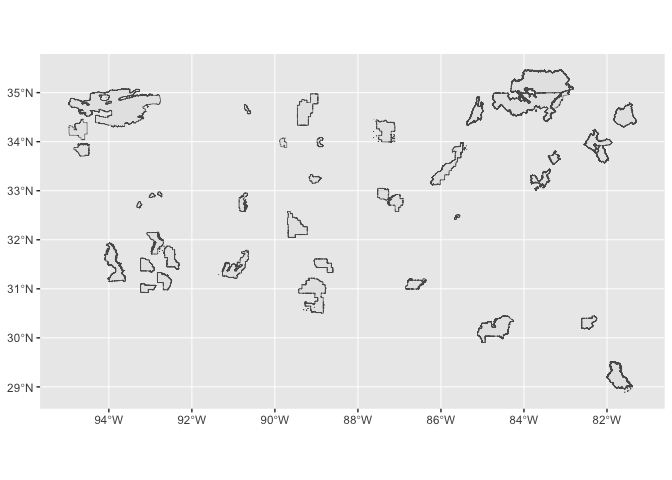 

Now let’s plot both this
forest dataset and our study area.

    ggplot() +
      geom_sf(data=my_area_tcrs) +
      geom_sf(data=collection_sf)

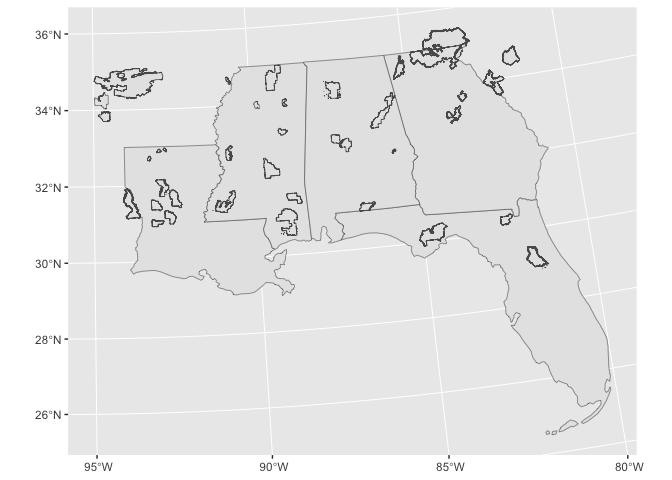 

First, it is
hard to distinguish the two vector datasets with the default coloring.
Second, we requested forests within a bounding box of our study area. So
let’s find the intersection of our forests and study area, and color the
forests polygons.

    my_forests_tcrs <- collection_sf %>%
      st_transform(target_crs) %>%
      st_buffer(1) %>%
      st_intersection(my_area_tcrs)
    #> Warning: attribute variables are assumed to be spatially constant throughout all geometries

    ggplot() +
      geom_sf(data=my_area_tcrs) +
      geom_sf(data=my_forests_tcrs,
              fill = 'forestgreen')

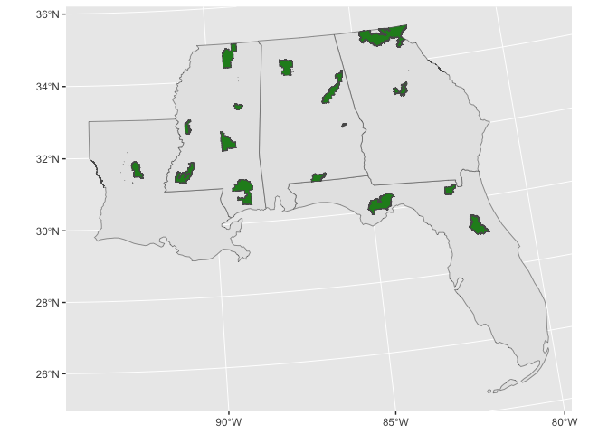

And let’s also get a raster dataset to fill in our study area. We will
grab some elevation from The National Map. Again, we will use our study
area bounding box to define our subset.

    tnm_url <- 'https://elevation.nationalmap.gov/arcgis/rest/services/'
    my_raster <- 'elev.tiff'
    GET(paste0(tnm_url,'3DEPElevation/ImageServer/exportImage?bbox=',bbox_str,
               '&bboxSR=4326&format=tiff&f=image'), 
        write_disk(my_raster,overwrite=TRUE))

    elev <- rast(my_raster) 

    # Visualize with default terra plotting function for rasters
    plot(elev)

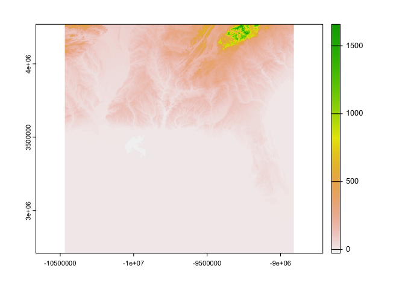 

We will reproject this raster
into our target CRS and apply a mask defined by our study area. Then, we
will also convert this `terra` object into a `data.frame` to help with
our `ggplot`ting.

    elev_masked <- elev %>%
      project(target_crs_str) %>%
      mask(my_area_tcrs)

    elev_df <- elev_masked %>%
      as.data.frame(xy=TRUE)

    elev_df %>%
      ggplot(aes(x,y,fill=elev)) +
      geom_raster()

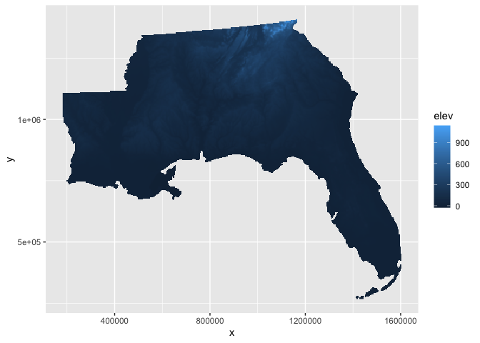

    elev_df %>%
      ggplot(aes(x,y,fill=elev)) +
      geom_raster() +
      scale_fill_continuous(trans = 'sqrt')
    #> Warning in self$trans$transform(x): NaNs produced
    #> Warning: Transformation introduced infinite values in discrete y-axis

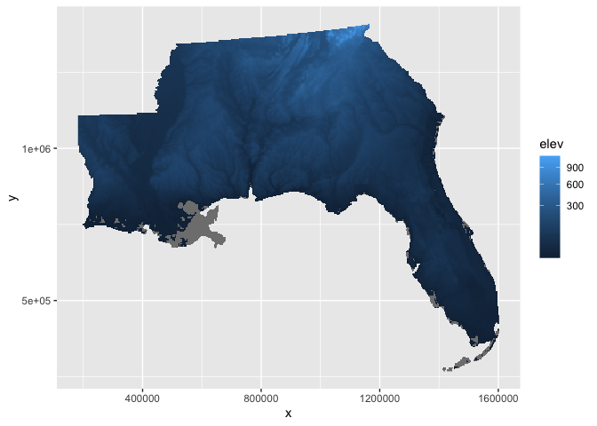

    elev_df %>%
      ggplot(aes(x,y,fill=sqrt(elev+50))) +
      geom_raster()

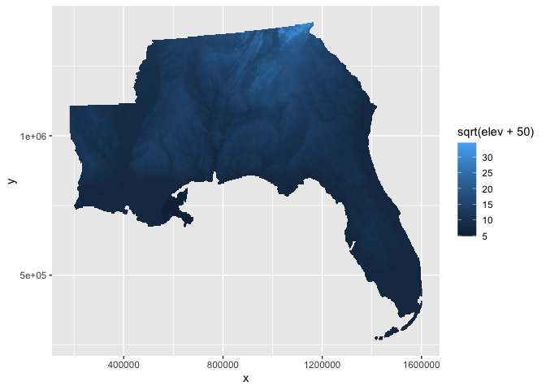

    ggplot() +
      geom_raster(aes(x,y,fill=elev),
                  data = elev_df) +
      scale_fill_fermenter(palette = 'BrBG',
                           name = 'Elevation',
                           breaks = c(-50,0,50,250,500,750))

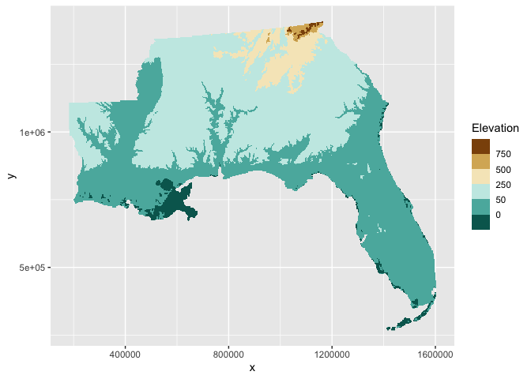

    ggplot() +
      geom_raster(aes(x,y,fill=elev),
                  data = elev_df) +
      geom_sf(data=my_area_tcrs,
              fill = NA) +
      geom_sf(data=my_forests_tcrs,
              fill = 'red') +
      scale_fill_fermenter(palette = 'BrBG',
                           name = 'Elevation',
                           breaks = c(-50,0,50,250,500,750))

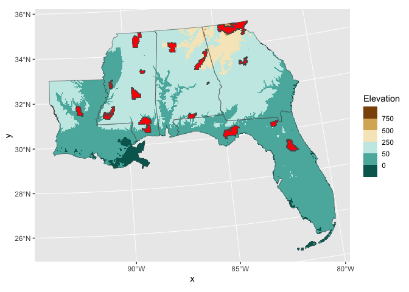

Now, we can add some nice map background layers and annotations. First,
let’s build a background to show the context of neighboring states and
water.

    all_states <- us_states() %>%
      st_transform(target_crs_str)

    ggplot() +
     geom_sf(data = all_states,  #base color for all land
                fill = "#e3f7dc",
                col = "gray75",
                linewidth = 0.15) +
      geom_sf(data=my_area_tcrs,   #our study area states
              fill = NA,
              linewidth = 0.5) +
      scale_x_continuous(name = 'Longitude',   # limit axes to study area bounding box
                         limits = range(my_bbox_tcrs[c(1,3)])) +
      scale_y_continuous(name = 'Latitude',
                         limits = range(my_bbox_tcrs[c(2,4)])) +
      theme(panel.background = element_rect(fill = alpha('#afdbed', 0.5)),  # water!
            panel.grid.major = element_line(color = 'white', linewidth = 0.3)) 

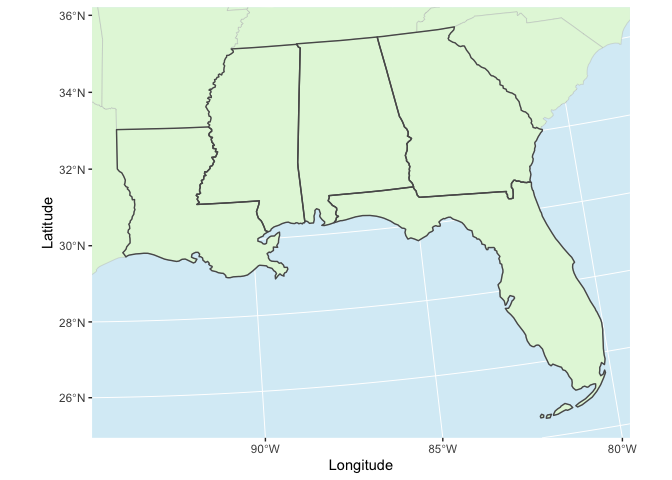

Everything together, plus some annotations!

    # Define points between which to draw an arrow
    arrow_pts <- data.frame(x = c(-82,-89.25),
                           y = c(29.5, 32.5)) %>%
      st_as_sf(coords = c('x','y'),
               crs = 4326) %>%
      st_transform(target_crs) %>%
      st_coordinates() %>%
      as_tibble()

    # Draw the complete map
    ggplot() +
     geom_sf(data = all_states,  #base color for all land
                fill = "#e3f7dc",
                col = "gray75",
                linewidth = 0.15) +
      geom_raster(aes(x,y,fill=elev),  # elevation raster
                  data = elev_df) +
      geom_sf(data=my_area_tcrs,  # our study area states
              fill = NA,
              linewidth = 0.5) +
      geom_sf(data=my_area_tcrs %>%  # highlight boundary of the study area
                st_union(),
              fill = NA,
              color = 'black',
              linewidth = 0.5) +
      geom_sf(data=my_forests_tcrs, # forest polygons
              fill = 'red',
              alpha = 0.5,
              color = 'firebrick',
              linewidth = 0.25) +
      geom_curve(aes(x=arrow_pts$X[1], y = arrow_pts$Y[1],  # curved arrow
                     xend = arrow_pts$X[2], yend = arrow_pts$Y[2]), 
                 curvature = 0.25,
                 arrow = arrow(length = unit(2,'mm'), 
                               type = 'closed'),
               color = 'red') +
      scale_fill_fermenter(palette = 'BrBG',
                           name = 'Elevation',
                           breaks = c(-50,0,50,250,500,750)) +
      scale_x_continuous(name = 'Longitude',
                         limits = range(my_bbox_tcrs[c(1,3)])) +
      scale_y_continuous(name = 'Latitude',
                         limits = range(my_bbox_tcrs[c(2,4)])) +
      annotation_scale(location = "tl") +
      annotation_north_arrow(height = unit(1, "cm"),
                             width = unit(1, "cm")) +
      theme(panel.background = element_rect(fill = alpha('#afdbed', 0.5)),
            panel.grid.major = element_line(color = 'white', linewidth = 0.3)) 
    #> Warning: Removed 23 rows containing missing values (`geom_raster()`).

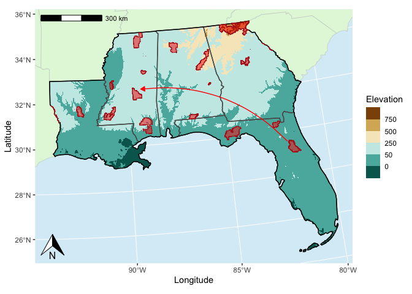
