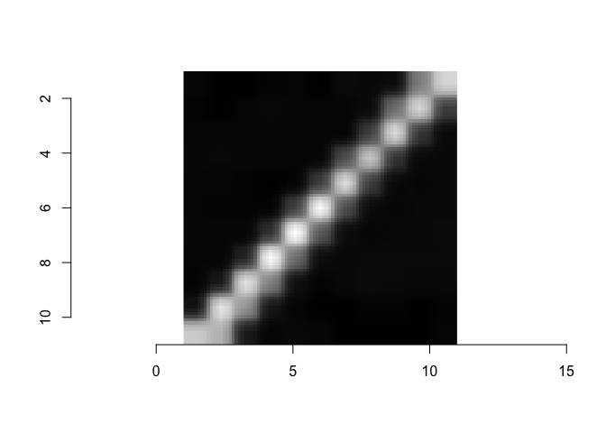

---
title: Image Processing Fundamentals
layout: single
author: Kerrie Geil
author_profile: true
header:
  overlay_color: "444444"
  overlay_image: /assets/images/margaret-weir-GZyjbLNOaFg-unsplash_dark.jpg
--- 

R\_Image\_Processing
================
Jennifer Chang
12/3/2020

## Overview

In this tutorial, we present a brief overview of image processing
concepts necessary to understand machine learning and deep learning.
Completion of this tutorial should give participants the basic
background and terminology necessary for an understanding of the basics
of image processing and the common manipulations of images used for
machine learning and deep learning.

## Downloading Images

We will be using the following two images:

-   [cameraman.png](https://geospatial.101workbook.org/Workshops/Tutorial1_Image_Processing_Essentials_Boucheron.html)
-   [peppers.png]()

|                                cameraman.png                                |                                peppers.png                                |
|:---------------------------------------------------------------------------:|:-------------------------------------------------------------------------:|
|  |  |

## Loading images into R

There are many R libraries, however for this tutorial we will be using
the `imager` library available on CRAN.

``` r
# install.packages("imager")       # <= uncomment to install
library(imager)
#> Loading required package: magrittr
#> 
#> Attaching package: 'imager'
#> The following object is masked from 'package:magrittr':
#> 
#>     add
#> The following objects are masked from 'package:stats':
#> 
#>     convolve, spectrum
#> The following object is masked from 'package:graphics':
#> 
#>     frame
#> The following object is masked from 'package:base':
#> 
#>     save.image
```

Load and display image

``` r
I_camera = load.image('../tutorials/data/cameraman.png')
plot(I_camera)
```

<!-- -->

## Subsetting the image

``` r
str(I_camera)     # cimg
#>  'cimg' num [1:256, 1:256, 1, 1] 0.612 0.624 0.62 0.608 0.62 ...

sub_I_camera = as.cimg(I_camera[100:110,100:110,,] )
plot(sub_I_camera)
```

<!-- -->

``` r
sub_I_camera[,,,1]
#>             [,1]       [,2]       [,3]       [,4]       [,5]       [,6]
#>  [1,] 0.04705882 0.03921569 0.04313725 0.04705882 0.04313725 0.04313725
#>  [2,] 0.03529412 0.03529412 0.04705882 0.05098039 0.04313725 0.03921569
#>  [3,] 0.03137255 0.04313725 0.04705882 0.04705882 0.03921569 0.03921569
#>  [4,] 0.03921569 0.05098039 0.04705882 0.04705882 0.03529412 0.03921569
#>  [5,] 0.04313725 0.04313725 0.04313725 0.04313725 0.03921569 0.27843137
#>  [6,] 0.03529412 0.04313725 0.04705882 0.04705882 0.27058824 0.78431373
#>  [7,] 0.06666667 0.04313725 0.04313725 0.32156863 0.71372549 0.31764706
#>  [8,] 0.05098039 0.06274510 0.27058824 0.65882353 0.26274510 0.05882353
#>  [9,] 0.06666667 0.41568627 0.70980392 0.23529412 0.05490196 0.04705882
#> [10,] 0.46274510 0.69803922 0.24313725 0.05490196 0.04705882 0.05490196
#> [11,] 0.69803922 0.26666667 0.05882353 0.05098039 0.05490196 0.05490196
#>             [,7]       [,8]       [,9]      [,10]      [,11]
#>  [1,] 0.04705882 0.04313725 0.03921569 0.10196078 0.67058824
#>  [2,] 0.04705882 0.04313725 0.13333333 0.72941176 0.60392157
#>  [3,] 0.04705882 0.18039216 0.72549020 0.52941176 0.12941176
#>  [4,] 0.22745098 0.78823529 0.47843137 0.11764706 0.04313725
#>  [5,] 0.80000000 0.41568627 0.09019608 0.04313725 0.05098039
#>  [6,] 0.35686275 0.07058824 0.03921569 0.03529412 0.04705882
#>  [7,] 0.06666667 0.05490196 0.05490196 0.03529412 0.03529412
#>  [8,] 0.04705882 0.06274510 0.06666667 0.03921569 0.03529412
#>  [9,] 0.05490196 0.05882353 0.06274510 0.03921569 0.03529412
#> [10,] 0.05490196 0.06274510 0.05098039 0.03529412 0.03529412
#> [11,] 0.06666667 0.06274510 0.05098039 0.03921569 0.04313725
min(sub_I_camera[,,,1])
#> [1] 0.03137255
max(sub_I_camera[,,,1])
#> [1] 0.8
```

Load `peppers.png`.

``` r
I_pepper = load.image('../tutorials/data/peppers.png')
plot(I_pepper)
```

<!-- -->

Convert to grayscale

``` r
gray_I_pepper = grayscale(I_pepper)
plot(gray_I_pepper)
```

<!-- -->

Now an image is really a matrix of numbers.

``` r
dim(gray_I_pepper)   # Width_in_pixels Height_in_pixels Depth(layers) color(1=grayscale, 3=RGB)
#> [1] 512 384   1   1
```

``` r
dim(I_pepper)    # Color version
#> [1] 512 384   1   3
```

Identify edges

``` r
dx <- imgradient(I_camera,"x")
dy <- imgradient(I_camera,"y")
grad.mag <- sqrt(dx^2+dy^2)
plot(grad.mag,main="Gradient magnitude")
```

<!-- -->
