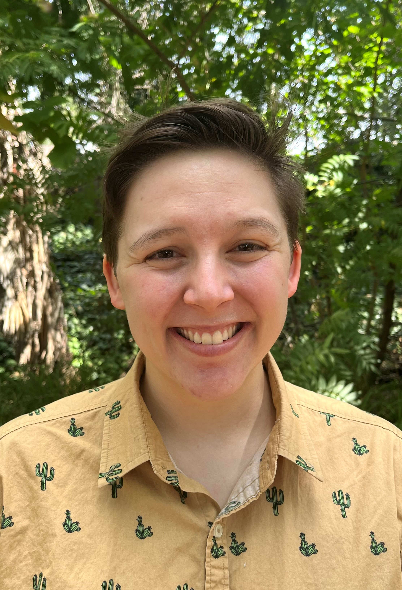

### Andrew Severin

{: .align-left}
Andrew manages the Genome Informatics Facility at Iowa State University. His academic background is in biochemistry with a Ph.D. in Biophysics/NMR Spectroscopy. He is an interdisciplinary scientist working at the interface of Genetics and Bioinformatics, translating Big Data into informative data for interesting biological questions. He is passionate about evolution and the science behind the genome.

### Kerrie Geil

{: .align-left-profile }
Kerrie is an ARS SCINet postdoc in the research group of Dr. Deb Peters in Las Cruces, NM. Her M.S. and Ph.D. degrees are in Atmospheric Sciences and her research background is in climate modeling.
<!--
Kerrie served as a AAAS Policy Fellow at USDA ARS in Beltsville MD from 2018-2020 and has recently transitioned in July to a SCINet Postdoc position in Las Cruces, NM in the research group of Dr. Deb Peters. She received her PhD in Atmospheric Sciences from the University of Arizona in 2016 and her research background is in global and regional climate modeling and climate model performance evaluation using in-situ and satellite observations. Kerrie has expertise in global-, continental-, and regional- scale climate dynamics including teleconnections/climate oscillations (ENSO, PDO, etc.), land-atmosphere-ocean interactions, and the North American Monsoon system. She has also worked on national- and local- scale extreme temperature projects. One of the projects Kerrie hopes to accomplish during her time as a postdoc at ARS is a climate model evaluation tool to make the process of model ensemble selection (e.g. which downscaled models should be excluded from your analyses due to the garbage in garbage out principle) simpler and quicker for research scientists.-->

### Rowan Gaffney
{: .align-left-profile }
Rowan is a physical scientist in the Rangeland Resource & Systems Research Unit in Fort Collins, CO. He specializes in analyzing large, multidimensional geospatial data using a variety of approaches from machine learning to numerical analysis.    

### Laura Boucheron

{: .align-left-profile }
Laura E. Boucheron received the B.S. and M.S. degrees in electrical engineering from New Mexico State University, Las Cruces, in 2001 and 2003, respectively, and the Ph.D. degree in electrical and computer engineering from the University of California, Santa Barbara, in 2008. She has intern and graduate research experience at both Sandia National Laboratories and Los Alamos National Laboratory and postdoctoral and research faculty experience in the Klipsch School of Electrical and Computer Engineering at New Mexico State University. She is currently an Associate Professor in the Klipsch School. Her teaching interests include signals & systems, digital signal processing, digital image processing, and pattern recognition and machine learning. Her research interests include image analysis, feature extraction, pattern recognition and machine learning, temporal image analysis, interdisciplinary research, solar image analysis, and biomedical image analysis.

### Suzy Stillman

{: .align-left-profile }
Suzy is an ARS SCINet postdoc in the research group of Dr. Deb Peters in Las Cruces, NM. Her M.S. and Ph.D. degrees are in Hydrometeorology and her research background is in hydrologic observations and projections.

<!--Suzy began working as a SCINet Postdoc in Las Cruces, NM in Dr. Deb Peters’ research group in July, 2020. After receiving her PhD in hydrometeorology from the University of Arizona, she worked at the Desert Research Institute in Las Vegas, NV, where her main research focus included climate analyses for DoD and DoE. Her background is in evaluating and improving the hydrologic observing system through combining data from a variety of sources. Some of her research that excites her most includes working towards understanding the impact of atmospheric rivers on Colorado River yield and the influence of topography on precipitation in the western US. Her research interests include making the best use of the already available suite of hydrologic observational data to gain a better understanding of the future hydroclimate.-->

### Amy Hudson
{: .align-left-profile }
Amy began her SCINet postdoc in May 2020 working with Dr. Debra Peters in Las Cruces, NM after recently completing a PhD in Natural Resources from the University of Arizona. Her research background is in examining climate-ecosystem interactions at regional to hemispheric scales by integrating multiple data sources. Past projects have focused on how changes in the Northern Hemisphere jet stream influence surface climate conditions, with impacts on the length of the growing season and continental insect migration. By leveraging signatures of climate on annual tree growth, Amy has also worked on teams to reconstruct Hadley Cell extent and summer temperatures in the US Northern Rockies, lending historical context to recent observed climate. Amy is currently involved in ARS research projects that include 1) a cross-site synthesis of the impacts of climate on long-term ecology at dryland sites and 2) determining the influence of broadscale climate on the spatial spread of the vector-borne virus Vesicular Stomatitis.

### Yanghui Kang
{: .align-left-profile }
Yanghui started her SCINet Postdoc position in May 2020 after receiving a Ph.D. degree in Geography from the University of Wisconsin-Madison. She works with Dr. Feng Gao and Dr. Martha Anderson at the Hydrology and Remote Sensing Laboratory in the Beltsville Agricultural Research Center, Beltsville, Maryland. Yanghui’s research projects have focused on the large-scale high-resolution monitoring of core agroecosystem variables (e.g., Leaf Area Index (LAI), crop yield), with the help of satellite remote sensing, machine learning, crop growth modeling, and data assimilation techniques. At ARS, Yanghui is currently developing a machine-learning-based approach to map LAI from Landsat and Sentinel-2 images over the entire globe. She is also interested in deriving crop phenological stages from satellite observations and monitoring agroecosystem dynamics through data assimilation.

### Aleksandra Badaczewska

{: .align-left-profile }
Alex is a Research Scientist IV at the Genome Informatics Facility at Iowa State University. Her academic background is in Chemistry and Biotechnology, with a Ph.D. in Computational Biology and broad experience in programming and designing web applications. She develops a comprehensive collection of highly customizable visualization solutions for Bioinformatics and supports software optimization for the USDA Geospatial analyses.
  

### Jennifer Chang

{: .align-left-profile }
Her PhD was in Bioinformatics and Computational Biology with a minor in Statistics. During her PhD, she developed the C++ software Mango Graph Studio which has been licensed to a startup. Since then, she has worked on automating the Influenza A Virus in Swine reports and recently has been designing Nextflow pipelines for highly scalable and reproducible pipelines. She enjoys designing workflows to reduce tedium and increase joy of discovery.

### Heather Savoy

{: .align-left-profile }
Heather is a Computational Biologist (Data Scientist) in the USDA-ARS SCINet Office. Her research interests include applying informatics methods to multidisciplinary agro-ecosystem problems and building data science software tools for geospatial research. She received her Ph.D. in Civil and Environmental Engineering with an emphasis in Computational Data Science and Engineering from the University of California Berkeley. She also holds a B.S. in Environmental Science with a minor in Computational Mathematics from the Florida Institute of Technology.

### Noa Mills

{: .align-left-profile }
Noa is an ORISE Research Fellow in the USDA-ARS SCINet Office. They got their bachelors in Computational Mathematics at UC Santa Cruz in 2020, and now work on a range of geospatial data science projects including satellite image analysis and the Geospatial Common Data Library project.
